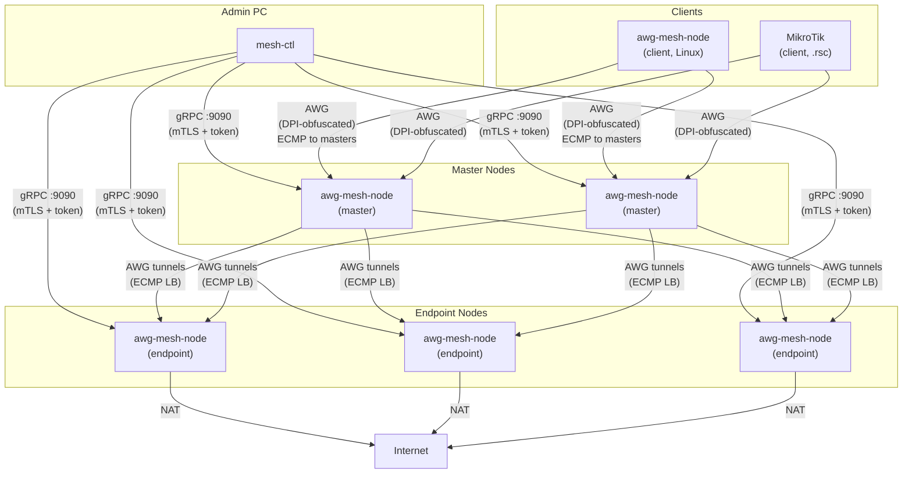
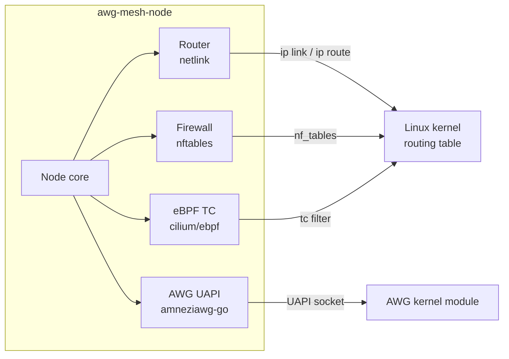

**English** | [Русский](README.ru.md)

<!-- BADGE_ROW -->
[](https://github.com/coonfuuseed-paandaa/awg-mesh/actions/workflows/build.yml)
[](https://github.com/coonfuuseed-paandaa/awg-mesh/releases)
[](https://go.dev/)
[](LICENSE)
[](https://github.com/coonfuuseed-paandaa/awg-mesh/pkgs/container/awg-mesh)
[](https://hub.docker.com/r/coonfuuseedpaandaa/awg-mesh)

# awg-mesh

Docker-native encrypted overlay mesh network built on AmneziaWG — topology-as-code, two-level ECMP load balancing, and anti-DPI obfuscation in Docker containers (42 MB node + 15 MB client).

Managing a multi-region WireGuard mesh by hand means scattered configs, manual key exchange, and no failover. awg-mesh replaces all of that with a single `mesh-topology.yml` file and three CLI commands. You describe your desired network — masters, endpoints, clients — and the system provisions keys, certificates, tunnels, firewall rules, and load balancer entries automatically using native Linux kernel interfaces (netlink, nftables, eBPF) with no subprocess forking.

The traffic model is two-level ECMP: clients connect to a pool of master nodes (ingress), each master maintains AWG tunnels to a pool of endpoint nodes (egress), and traffic is distributed across all live paths with conntrack-based sticky sessions and health-checked failover.

## Architecture



## What's New

### Guided upgrade (v1.10.2+)

```bash
mesh-ctl upgrade v1.10.2 -t mesh-topology.yml --confirm
# Prints plan, requires --confirm. Orders masters-last by default. Per-node: prepare → deploy → init → verify → rollback-on-fail. Writes log to ~/.mesh-ctl/upgrade-<version>-<ts>.log.

mesh-ctl upgrade status -t mesh-topology.yml
# Prints most recent upgrade log.

mesh-ctl upgrade compose old-compose.yml > new-compose.yml
# Migrates an older docker-compose.yml to current schema. Use --from-schema <ver> if auto-detection fails; --in-place to rewrite with .bak backup.
```

**SSH-mode upgrade flags** (v1.11.0+):

| Flag | Default | Description |
|------|---------|-------------|
| `--ssh` | false | SSH-trigger `docker compose up -d` on each node |
| `--ssh-user` | root | SSH username |
| `--ssh-port` | 22 | SSH port |
| `--ssh-key` | | Path to SSH private key (empty = ssh-agent) |
| `--accept-new-host-key` | false | Accept unknown SSH host keys (TOFU) |
| `--remote-compose-dir` | `/etc/docker/compose` | Remote directory where compose files are uploaded before deployment |

The `--remote-compose-dir` flag controls where the rendered compose file is uploaded on each remote node via SFTP before `docker compose up -d` is run. The SSH user must have write access to this directory.

```bash
# Standard upgrade via SSH (compose files uploaded to /etc/docker/compose)
mesh-ctl upgrade v1.11.0 --ssh --ssh-key ~/.ssh/deploy -t mesh-topology.yml

# Non-root SSH user: use a writable directory
mesh-ctl upgrade v1.11.0 --ssh --ssh-key ~/.ssh/deploy \
    --ssh-user deploy --remote-compose-dir /home/deploy/compose \
    -t mesh-topology.yml
```

> **Note:** The SSH user needs write access to `--remote-compose-dir`. For `/etc/docker/compose` (default), the user typically needs `sudo` or membership in the `docker` group. Use `--remote-compose-dir /home/<user>/compose` for non-root deployments.

### v1.10.1

- **`mesh-ctl inspect <node>`** — 3-column drift report (Admin | Disk | Runtime) for any master or endpoint. Detects key mismatches and IP divergence between admin expected state, node-persisted state, and live WireGuard runtime. Exit 1 on drift. Requires node running v1.10.1+ (`GetTransportState` RPC).
- **`mesh-ctl reconcile`** — idempotent topology-walk that force-syncs admin state to every node. Calls `UpdateTunnelPeer` per (master, endpoint) and `AddPeer` per (endpoint, master). Summary table per node. Safe to re-run after manual intervention or post-recovery.
- **`mesh-ctl status --verify-data-plane`** — opt-in L3 verification layered onto the existing status command. Probes `GetHealth` + `ListTunnels` concurrently per master with configurable `--timeout` and `--concurrency`. Structured failure reasons: `missing_peer`, `key_mismatch`, `handshake_timeout`, `unreachable`.
- **`GetTransportState` RPC** — new read-only gRPC endpoint on every node: returns overlay IP, mode, and per-peer public key hex + allowed IPs + last handshake. Used by `inspect` to compare against admin and runtime state.

### v1.8.0

- **Internal review hardening** — closes 5 open issues (#20, #21, #23, #24, #25) with zero new runtime dependencies. All cover correctness, security, or observability.
- **ICMP healthcheck rewrite** — shared raw ICMP socket per `HealthChecker` with demux-by-seq; eliminates cross-goroutine packet starvation on Linux. Race-free `socketMu sync.RWMutex` + `sync.Once` Close + atomic `seqCounter` on the hot path. See [ADR-0006](docs/adr/0006-icmp-shared-socket-demux.md).
- **Plaintext token removed from stdout** — `mesh-ctl` no longer prints the bearer token to stdout by default. Token still persists to disk (mode 0600). Opt-in via `--show-token` flag (WARN log fires when set). **Breaking** for operators parsing `mesh-ctl ... prepare` stdout — update to `cat <config-dir>/nodes/<name>/token`.
- **DSCP range validation** — topology loader rejects `routing_policies[].dscp` outside 1..63, preventing `tableID = 100 + DSCP` from clobbering kernel-reserved tables 253 (default) / 254 (main).
- **Typed YAML corruption sentinel** — `ErrCorruptNodeState`, `ErrCorruptTransportState`, `ErrCorruptClientState` replace fragile `strings.Contains` classification. See [ADR-0007](docs/adr/0007-typed-error-sentinel-for-yaml.md).
- **`mesh-ctl bootstrap --host IP`** — new SSH-based VPS provisioning: installs Docker (if missing) and pulls the node image. Strict host-key verification via `~/.ssh/known_hosts` by default. SSH agent preferred over on-disk key. Command-injection-safe `--image` parsing.
- **Legacy migration guide** — `docs/MIGRATION.md` covers the legacy 5× MikroTik container layout → `awg-mesh` 2× master + endpoints + clients cut-over with rollback paths.
- **Smoke + e2e Docker fixture** — `tests/v18_smoke/` + `make release-gate` validates every v1.8.0 behavior end-to-end before release.

### v1.7.0

- **Client-side ECMP hardening** — unified `rebuildClientECMP` path applies health filtering, CONNMARK sticky sessions, and L4 multipath hash uniformly across VIP and legacy topologies. No more divergent semantics.
- **Deterministic client interface names** — `wg-c<4-hex>` derived from peer pubkey SHA-256. Stable across restarts; legacy `wg-cN` interfaces are cleaned up on reconcile. External monitoring scraping interface names must be updated.
- **Schema-versioned transport state** — `transport.yml` now carries `schema_version: 1` plus per-tunnel `allowed_ips` and `persistent_keepalive`. Pre-v1.6.0 state files auto-migrate on first boot with one WARN log; migration is durable. Closes the hardcoded-`0.0.0.0/0` reconcile bug.
- **CIDR-scoped sticky ECMP** — `EnableStickyECMP` rules now carry `ip daddr <cidr>` match; `DisableStickyECMP` actually removes the rules (was a no-op). Runtime `balancer_ip` changes produce clean conntrack state.
- **Partial-mesh boot tolerance** — reconcile errors are no longer fatal to `Run()`; the client starts with whatever tunnels are healthy and converges via healthcheck.
- **Structured ECMP logging** — every `ecmp_install` / `ecmp_withdraw` / `sticky_enable` / `sticky_disable` carries `reason` (`init` / `onUp` / `onDown` / `reconcile` / `balancer_change` / `no_healthy_links`).
- **Docker-compose fixture** — `tests/client_ecmp/` ships a 4-service reproducible stack plus `verify.sh` for manual US1 (failover) and US2 (stickiness) regression tests.

### v1.6.0

- **12-factor env var bootstrap** — node binary reads `MESH_MODE`, `MESH_NAME`, `MESH_OVERLAY_IP`, `MESH_LISTEN_PORT`, `MESH_CONFIG_DIR`, `MESH_TOPOLOGY`, `MESH_LOG_LEVEL`, `MESH_METRICS_ADDR` as fallbacks for every CLI flag. Flags still win when explicit.
- **First-boot token bootstrap** — `MESH_TOKEN_HASH` (bcrypt) is written into `/config/mesh.token` on first start; ignored on subsequent boots. Operators no longer ship token files by hand.
- **Multi-arch docker images** — `linux/amd64`, `linux/386`, `linux/arm64`, `linux/arm/v7`, `linux/arm/v6`. Covers Intel/AMD servers, legacy 32-bit x86, Raspberry Pi 3/4/5 (arm64), Pi 2/3 (arm/v7), Pi Zero/1 (arm/v6), and MikroTik hAP ax.
- **Template contract tests** pin deploy invariants (no sysctls on host-net, `/dev/net/tun` mounted, `MESH_TOKEN_HASH` embedded, `MESH_NAME` present, `/config` volume).
- **13 production deploy bugs fixed** — host-network sysctls rejection, missing TUN device, bcrypt `$`-escaping in compose, wrong volume layout, missing env vars, TLS capture primer, MikroTik RouterOS 7.21+ `list=` syntax, `MESH_MASTERS host:port` port mismatch, and more.
- **CI: govulncheck + privileged routing tests + multi-arch manifest verification.**

### v1.5.0

- **Client state persistence** — DSCP routing policies and DNS config are saved to `/config/client-state.yml` after `mesh-ctl client init`. Container restores full state on restart without requiring the topology file or a gRPC re-init.

### v1.4.0

- **Traefik integration** (`--traefik` flag) — awg-mesh-node announces itself to Traefik via labels. gRPC management uses TCP mTLS passthrough; AWG UDP bypasses Traefik via direct port binding (source IP required for WG peer identification).
- **Connmark DSCP fix** — return traffic from endpoints now correctly carries DSCP marks back through the master, fixing asymmetric routing in conntrack-based sticky sessions.

### v1.3.0

- **Two Docker images** — lightweight `awg-mesh-client` (~15 MB, CGO-free) for MikroTik/Linux clients, full `awg-mesh-node` (~42 MB) for master/endpoint nodes. `awg-mesh:latest` remains an alias for the node image.
- **Interface auto-discovery** — container automatically detects its WAN interface via default route (netlink). Works on MikroTik ROS < 7.20 (`eth0`), ROS >= 7.20 (custom VETH names), and standard Docker. Override with `MESH_INTERFACE` environment variable.
- **Client state persistence** — after first `mesh-ctl client init`, routing policies and DNS config are saved to `/config/client-state.yml`. Container restores full state on restart without topology file or gRPC re-init.
- **`nocapture` build tag** — `CGO_ENABLED=0 go build -tags nocapture` produces a static client binary without gopacket/libpcap.
- **CI matrix build** — GitHub Actions builds and pushes both client and node images with separate smoke tests.

### v1.2.0

- **Smart Client** — single container replaces N per-region AWG containers with DSCP-based policy routing. Router marks traffic with DSCP, container reads DSCP field and routes to the correct endpoint via policy routing tables.
- **Embedded DNS server** — client containers serve A and PTR records for the overlay zone via miekg/dns. `dig node-asia-01.mesh.zone @client` returns the overlay IP. Non-zone queries are forwarded to an upstream DNS server.
- **Router config generation** — `mesh-ctl routing generate` produces platform-specific configs:
  - `--platform mikrotik`: RouterOS `.rsc` script with `/ip/firewall/mangle` DSCP rules and routing tables
  - `--platform linux`: shell script with `iptables -t mangle` DSCP marking and `ip rule`/`ip route` entries
  - `--platform generic`: JSON with DSCP map and fallback overlay-IP static routes for routers without DSCP support
- **Master exit mode** — masters with `exit: true` in topology enable masquerade, acting as VPN exit points (one fewer hop vs routing through an endpoint).
- **DSCP teardown on shutdown** — nftables DSCP rules and ip rules are cleaned up when the client shuts down.

### v1.1.0

- **Idempotent endpoint init** — re-running `endpoint init` is safe; existing tunnels are preserved rather than duplicated.
- **Overlay route propagation** — overlay IPs are reliably announced across all tunnel interfaces after init.
- **Pure Go data plane** — 443 lines of `exec.Command` shell-out code removed; all routing and firewall operations go through netlink, nftables, and eBPF directly.
- **E2E simulation suite** — 8-node Docker simulation (`tests/simulation/`) covering WG handshakes, overlay ping, ECMP nexthop counts, client-to-master connectivity, and mesh-wide status.

### v1.0.0

- **Native routing layer** — WireGuard interface management, route programming, and firewall rules via vishvananda/netlink, google/nftables, and cilium/ebpf. No subprocess execution at runtime.
- **Router / Firewall / Sysctl interfaces** — clean separation of concerns; each subsystem is independently testable and swappable.
- **Zero known defects** — all 15 findings from the v0.9.x investigation cycle resolved.

## Features

**Network**
- AmneziaWG overlay mesh with configurable anti-DPI obfuscation (WireGuard fork with junk packets and S/H header randomization)
- Two-level ECMP load balancing with nftables conntrack sticky sessions
- Health-checked failover using ICMP probes with WG handshake timestamp as fallback
- Configurable overlay address space with per-role CIDR ranges and virtual balancer IPs
- Transport point-to-point addressing (10.255.x.x) allocated automatically per tunnel pair

**Smart Client (v1.2.0)**
- DSCP-based policy routing: router marks traffic with DSCP values (1-63), client reads IP DSCP field via nftables → sets fwmark → ip rule routes to per-policy routing table
- Embedded DNS server for overlay zone: A records (`node.mesh.zone` → overlay IP), PTR records (reverse lookup), upstream forwarding for non-zone queries
- Router config generation: `mesh-ctl routing generate` for MikroTik `.rsc`, Linux shell, and generic JSON
- Master exit mode: `exit: true` enables direct internet egress via masquerade — no endpoint hop required
- Fallback overlay-IP routing for consumer routers without DSCP support

**Operations**
- Topology-as-code: single `mesh-topology.yml` as the only source of truth
- Three-step onboarding: `prepare` (keygen + compose) → `deploy` (copy to host) → `init` (gRPC activation)
- MikroTik RouterOS `.rsc` script generation for hardware client provisioning
- Single 42 MB Alpine Docker image — no sidecar containers, no agents

**Security**
- gRPC management plane with mTLS + bearer token dual authentication (both required)
- Tokens hashed with bcrypt at rest; rotatable independently of TLS certificates
- Three-tier AWG parameter rotation: junk params / S-H headers / full keypair
- TLS/QUIC packet capture via gopacket/libpcap for traffic fingerprint mimicry

**Routing (native kernel)**
- WireGuard interface lifecycle via vishvananda/netlink — no `ip` subprocess
- ECMP multipath routes programmed directly into the kernel routing table
- nftables NAT and conntrack via google/nftables — no `nft` subprocess
- eBPF TC programs via cilium/ebpf for high-performance packet forwarding

**Observability**
- Prometheus metrics on `:9091`
- Structured JSON logging via zerolog with configurable log level
- Per-node status via `mesh-ctl status`

## Use Cases

- **Censorship-resistant egress**: route traffic through a pool of egress nodes in different jurisdictions, with automatic failover when one is blocked.
- **Multi-region branch connectivity**: connect office routers (MikroTik or Linux) to a mesh of master nodes, with ECMP distributing load across masters.
- **Self-hosted VPN with horizontal scale**: add more master or endpoint nodes to the topology file and re-run `init` — no manual peer wiring.
- **Anti-DPI environments**: AWG obfuscation parameters rotate on schedule and are fingerprinted against real TLS/QUIC traffic to defeat traffic classifiers.
- **MikroTik single-container VPN**: replace 5+ AWG containers (one per region) with a single smart client container. DSCP marks on the router select which endpoint each traffic flow reaches — 33 manual mangle rules and 10 routing tables replaced by one topology file and `mesh-ctl routing generate`.

## Traffic Steering with DSCP

> **MikroTik minimum version: RouterOS 7.21+** — the client container uses nftables (kernel `nf_tables` module) for DSCP→fwmark policy routing. RouterOS versions before 7.21 do not load `nf_tables` into the container kernel. On Linux (non-MikroTik), any modern kernel with nf_tables support works.

DSCP (Differentiated Services Code Point) is the mechanism for selecting which endpoint handles each traffic flow. Routing marks on MikroTik are local to conntrack — they don't survive the trip through the WG tunnel. DSCP is the only field in the IP header that the router can set and the client container can read on the other side.

### How it works

```
Router                           Client container              Master            Endpoint
  │                                │                            │                  │
  │ 1. address-list → conn-mark    │                            │                  │
  │ 2. conn-mark → change-dscp     │                            │                  │
  │ 3. route to container gateway  │                            │                  │
  │ ───────────────────────────────>│                            │                  │
  │                                │ 4. nftables: read DSCP     │                  │
  │                                │ 5. DSCP → fwmark           │                  │
  │                                │ 6. fwmark → policy table   │                  │
  │                                │ 7. table → via master WG   │                  │
  │                                │ ───────────────────────────>│                  │
  │                                │                            │ 8. forward       │
  │                                │                            │ ────────────────>│
  │                                │                            │                  │ 9. NAT → internet
```

- **DSCP 0** (default): ECMP across all endpoints — no special marking needed
- **DSCP 1-63**: each value maps to a routing policy in `mesh-topology.yml`
- The router sets DSCP; the container reads it. Routing marks don't cross device boundaries.

### MikroTik examples

**Step 1: Define which traffic goes where (address lists):**

```routeros
/ip/firewall/address-list
add list=via-asia address=8.8.8.8 comment="Google DNS via Asia"
add list=via-asia address=1.1.1.1 comment="Cloudflare via Asia"
add list=via-us address=208.67.222.222 comment="OpenDNS via US"
```

**Step 2: Mark connections and set DSCP (mangle):**

```routeros
/ip/firewall/mangle
# Mark connections by destination address list
add chain=prerouting dst-address-list=via-asia action=mark-connection \
    new-connection-mark=vpn-asia-conn passthrough=yes comment="awg-mesh: mark Asia connections"
add chain=prerouting dst-address-list=via-us action=mark-connection \
    new-connection-mark=vpn-us-conn passthrough=yes comment="awg-mesh: mark US connections"

# Set DSCP based on connection mark (this survives the WG tunnel)
add chain=prerouting connection-mark=vpn-asia-conn action=change-dscp \
    new-dscp=10 passthrough=yes comment="awg-mesh: DSCP=10 for Asia"
add chain=prerouting connection-mark=vpn-us-conn action=change-dscp \
    new-dscp=20 passthrough=yes comment="awg-mesh: DSCP=20 for US"
```

**Step 3: Route marked traffic to the client container:**

```routeros
/routing/table
add name=vpn-mesh fib comment="awg-mesh VPN routing table"

/ip/route
add dst-address=0.0.0.0/0 gateway=192.168.254.4 routing-table=vpn-mesh \
    distance=5 comment="awg-mesh: default VPN route"

/ip/firewall/mangle
add chain=prerouting connection-mark=vpn-asia-conn action=mark-routing \
    new-routing-mark=vpn-mesh passthrough=no comment="awg-mesh: route Asia via mesh"
add chain=prerouting connection-mark=vpn-us-conn action=mark-routing \
    new-routing-mark=vpn-mesh passthrough=no comment="awg-mesh: route US via mesh"
```

**Or generate all of this automatically:**

```bash
mesh-ctl routing generate --platform mikrotik --client my-router -t mesh-topology.yml > awg-routing.rsc
# Import on MikroTik: /import awg-routing.rsc
```

### All-traffic VPN (no per-flow steering)

If you just want all traffic through the VPN without selecting endpoints:

```routeros
# Simple: route everything through the client container
/ip/route
add dst-address=0.0.0.0/0 gateway=192.168.254.4 distance=10 comment="all traffic via awg-mesh"
```

DSCP 0 (default) → ECMP across all endpoints automatically.

### Master exit (direct egress)

Masters with `exit: true` in topology can act as VPN exit points directly. Assign a DSCP value targeting the master in `routing_policies`:

```yaml
routing_policies:
  - name: vpn-direct
    dscp: 50
    targets: [master-01]   # master with exit: true
```

Traffic with DSCP=50 exits from master-01's location without the extra hop through an endpoint.

### Overlay DNS

The client container runs an embedded DNS server for the overlay zone:

```bash
dig node-asia-01.mesh.zone @192.168.254.4    # → 172.20.70.34
dig -x 172.20.70.34 @192.168.254.4           # → node-asia-01.mesh.zone
```

On MikroTik, forward mesh zone queries to the client container:

```routeros
/ip/dns/static
add name=mesh.zone type=FWD forward-to=192.168.254.4
```

## Quick Start

This example deploys a minimal mesh: two masters in two regions, two endpoints in two other regions, one Linux client.

```bash
# 1. Install mesh-ctl on your admin machine
go install github.com/coonfuuseed-paandaa/awg-mesh/cmd/mesh-ctl@v1.7.0
export PATH=$PATH:$(go env GOPATH)/bin

# 2. Create your topology file (see Configuration section for all fields)
cp mesh-topology.example.yml mesh-topology.yml
# edit mesh-topology.yml with your actual IPs and node names

# 3. Prepare each node (generates keys, token, docker-compose file)
mesh-ctl master   prepare master-01 -t mesh-topology.yml
mesh-ctl master   prepare master-02 -t mesh-topology.yml
mesh-ctl endpoint prepare node-asia-01        -t mesh-topology.yml
mesh-ctl endpoint prepare node-asia-02        -t mesh-topology.yml
mesh-ctl client   prepare my-router    -t mesh-topology.yml

# 4. Copy each generated <name>-docker-compose.yml and start containers on each host
#    (see Deployment section for the full scp + docker compose workflow)

# 5. Initialize the mesh — connects via gRPC and brings up AWG tunnels
mesh-ctl endpoint init node-asia-01        -t mesh-topology.yml
mesh-ctl endpoint init node-asia-02        -t mesh-topology.yml
mesh-ctl master   init master-01 -t mesh-topology.yml
mesh-ctl master   init master-02 -t mesh-topology.yml
mesh-ctl client   init my-router    -t mesh-topology.yml

# 6. Verify
mesh-ctl status -t mesh-topology.yml
```

## Installation

### Prerequisites

**Admin machine** (where you run `mesh-ctl`):
- Go 1.25+
- Network access to port 9090 on every node host

**Each node host**:
- Docker Engine 24+
- Linux kernel with `/dev/net/tun` available (standard on all modern distributions)
- Outbound UDP 51820 and inbound TCP 9090 open

### Install mesh-ctl

```bash
go install github.com/coonfuuseed-paandaa/awg-mesh/cmd/mesh-ctl@v1.7.0
```

The binary lands in `$(go env GOPATH)/bin`. Ensure that directory is in your `PATH`:

```bash
export PATH=$PATH:$(go env GOPATH)/bin
mesh-ctl version
```

On first use, `mesh-ctl` creates `~/.mesh-ctl/` to store the mesh CA, per-node tokens, public keys, and transport allocations. You can inspect this state at any time:

```bash
mesh-ctl config show -t mesh-topology.yml
```

### Deploy node containers

`mesh-ctl prepare` generates a `<name>-docker-compose.yml` for each node. Copy it to the target host and start the container:

```bash
# Transfer files to the host
ssh user@198.51.100.10 'sudo mkdir -p /srv/awg-mesh'
scp master-01-docker-compose.yml user@198.51.100.10:~/

# Start the container
ssh user@198.51.100.10 'docker compose -f master-01-docker-compose.yml up -d'
```

The generated compose file includes the correct image, capabilities, port mappings, and startup flags for that node. You can integrate the `awg-mesh-node` service block into your existing infrastructure compose file if preferred — see [Deployment](#deployment).

### Pinning image versions

By default, `mesh-ctl prepare` writes the built-in `:latest` tag into the generated compose file. Rolling tags make deployments non-reproducible: a `docker compose pull` on two different days can silently pull different code. Pin to a semver tag to ensure every node in your fleet runs the exact same image digest.

**Resolution priority** (first non-empty value wins):

1. `--image` CLI flag passed to the prepare command
2. `defaults.image.node` (master/endpoint) or `defaults.image.client` (client) from `mesh-topology.yml`
3. Built-in fallback: `ghcr.io/coonfuuseed-paandaa/awg-mesh-node:latest` (node) or `ghcr.io/coonfuuseed-paandaa/awg-mesh-client:latest` (client)

**Available image tags** are published on GHCR and Docker Hub — see the [GHCR package page](https://github.com/coonfuuseed-paandaa/awg-mesh/pkgs/container/awg-mesh) for the full list. Supported tags are `:latest` (master branch), release semver tags with `v` prefix (for example `:v0.X.Y`), and commit SHA tags generated by CI; minor aliases like `:1.8` are not published.

#### Pin via CLI flag

Pass `--image` to any prepare subcommand to override the image for that invocation:

```bash
# Pin master node to a specific release
mesh-ctl master   prepare master-01    -t mesh-topology.yml \
    --image ghcr.io/coonfuuseed-paandaa/awg-mesh-node:v1.8.1

# Pin endpoint node
mesh-ctl endpoint prepare node-asia-01 -t mesh-topology.yml \
    --image ghcr.io/coonfuuseed-paandaa/awg-mesh-node:v1.8.1

# Pin Linux client (uses the lighter client image)
mesh-ctl client   prepare my-router    -t mesh-topology.yml \
    --image ghcr.io/coonfuuseed-paandaa/awg-mesh-client:v1.8.1
```

Use a full image reference (`registry/repo:tag`) or a short tag recognized by your Docker daemon. The value is passed through verbatim — no registry lookup is performed at prepare time.

#### Pin via topology defaults

Set `defaults.image` in `mesh-topology.yml` once and every subsequent `prepare` call picks it up automatically — no need to repeat `--image` on each command:

```yaml
defaults:
  image:
    node:   ghcr.io/coonfuuseed-paandaa/awg-mesh-node:v1.8.1   # used by master + endpoint prepare
    client: ghcr.io/coonfuuseed-paandaa/awg-mesh-client:v1.8.1  # used by client prepare

# masters, endpoints, clients, overlay, ... (rest of topology unchanged)
```

Both fields are optional. Setting only `node` leaves `client` at the built-in fallback, and vice versa.

#### Recommendations

- **Production / stable environments:** pin to a semver tag (`:v1.8.1`). Re-run `prepare` and redeploy when you intentionally upgrade.
- **Edge / preview environments:** `:latest` is acceptable if you want rolling updates on every `docker compose pull`.
- **Hotfix a single node without touching the shared topology:** pass `--image <hotfix-ref>` on the CLI — it overrides the topology default for that one prepare invocation only.

### Verify

```bash
mesh-ctl status -t mesh-topology.yml
```

All nodes should appear `ONLINE` with tunnel counts matching the topology.

## Upgrading

### Upgrading mesh-ctl

```bash
go install github.com/coonfuuseed-paandaa/awg-mesh/cmd/mesh-ctl@v1.7.0
```

The `~/.mesh-ctl/` state directory (CA, tokens, keys, transport allocations) is not affected.

### Upgrading node containers

Pull the new image and restart. AWG tunnels reconnect in 2–5 seconds:

```bash
# On each node host:
docker compose -f <name>-docker-compose.yml pull
docker compose -f <name>-docker-compose.yml up -d
```

For multi-master setups, update one master at a time to maintain connectivity:

```bash
# Update Master 1 (ECMP keeps traffic flowing through Master 2)
ssh master-01 'docker compose -f master-01-docker-compose.yml pull && docker compose -f master-01-docker-compose.yml up -d'

# Wait for Master 1 to come back online
mesh-ctl status -t mesh-topology.yml

# Then update Master 2
ssh master-02 'docker compose -f master-02-docker-compose.yml pull && docker compose -f master-02-docker-compose.yml up -d'
```

### Guided upgrade (v1.10.2+)

`mesh-ctl upgrade` orchestrates a zero-downtime rolling upgrade of the entire mesh with
automatic verification and per-node rollback on failure.

**Preview the plan:**

```bash
mesh-ctl upgrade v1.10.2 --dry-run
```

**Execute with SSH auto-deploy:**

```bash
mesh-ctl upgrade v1.10.2 \
    --ssh \
    --ssh-user deploy \
    --ssh-key ~/.ssh/mesh_deploy_ed25519
```

**Execute with manual deploy** (for air-gapped or restricted hosts):

```bash
mesh-ctl upgrade v1.10.2 --deploy-wait 300
# CLI prints compose file path for each node; copy and run docker compose up -d manually
```

**Monitor progress:**

```bash
mesh-ctl upgrade status
```

Nodes are upgraded in dependency order: endpoints first (region-grouped), masters last.
If the data-plane verify phase fails for any node, the driver automatically rolls back
that node (restores the `.bak` compose, redeploys, reconciles) and halts the upgrade.

**Migrate an older compose file** (pre-v1.9.0 nodes):

```bash
# Print migrated compose to stdout:
mesh-ctl upgrade compose /etc/docker/compose/<node>-docker-compose.yml

# Rewrite in-place (original saved as .bak):
mesh-ctl upgrade compose /etc/docker/compose/<node>-docker-compose.yml --in-place
```

See `docs/MIGRATION.md` — Rolling Upgrade Procedure for the full operator checklist.

## Upgrade safety

When upgrading to a new awg-mesh-node image, always remove the local cached image
before pulling so Docker cannot silently reuse a stale layer when the pull fails
mid-transfer:

```bash
docker compose -f <compose> down
docker image rm <image-ref> 2>/dev/null || true   # force fresh pull; image may be absent
docker pull <image-ref>       # verify new digest appears in output
docker compose -f <compose> up -d
```

Check the container startup log after `up -d` and confirm the reported `"version"`
field matches the expected semver before proceeding to the next node.

## Deployment

### Docker image

```
# Node image (master/endpoint — full capabilities)
ghcr.io/coonfuuseed-paandaa/awg-mesh-node:latest
ghcr.io/coonfuuseed-paandaa/awg-mesh:latest          # alias for node

# Client image (MikroTik/Linux — lightweight, no CGO)
ghcr.io/coonfuuseed-paandaa/awg-mesh-client:latest
```

- Size: ~42 MB (Alpine base)
- Architectures (multi-arch manifest, since v1.6.0): `linux/amd64`, `linux/386`, `linux/arm64`, `linux/arm/v7`, `linux/arm/v6` — covers x86_64 servers, legacy 32-bit x86, Raspberry Pi 3/4/5 (arm64), Pi 2/3 (arm/v7), Pi Zero/1 (arm/v6), and MikroTik hAP ax
- No external runtime dependencies

### Volume mount

The container expects configuration at `/config`. Map your node's config directory there:

```
/srv/awg-mesh  →  /config  (inside container)
```

`mesh-ctl prepare` generates all required files into the compose file's volume binding. The generated compose uses `network_mode: host` (direct port binding, source IP preservation), mounts `/dev/net/tun`, and embeds `MESH_TOKEN_HASH` — the node bootstraps `/config/mesh.token` from that env var on first boot. The configuration below is an equivalent bridge-network alternative if you prefer explicit port publishing.

### Minimal service definition

```yaml
services:
  awg-mesh-node:
    image: ghcr.io/coonfuuseed-paandaa/awg-mesh-node:latest
    restart: unless-stopped
    cap_add:
      - NET_ADMIN
      - NET_RAW
    devices:
      - /dev/net/tun:/dev/net/tun
    volumes:
      - /srv/awg-mesh:/config
    ports:
      - "51820:51820/udp"   # AWG data plane
      - "9090:9090"          # gRPC management
      - "9091:9091"          # Prometheus metrics
    command:
      - --mode=master         # or endpoint / client
      - --name=master-01  # must match topology entry
      - --topology=/config/mesh-topology.yml
```

### Ports

| Port | Protocol | Purpose |
|------|----------|---------|
| 51820 | UDP | AmneziaWG data plane (peer tunnels) |
| 9090 | TCP | gRPC management (mTLS + token auth) |
| 9091 | TCP | Prometheus metrics |

Port 51820 must be reachable between nodes (masters ↔ endpoints, clients → masters).
Port 9090 must be reachable from your admin machine running `mesh-ctl`.

### Required capabilities

| Capability | Reason |
|-----------|--------|
| `NET_ADMIN` | Create and configure AWG interfaces, program routes, manage nftables |
| `NET_RAW` | gopacket/libpcap traffic capture for protocol fingerprinting |
| `/dev/net/tun` | TUN device for overlay network interface |

### Traefik integration

awg-mesh works with Traefik reverse proxy using a hybrid pattern: Traefik handles gRPC and metrics (TCP/HTTP), while AWG UDP traffic bypasses Traefik via direct port binding.

> **Why not route AWG through Traefik?** Traefik's UDP proxy replaces the source IP with its own container IP. WireGuard uses source IP for peer identification — all peers would appear as the same address, breaking handshakes. This is a fundamental protocol limitation, not a performance issue. See [ADR-0003](docs/adr/0003-traefik-integration.md) for details.

```yaml
services:
  awg-mesh-node:
    image: ghcr.io/coonfuuseed-paandaa/awg-mesh-node:latest
    restart: unless-stopped
    cap_add:
      - NET_ADMIN
      - NET_RAW
    devices:
      - /dev/net/tun:/dev/net/tun
    volumes:
      - /srv/awg-mesh:/config
    ports:
      # AWG data plane — DIRECT, bypasses Traefik (required)
      - "51820:51820/udp"
    labels:
      - "traefik.enable=true"
      # gRPC management — TCP with mTLS passthrough
      - "traefik.tcp.routers.awg-grpc.entrypoints=awg-grpc"
      - "traefik.tcp.routers.awg-grpc.rule=HostSNI(`*`)"
      - "traefik.tcp.routers.awg-grpc.tls.passthrough=true"
      - "traefik.tcp.routers.awg-grpc.service=awg-grpc-svc"
      - "traefik.tcp.services.awg-grpc-svc.loadbalancer.server.port=9090"
      # Prometheus metrics — HTTP
      - "traefik.http.routers.awg-metrics.rule=Host(`node.example.com`) && PathPrefix(`/metrics`)"
      - "traefik.http.routers.awg-metrics.entrypoints=web"
      - "traefik.http.routers.awg-metrics.service=awg-metrics-svc"
      - "traefik.http.services.awg-metrics-svc.loadbalancer.server.port=9091"
    command:
      - --mode=master
      - --name=master-01
      - --topology=/config/mesh-topology.yml
```

Traefik static config — add the gRPC entrypoint:

```yaml
entryPoints:
  awg-grpc:
    address: ":9090"
```

| Port | Protocol | Routing | Why |
|------|----------|---------|-----|
| 51820 | UDP | Direct (`ports:`) | Source IP required for WG peer ID |
| 9090 | TCP | Traefik (mTLS passthrough) | gRPC management, TLS at node |
| 9091 | HTTP | Traefik | Prometheus metrics |

> **Multi-master endpoints (v1.12.2+):** Each bound master uses a separate UDP port starting at
> `listen_port` (sorted by master name). An endpoint with `listen_port: 51820` and two masters
> uses ports 51820 and 51821. When using explicit port mappings (Traefik or bridge-network mode),
> expand the `ports:` entry to a range that covers all bound masters:
> ```yaml
> ports:
>   - "51820-51829:51820-51829/udp"   # covers up to 10 bound masters
> ```
> With `network_mode: host` (the default), all host ports are accessible automatically and no
> change is needed. Single-master endpoints are unaffected.
>
> **v1.12.3 note:** Upgrade endpoint containers before master containers in multi-master
> topologies. After the rollout completes, run `mesh-ctl master init` or `mesh-ctl reconcile`
> once so each master persists the correct per-master `peer_endpoint` port. This closes the
> second-master handshake drop tracked in issue `#144`.
>
> **v1.12.4 note:** The initial issue `#147` mitigation added `src <endpointOverlayIP>` on eager
> per-master overlay route installs, but `ConfigureTransport` still reinstalled `/27` and `/25`
> routes without src immediately after `AddPeer`. The definitive root fix ships in **v1.12.5**,
> which merges that two-loop route install path into one correct src-hinted pass.

### Systemd integration (optional)

```ini
# /etc/systemd/system/awg-mesh.service
[Unit]
Description=awg-mesh node
After=docker.service
Requires=docker.service

[Service]
Type=oneshot
RemainAfterExit=yes
WorkingDirectory=/home/user
ExecStart=/usr/bin/docker compose -f master-01-docker-compose.yml up -d
ExecStop=/usr/bin/docker compose -f master-01-docker-compose.yml down
TimeoutStartSec=0

[Install]
WantedBy=multi-user.target
```

```bash
sudo systemctl enable --now awg-mesh.service
```

## Configuration

`mesh-topology.yml` is the single source of truth for the entire mesh. All `mesh-ctl` commands read from this file.

### overlay

```yaml
overlay:
  space: 172.20.70.0/24      # total address space for the overlay network
  physical_mtu: 1500          # MTU of the physical network (typical: 1500)
  awg_overhead: 80            # bytes of overhead added by AWG encapsulation
  ranges:
    - name: masters           # label for this range (informational)
      cidr: 172.20.70.0/27   # address range assigned to master nodes
      balancer_ip: 172.20.70.1  # virtual IP for ECMP load balancer
    - name: endpoints
      cidr: 172.20.70.32/27
      balancer_ip: 172.20.70.33
    - name: clients
      cidr: 172.20.70.128/25  # leaf nodes — no balancer_ip needed
```

Overlay MTU = `physical_mtu - awg_overhead`. Set `physical_mtu` to your physical link MTU.

### masters

```yaml
masters:
  - name: master-01        # unique name used in all mesh-ctl commands
    host: 198.51.100.10        # public IP — used by mesh-ctl for gRPC connections
    peer_host: 192.168.50.10  # optional: WG peering address when it differs from host
                              #   (e.g. Docker simulation with internal network IPs)
    overlay_ip: 172.20.70.2   # assigned overlay IP (from masters.cidr range)
    listen_port: 51820         # AWG listen port
    grpc_port: 9090            # optional: gRPC port override (default: 9090)
    endpoints:                 # which endpoint nodes this master connects to
      - node-asia-01
      - node-asia-02
      - node-eu-01
    exit: true                 # optional: enable direct internet egress (masquerade)
```

`peer_host` is used when the address that WireGuard peers use to reach this node differs from the address `mesh-ctl` uses for gRPC management. This is common in Docker simulations where internal container IPs are used for data-plane peering while `localhost` with mapped ports is used for management.

### endpoints

```yaml
endpoints:
  - name: node-asia-01
    host: 203.0.113.10      # public IP — used by mesh-ctl for gRPC connections
    peer_host: 192.168.50.20  # optional: WG peering address (see peer_host above)
    overlay_ip: 172.20.70.34
    listen_port: 51820
    grpc_port: 9090            # optional: gRPC port override
    region: asia                 # optional region tag (informational)
```

### clients

```yaml
clients:
  - name: my-router
    type: linux                # linux | mikrotik | generic
    host: 203.0.113.50          # management host for gRPC (linux clients)
    overlay_ip: 172.20.70.131
    grpc_port: 9090            # optional: gRPC port override
    masters:
      - master-01           # which masters this client connects to
      - master-02

    # Smart Client: DSCP-based policy routing (optional, v1.2.0+)
    routing_policies:
      - name: vpn-asia           # policy name (used in generated router configs)
        dscp: 10               # DSCP value (1-63) — router marks traffic with this
        targets: [node-asia-01]       # endpoint or exit-master names to route through
      - name: vpn-americas
        dscp: 20
        targets: [node-us-01]
      # DSCP 0 (default) → ECMP across all endpoints

    # Embedded DNS server (optional, v1.2.0+)
    dns:
      zone: mesh.zone          # overlay DNS zone name
      listen: "0.0.0.0:53"     # bind address (default: 0.0.0.0:53)
      upstream: "1.1.1.1"      # forward non-zone queries here
```

For `type: mikrotik`, `mesh-ctl client prepare` generates a `.rsc` script ready to paste into a RouterOS terminal. No `host` or `grpc_port` required for MikroTik clients — they are provisioned offline.

### Client interface naming (v1.7.0+)

Client-side WireGuard interfaces use deterministic, pubkey-derived names:
`wg-c` + first 4 hex chars of `SHA-256(peer_pubkey)`. This makes names stable
across restarts and survives peer remove+re-add cycles.

### Transport state schema

`/config/transport.yml` uses `schema_version: 1` starting from v1.7.0. Pre-v1.6.0
state files (no schema field, no AllowedIPs per-tunnel) are auto-migrated on
first boot with a WARN log; operators should re-run `mesh-ctl client init`
after upgrade to refresh state with topology-driven values.

### capture

Controls TLS/QUIC fingerprint sampling used for AWG protocol mimicry (master nodes only):

```yaml
capture:
  domains_file: /config/domains.txt  # list of domains to sample from
  schedule: "24h"                     # refresh interval (duration or cron expression)
  retention_days: 30                  # how long to keep captured data
```

### rotation

AWG obfuscation parameter rotation schedule:

```yaml
rotation:
  defaults:
    tier1_interval: 24h     # rotate junk packet parameters
    tier2_interval: 168h    # rotate S1/H1/S2/H2 header bytes
    tier3_interval: 720h    # full AWG keypair rotation
    preset: aggressive      # obfuscation parameter preset
```

### transport

Point-to-point addressing for WireGuard tunnel interfaces. Allocated automatically by `mesh-ctl` — you do not assign these manually:

```yaml
transport:
  pool: 10.255.0.0/16      # address pool for tunnel point-to-point links
  prefix_length: 30         # /30 = 4 IPs per tunnel (2 usable: master-side + endpoint-side)
```

Transport allocations are stored in `~/.mesh-ctl/transport.yml` (admin side) and mirrored to `/config/transport.yml` on each node (node side). Per-node state example (v1.7.0+ schema):

```yaml
# /config/transport.yml on a client
schema_version: 1         # v1.7.0+. Absent → pre-v1.6.0 state; auto-migrates on first boot with a WARN log
overlay_ip: 172.20.70.130
tunnels:
  - name: wg-c<4-hex>     # deterministic name from peer pubkey sha256[:4]
    transport_ip: 10.255.0.2
    peer_transport_ip: 10.255.0.1
    peer_public_key: <hex>
    peer_endpoint: master-01.example:51820
    balancer_ip: 172.20.70.1
    allowed_ips: ["172.20.70.0/24"]     # persisted verbatim from AddPeer; no hardcoded 0.0.0.0/0 fallback in v1.7.0+
    persistent_keepalive: 25             # seconds; 0 = disabled
```

On the admin side, `mesh-ctl config show` surfaces the transport allocator state.

## Usage

### Common workflows

**Initial mesh deployment:**

```bash
# Prepare all nodes (generates keys, tokens, docker-compose files)
mesh-ctl master   prepare master-01 -t mesh-topology.yml
mesh-ctl master   prepare master-02 -t mesh-topology.yml
mesh-ctl endpoint prepare node-asia-01        -t mesh-topology.yml
mesh-ctl endpoint prepare node-eu-01        -t mesh-topology.yml
mesh-ctl client   prepare my-router    -t mesh-topology.yml

# Deploy containers (copy compose files to hosts, start containers)
# ...see Deployment section...

# Initialize — run endpoints before masters so masters can exchange peer keys
mesh-ctl endpoint init node-asia-01        -t mesh-topology.yml
mesh-ctl endpoint init node-eu-01        -t mesh-topology.yml
mesh-ctl master   init master-01 -t mesh-topology.yml
mesh-ctl master   init master-02 -t mesh-topology.yml
mesh-ctl client   init my-router    -t mesh-topology.yml
```

**Check mesh status:**

```bash
mesh-ctl status -t mesh-topology.yml
mesh-ctl status --node master-01 -t mesh-topology.yml
```

**Rotate AWG parameters:**

```bash
mesh-ctl rotate --tier 1 --endpoint <name> -t mesh-topology.yml   # junk params (no tunnel restart)
mesh-ctl rotate --tier 2 --endpoint <name> -t mesh-topology.yml   # S/H headers (brief re-handshake)
mesh-ctl rotate --tier 3 --endpoint <name> -t mesh-topology.yml   # full keypair rotation (v1.12+: 4-party coordinated, see Security section)
```

**Rotate bearer tokens:**

```bash
mesh-ctl token rotate -t mesh-topology.yml
mesh-ctl token rotate --node master-01 -t mesh-topology.yml
```

**Refresh protocol fingerprints:**

```bash
mesh-ctl capture refresh -t mesh-topology.yml
```

**Propagate a rotated endpoint key to masters (v1.10+):**

When an endpoint's keypair rotates (e.g. after `endpoint prepare --rotate`), re-run
`endpoint init` — it now automatically invokes the `UpdateTunnelPeer` RPC on every
bound master, replacing the stale peer public key in-place without a container
restart. Per-master status lines are printed to stdout:

```bash
mesh-ctl endpoint init node-asia-01 -t mesh-topology.yml
# Tunnel "node-asia-01" on master "master-01": updated (new key: a1b2c3d4)
# Tunnel "node-asia-01" on master "master-02": updated (new key: a1b2c3d4)
```

If any master fails, the command exits non-zero with a remediation hint directing
you to `mesh-ctl master reload <name>`. A master running a version older than v1.10
will return `codes.Unimplemented` — the CLI surfaces a clear upgrade instruction.

**Recover master state — `mesh-ctl master reload` (v1.10+):**

When a master's runtime state has diverged from the admin-state (e.g. after a
crash recovery that restored stale `/config/transport.yml`, or manual editing),
force-reconcile every endpoint's key on that master:

```bash
mesh-ctl master reload master-01 -t mesh-topology.yml
# Endpoint "node-asia-01": already up to date
# Endpoint "node-asia-02": updated (new key applied)
# Endpoint "node-us-01": already up to date
```

Idempotent — safe to re-run. Exits non-zero if any endpoint RPC fails. Read-only
from topology + `~/.mesh-ctl/nodes/<endpoint>/pubkey` admin state; does not modify
local config. Inherits existing mTLS + token auth.

This command implements the recovery primitive described in
[`.agent/investigations/issue-92-endpoint-init-propagation.md`](./.agent/investigations/issue-92-endpoint-init-propagation.md).

## Node Modes

All three modes run from the same binary (`awg-mesh-node`). The mode is selected with `--mode`.

| Mode | Role | Key Responsibilities |
|------|------|----------------------|
| `master` | Ingress + routing | Accepts client AWG connections, maintains tunnels to endpoints, programs ECMP routes, health-checks endpoints, runs capture loop |
| `endpoint` | Egress + NAT | AWG server accepting tunnels from masters, NAT to internet, overlay IP assignment |
| `client` | Leaf node | AWG tunnels to masters, ECMP route to masters balancer IP, overlay routing |

### Node binary flags

```
--mode          string   Node operating mode: master|endpoint|client (default: master)
--name          string   Node name matching topology entry (required)
--overlay-ip    string   Overlay IP address for this node (e.g., 172.20.70.2)
--listen-port   int      AWG/WireGuard UDP listen port (default: 51820)
--config-dir    string   Directory for keys, certs, token, and runtime state (default: /config)
--topology      string   Path to mesh-topology.yml (optional — node can receive config via gRPC Init)
--log-level     string   Logging verbosity: debug|info|warn|error (default: info)
--metrics-addr  string   Prometheus metrics listen address (default: :9091)
MESH_INTERFACE  env    Override auto-discovered WAN interface name (e.g., veth-awg)
```

## CLI Reference

`mesh-ctl` runs on your admin workstation. It communicates with nodes over gRPC (mTLS + token).

**Global flags:**

```
-t, --topology    string   Path to mesh-topology.yml (default: mesh-topology.yml)
    --config-dir  string   mesh-ctl state directory (default: ~/.mesh-ctl)
```

### Node lifecycle

```bash
# Master nodes
mesh-ctl master prepare <name>   # generate keys, token, docker-compose file
mesh-ctl master init    <name>   # activate via gRPC: issue certs, exchange peers, bring up tunnels
mesh-ctl master remove  <name>   # tear down all tunnels from this master

# Endpoint nodes
mesh-ctl endpoint prepare <name>
mesh-ctl endpoint init    <name>
mesh-ctl endpoint remove  <name>

# Client nodes
mesh-ctl client prepare <name>   # generates linux config or MikroTik .rsc
mesh-ctl client init    <name>
mesh-ctl client remove  <name>
```

### Router config generation (v1.2.0)

```bash
# Generate MikroTik RouterOS .rsc script
mesh-ctl routing generate --platform mikrotik -t mesh-topology.yml

# Generate Linux iptables/ip rule shell script
mesh-ctl routing generate --platform linux -t mesh-topology.yml

# Generate generic JSON (with fallback overlay-IP routes)
mesh-ctl routing generate --platform generic -t mesh-topology.yml

# Target a specific client (defaults to first client in topology)
mesh-ctl routing generate --platform mikrotik --client my-router -t mesh-topology.yml
```

The generated config maps each routing policy's DSCP value to the appropriate platform commands:
- **MikroTik**: `/ip/firewall/mangle` rules with `change-dscp` action + `/ip/route` entries
- **Linux**: `iptables -t mangle` DSCP marking + `ip rule add fwmark N lookup TABLE` + `ip route`
- **Generic JSON**: `dscp_map[]` entries + `fallback_routes[]` with per-overlay-IP static routes

### Status and monitoring

```bash
mesh-ctl status                   # mesh-wide status table (all nodes)
mesh-ctl status --node <name>     # single node detail
```

### Data-plane verification and drift detection (v1.10.1)

```bash
# Verify L3 data-plane health for every (master, endpoint) pair.
# Probes GetHealth + ListTunnels concurrently per master.
# Structured failure reasons: missing_peer | key_mismatch | handshake_timeout | unreachable
mesh-ctl status --verify-data-plane
mesh-ctl status --verify-data-plane --timeout 10s --concurrency 8

# Inspect expected vs disk vs runtime state for a specific node (drift report).
# Columns: ADMIN (expected) | DISK (node persisted) | RUNTIME (live wg state).
# Drift reasons surfaced: key_mismatch | ip_mismatch | runtime_only | admin_only
# Exit 1 when drift is detected; exit 0 when all peers match.
# Requires node running v1.10.1+; pre-v1.10.1 nodes return an upgrade message.
mesh-ctl inspect master-01
mesh-ctl inspect endpoint-us-01

# Force-sync admin state to every node in the topology (idempotent).
# For each master: calls UpdateTunnelPeer for every bound endpoint.
# For each endpoint: calls AddPeer for every master it is bound to.
# Safe to re-run after manual intervention or post-recovery.
# Exit 1 if any node reports failures; summary table printed on completion.
mesh-ctl reconcile
```

### AWG parameter rotation

```bash
mesh-ctl rotate --tier 1                    # rotate junk packet count/sizes
mesh-ctl rotate --tier 2                    # rotate S1/H1/S2/H2 obfuscation headers
mesh-ctl rotate --tier 3 --endpoint <endpoint>  # full keypair rotation (v1.12+: 4-party coordinated, masters updated automatically)
```

### Token management

```bash
mesh-ctl token rotate                       # rotate bearer tokens on all nodes
mesh-ctl token rotate --node <name>        # rotate on a specific node
```

### Traffic capture (protocol mimicry)

```bash
mesh-ctl capture refresh                              # refresh TLS/QUIC fingerprints now
mesh-ctl capture schedule --cron "0 4 * * *"         # schedule automatic refresh
mesh-ctl capture domains --list                       # list domains used for sampling
```

### Overlay IP management

```bash
mesh-ctl ip list                            # list all assigned overlay IPs
mesh-ctl ip range --set 10.100.0.0/16      # configure overlay address range
```

### Configuration

```bash
mesh-ctl config show                        # show current mesh-ctl state
mesh-ctl version                            # show mesh-ctl version
```

## Architecture

### Routing layer

The data plane runs entirely through native Linux kernel interfaces — no subprocess execution at runtime:



- **Router (netlink)**: creates WireGuard interfaces, programs ECMP multipath routes, manages transport point-to-point links via `vishvananda/netlink` — zero `ip` subprocess calls.
- **Firewall (nftables)**: configures NAT masquerade, conntrack for sticky sessions, and packet mark rules via `google/nftables` — zero `nft` subprocess calls.
- **eBPF TC**: high-performance packet forwarding programs loaded via `cilium/ebpf`.
- **AWG UAPI**: peer configuration, key exchange, and obfuscation parameters via the AmneziaWG UAPI socket (`amneziawg-go` imported as a library, not a subprocess).

### gRPC management plane

All control-plane operations go through a gRPC server on `:9090`. The 14 RPCs include:

- `Init` — provision node with certs, config, and overlay IP
- `AddTunnel` / `RemoveTunnel` — manage master→endpoint AWG tunnels
- `AddPeer` / `RemovePeer` — manage peer entries on endpoint nodes
- `RotateParams` — trigger AWG parameter rotation by tier
- `GetStatus` — return node health, tunnel state, and peer info
- `RotateToken` — issue a new bearer token
- `RefreshCapture` — trigger live TLS/QUIC fingerprint sampling

### DSCP policy routing (v1.2.0)

```
Router (MikroTik/Linux)        Client container              Master            Endpoint
  │                              │                            │                  │
  │ 1. address-list match        │                            │                  │
  │ 2. set DSCP=10               │                            │                  │
  │ 3. route to client gateway   │                            │                  │
  │ ─────────────────────────────>│                            │                  │
  │                              │ 4. nftables: DSCP→fwmark   │                  │
  │                              │ 5. ip rule: fwmark→table   │                  │
  │                              │ 6. table: default via WG   │                  │
  │                              │ ─────────────────────────────>                │
  │                              │                            │ 7. overlay route │
  │                              │                            │ ───────────────────>
  │                              │                            │                  │ 8. NAT → internet
```

DSCP values 1-63 map to individual routing policies. DSCP 0 (default) uses the existing ECMP path across all endpoints.

### ECMP load balancing

```
Client → balancer_ip (172.20.70.1)
             ↓  nftables conntrack (sticky)
       ┌─────┴─────┐
    master-01    master-02   (ECMP nexthops in routing table)
       ↓ ECMP         ↓ ECMP
    ┌──┴──┐        ┌──┴──┐
  node-asia-01 node-eu-01    node-asia-01 node-eu-01  (endpoint pool per master)
```

Each master programs a multipath ECMP route for the endpoints balancer IP with one nexthop per live endpoint. Healthcheck failures remove the failing nexthop; recovery adds it back — no restart required.

### WG handshake health fallback

Primary healthcheck: ICMP ping to the transport peer IP. Fallback: WireGuard handshake timestamp — if the last handshake was within the threshold, the peer is considered live even if ICMP is blocked.

## Security

### Authentication

The gRPC management port (`:9090`) requires **both** mTLS and a bearer token. A connection is rejected if either credential is absent or invalid.

- **mTLS**: each node holds a unique certificate signed by the mesh CA. `mesh-ctl prepare` generates the CA on first use and issues node certificates at `init` time. Certificates are hot-reloaded on `SIGHUP` — no container restart required.
- **Bearer token**: a random token generated at `prepare` time, hashed with bcrypt and stored at `/config/mesh.token`. The plaintext is kept only in `~/.mesh-ctl/nodes/<name>/`. Rotate independently with `mesh-ctl token rotate`.

### AWG parameter rotation

AmneziaWG extends WireGuard with obfuscation fields that make tunnel traffic unidentifiable to DPI systems:

| Tier | What rotates | Tunnel impact |
|------|-------------|---------------|
| 1 | Junk packet count and sizes | None — live update |
| 2 | S1/H1/S2/H2 header bytes | Brief re-handshake |
| 3 | AWG keypair (v1.12+: full 4-party coordinated) | Full tunnel re-establishment |

Schedule rotation via `mesh-ctl rotate` or configure automatic intervals in `mesh-topology.yml` under `rotation.defaults`.

#### Tier 3 — full keypair rotation (v1.12+)

`mesh-ctl rotate --tier 3 --endpoint <endpoint-name>` atomically rotates the endpoint's
WireGuard keypair across the entire cluster:

1. CLI generates fresh Curve25519 keypair.
2. Endpoint persists new private key (atomic, mode 0600) and rebinds amneziawg-go.
3. Every master that has the endpoint as a peer atomically replaces the old peer
   with the new keypair via `UpdateTunnelPeer`.
4. CLI commits new public key to local admin-state.

**Requirements:**
- CLI + endpoint container: v1.12+
- Master containers: v1.10+ (`UpdateTunnelPeer` RPC)

**Idempotency:** Every invocation issues a fresh rotation; there is no
"already converged" short-circuit (added then removed in v1.12 to prevent
permanent-no-op bug).

**Partial failure:** If one master's RPC fails, CLI surfaces a NAME/STATUS/DETAIL
table and attempts best-effort rollback to the previous keypair. If rollback
also fails, run `mesh-ctl reconcile` to force-sync admin state to every node.

### Security hardening

A 48-finding security audit was performed against the full codebase. All findings were remediated across four batches covering: race condition elimination, input validation at all gRPC and CLI boundaries, full certificate chain verification (leaf + intermediates + CA), metrics endpoint hardening, TOCTOU-safe file operations, and general defence-in-depth improvements. No known security findings remain open.

### Protocol mimicry

Master nodes run a gopacket/libpcap capture loop that samples real TLS ClientHello and QUIC Initial packets from configured domains. Captured fingerprints are applied to AWG obfuscation parameters, making tunnel traffic statistically resemble ordinary HTTPS/QUIC flows.

## Observability

### Prometheus metrics

Each node exposes metrics at `:9091/metrics`.

| Metric | Description |
|--------|-------------|
| `awgmesh_tunnel_up` | AWG tunnel health (0/1) per peer |
| `awgmesh_tunnel_rx_bytes_total` | Bytes received per tunnel |
| `awgmesh_tunnel_tx_bytes_total` | Bytes transmitted per tunnel |
| `awgmesh_ecmp_active_paths` | Active ECMP paths per master |
| `awgmesh_rotation_total` | AWG rotation events by tier |
| `awgmesh_grpc_requests_total` | gRPC request count by method and status |
| `awgmesh_healthcheck_failures_total` | Endpoint healthcheck failure count |

### Logging

All components log structured JSON to stdout via zerolog. Pipe to your log aggregator using standard Docker log drivers.

```bash
# Filter error-level events from a running node
docker logs -f awg-mesh-master | jq 'select(.level == "error")'
```

Set `--log-level debug` for full tunnel negotiation and routing traces.

## Testing

### Unit and integration tests

```bash
# Install libpcap development headers (required for gopacket CGO build)
sudo apt-get install -y libpcap-dev   # Debian/Ubuntu
sudo apk add libpcap-dev              # Alpine

# Run unit tests with race detector
CGO_ENABLED=1 go test -race ./...

# Run with coverage
CGO_ENABLED=1 go test -race -coverprofile=coverage.out ./...
go tool cover -func=coverage.out
```

The CI pipeline enforces a 30% coverage floor.

### E2E simulation

The `tests/simulation/` directory contains an 8-node Docker simulation:

| Node | Mode | Name |
|------|------|------|
| Master | master | master-01, master-02 |
| Endpoint | endpoint | node-asia-01, node-asia-02, node-asia-03, node-eu-01, node-us-01 |
| Client | client | client-01 |

The simulation uses an internal Docker network (`192.168.50.0/24`) for AWG data-plane peering, with mapped ports on `localhost` for gRPC management. This is where the `peer_host` field is exercised — each node's `host` is `127.0.0.1` (gRPC) while `peer_host` is the container's internal IP (WG peering).

**Run the E2E suite:**

```bash
cd tests/simulation
AWG_E2E=1 go test -tags e2e -v -timeout 300s .
```

The test runner (`TestE2EFullMesh`) executes five subtests in sequence:

| Subtest | Verifies |
|---------|---------|
| `WGHandshake` | Each master has 6 WG interfaces up (5 endpoints + 1 client) |
| `OverlayPing` | Master can ping all endpoint overlay IPs |
| `ECMP` | Master has ≥4 ECMP nexthops; client has 2 nexthops to master balancer |
| `ClientToMaster` | Client reaches master transport and overlay IPs |
| `Status` | All 7 non-client nodes appear `ONLINE` in `mesh-ctl status` |

The `AWG_E2E=1` guard prevents accidental execution in CI. Docker must be running with the compose stack in `tests/simulation/` available.

## Development

### Build from source

> **Important:** `CGO_ENABLED=1` is required. The project uses gopacket/libpcap for packet capture, which requires CGO. `CGO_ENABLED=0` builds will fail.

```bash
# Install system dependency
sudo apt-get install -y libpcap-dev   # Debian/Ubuntu

# Build both binaries
CGO_ENABLED=1 go build -trimpath -o bin/awg-mesh-node ./cmd/awg-mesh-node
CGO_ENABLED=1 go build -trimpath -o bin/mesh-ctl      ./cmd/mesh-ctl
```

Version is detected automatically at runtime for `go install` builds via `runtime/debug.ReadBuildInfo()`. Docker builds pass `--build-arg VERSION=...` and inject that value into `main.versionFromBuild` via ldflag.

| How built | Version shown |
|-----------|--------------|
| `go install ...@v1.7.0` | `v1.7.0` |
| Local clone at tagged commit | `v1.7.0 (abcd1234)` |
| Docker build (with `--build-arg VERSION`) | injected value |
| `go run` | `dev` |

### Docker image build

The Dockerfile uses a multi-stage build: `golang:1.25-alpine` builder (with `libpcap-dev`) producing a CGO binary, copied into an `alpine:3.21` runtime image with the `libpcap` shared library:

```bash
docker build -f deploy/Dockerfile.node -t awg-mesh:dev .
```

### Lint

```bash
golangci-lint run ./...
```

### CI pipeline

GitHub Actions runs on every push and pull request to `main`:

```
lint → test → build → docker (smoke test + push to GHCR)
```

- **lint**: golangci-lint v2.11.4
- **test**: `CGO_ENABLED=1 go test -race` with coverage threshold enforcement; privileged tests run with sudo on the CI runner; govulncheck scans for known CVEs; coverage profiles from all packages are merged before threshold check
- **build**: `CGO_ENABLED=1 go build -trimpath` for both binaries
- **docker**: matrix build — `awg-mesh-node` and `awg-mesh-client` images built in parallel, each followed by a dedicated smoke test (verifies AWG interface creation and gRPC server startup); both images pushed to `ghcr.io/coonfuuseed-paandaa/awg-mesh` on merge to main

## Contributing

See [CONTRIBUTING.md](CONTRIBUTING.md) for development guidelines, branch conventions, and pull request requirements.

## License

MIT — see [LICENSE](LICENSE).
