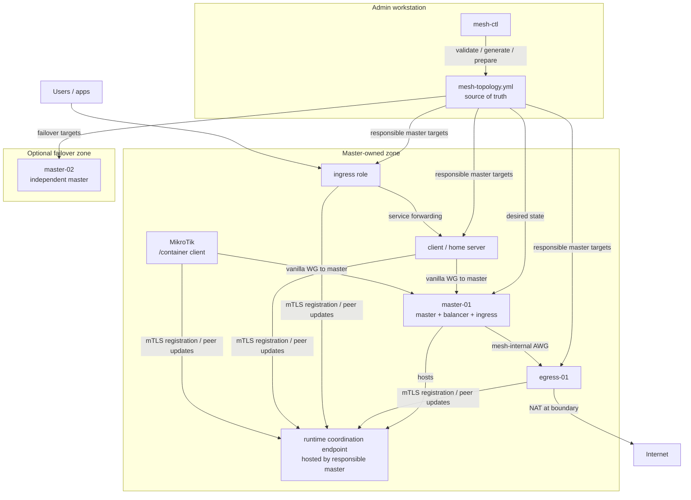

**English** | [Русский](README.ru.md) | [中文](README.zh-CN.md)

[](https://github.com/coonfuuseed-paandaa/awg-mesh/actions/workflows/build.yml)
[](https://github.com/coonfuuseed-paandaa/awg-mesh/releases)
[](https://go.dev/)
[](LICENSE)
[](https://github.com/coonfuuseed-paandaa/awg-mesh/pkgs/container/awg-mesh-node)
[](https://hub.docker.com/r/coonfuuseedpaandaa/awg-mesh-node)

# awg-mesh

Docker-native encrypted overlay mesh network built on AmneziaWG. awg-mesh v2
uses a flat role-tagged topology, master-owned runtime zones, local
backup/restore, MikroTik RouterOS container deployment, and release gates that
prove both code contracts and product behavior before a tag is published.

## Architecture Overview



`mesh-ctl` is the desired-state tool: it reads `mesh-topology.yml`, validates
intent, prepares node material, and drives explicit operator actions. The data
plane runs on `awg-mesh-node` instances. In the current v2.x model, masters own
runtime responsibility for their zones; no standalone daemon is required in the
happy path, and masters do not share runtime state with each other.

The v2 topology file declares nodes once under `nodes:` and gives each node one
or more roles:

| Role | Purpose |
|---|---|
| `client` | End-user device or home server. This role is exclusive. |
| `master` | Accepts client links and bridges them into the mesh. |
| `balancer` | Selects the active egress/mesh path for flows. |
| `egress` | Performs internet-bound masquerade at the boundary. |
| `ingress` | Publishes services from mesh clients to public hostnames or ports. |

Egress, ingress, balancer, and client nodes use the responsible master generated
from topology. Peering every non-client role to every master is a deployment
choice, not a default invariant.

See [docs/architecture/F-009-overview.md](docs/architecture/F-009-overview.md)
for historical F-009 background. The v2.0.1 release path documented here is
the current master-owned-zone contract.

## What's New in v2.0

- **Schema v2 topology** with `schema_version: 2`, role-tagged `nodes:`, and
  service ingress declarations.
- **Role-agnostic CLI**: current onboarding uses `mesh-ctl node prepare`,
  `mesh-ctl node init`, `mesh-ctl node list`, and `mesh-ctl node remove`.
  Legacy `master`, `endpoint`, and `client` role subcommands were removed from
  the v2 operator path.
- **Master-owned coordination** with CA-backed mTLS and local admin
  certificates. Insecure coordination/admin paths are not part of the release
  flow.
- **Local backup/restore** for admin state, topology, and optional
  coordination state archives.
- **MikroTik RouterOS `/container` deployment** through
  `mesh-ctl node prepare --platform mikrotik`. Runtime release validation
  targets RouterOS 7.21+; generator syntax tests also cover 7.16.2 and 7.20.8.
- **Critical suite + product emulation playbook** as release blockers.
  `PRODUCT_WORKS` is required before tagging.
- **Go module v2 path**:
  `github.com/coonfuuseed-paandaa/awg-mesh/v2`.

## Quick Start

This local walkthrough builds the tools, validates the example v2 topology, and
prepares local node credentials. It does not deploy a production mesh by itself;
deployment requires real hosts, Docker, a reachable responsible-master
coordination endpoint, and node-specific firewall rules.

### Prerequisites

- Go 1.25+
- Docker Engine 24+ for image builds and release simulations
- Linux or WSL2 for Bash release gates
- `/dev/net/tun` on hosts that run data-plane containers

### Install mesh-ctl

For the current v2 release line:

```bash
go install github.com/coonfuuseed-paandaa/awg-mesh/v2/cmd/mesh-ctl@v2.0.1
```

For local development from a clone:

```bash
CGO_ENABLED=1 go build -trimpath -o bin/mesh-ctl ./cmd/mesh-ctl
CGO_ENABLED=1 go build -trimpath -o bin/awg-mesh-node ./cmd/awg-mesh-node
```

Add the binary directory to `PATH`, then confirm the version:

```bash
export PATH="$PATH:$(go env GOPATH)/bin"
mesh-ctl version
```

### Create and validate topology

```bash
mkdir -p .mesh-local
cp mesh-topology.example.yml .mesh-local/mesh-topology.yml
mesh-ctl --config-dir .mesh-local --topology mesh-topology.yml topology validate
mesh-ctl --config-dir .mesh-local --topology mesh-topology.yml node list
```

Expected shape:

```text
topology "mesh-topology.yml" valid: schema_version=2 ...
```

### Prepare node material

`node prepare` writes local admin-side state under `--config-dir`:

```bash
mesh-ctl --config-dir .mesh-local --topology mesh-topology.yml node prepare master-01
mesh-ctl --config-dir .mesh-local --topology mesh-topology.yml node prepare home-server-01
```

Generated per-node artifacts include:

```text
.mesh-local/ca.crt
.mesh-local/nodes/<name>/token
.mesh-local/nodes/<name>/mesh.token
.mesh-local/nodes/<name>/node.crt
.mesh-local/nodes/<name>/node.key
```

For MikroTik RouterOS container deployment, embed the reachable responsible
master coordination address. The current CLI flag name remains
`--control-plane` for v2.0.1 compatibility:

```bash
mesh-ctl --config-dir .mesh-local --topology mesh-topology.yml \
  node prepare mikrotik-home \
  --platform mikrotik \
  --control-plane 192.0.2.10:9090 \
  --target-ros 7.21.4
```

The RouterOS compatibility contract is documented in
[docs/MIKROTIK-VERSION-COMPAT.md](docs/MIKROTIK-VERSION-COMPAT.md).

### Register nodes with the responsible master

Start the responsible master node in the deployment environment, then register
prepared nodes against that master's coordination endpoint. The
`--control-plane` flag is the retained compatibility name for this target:

```bash
mesh-ctl --config-dir .mesh-local --topology mesh-topology.yml \
  node init master-01 --control-plane 192.0.2.10:9090

mesh-ctl --config-dir .mesh-local --topology mesh-topology.yml \
  node init home-server-01 --control-plane 192.0.2.10:9090
```

`node init` uses the local CA and prepared node certificate. A rejected
registration is a deployment blocker, not a warning.

## Topology Example

Minimal v2 topology:

```yaml
schema_version: 2

mesh:
  name: example-mesh
  overlay_supernet: 172.21.92.0/24
  tenants: [default]

nodes:
  - name: master-01
    roles: [master, balancer, egress, ingress]
    overlay_ip: 172.21.92.2
    bridge_ip: 192.168.93.10
    public_ip: 203.0.113.10
    region: eu
    internet_iface: eth0

  - name: home-server-01
    roles: [client]
    overlay_ip: 172.21.92.130
    region: home
    preferred_master: master-01

services:
  - name: jellyfin
    owner_node: home-server-01
    protocol: tcp
    local_port: 8096
    tenant: default
    ingress:
      - hostname: media.example.com
        mode: sni_passthrough
        ingress_node: master-01
```

Use [mesh-topology.example.yml](mesh-topology.example.yml) as the maintained
starting point.

## Docker Images

Release images are published to both GHCR and Docker Hub.

```text
ghcr.io/coonfuuseed-paandaa/awg-mesh-node:v2.0.1
ghcr.io/coonfuuseed-paandaa/awg-mesh-client:v2.0.1
ghcr.io/coonfuuseed-paandaa/awg-mesh:v2.0.1          # GHCR-only legacy node alias

docker.io/coonfuuseedpaandaa/awg-mesh-node:v2.0.1
docker.io/coonfuuseedpaandaa/awg-mesh-client:v2.0.1
```

The CI workflow publishes multi-arch manifests for:

```text
linux/amd64
linux/386
linux/arm64
linux/arm/v7
linux/arm/v6
```

On a release tag, the workflow publishes `vX.Y.Z`, `X.Y.Z`, `X.Y`, `X`, and
commit-SHA tags where the major alias is enabled for non-v0 releases. For
production, pin `:vX.Y.Z`; use `:latest` only for preview environments.

## Commands

### Topology

```bash
mesh-ctl --config-dir .mesh-local --topology mesh-topology.yml topology validate
mesh-ctl --config-dir .mesh-local --topology mesh-topology.yml topology validate --output json
mesh-ctl --config-dir .mesh-local --topology mesh-topology.yml topology generate-prometheus-config
mesh-ctl migrate --from old-v1-topology.yml --to mesh-topology.yml
```

### Node lifecycle

The `--control-plane` flag name is retained for v2.0.1 CLI compatibility. In
the current master-owned-zone model, pass the responsible master coordination
address.

```bash
mesh-ctl --config-dir .mesh-local --topology mesh-topology.yml node list
mesh-ctl --config-dir .mesh-local --topology mesh-topology.yml node prepare <name>
mesh-ctl --config-dir .mesh-local --topology mesh-topology.yml node init <name> --control-plane <host:port>
mesh-ctl --config-dir .mesh-local --topology mesh-topology.yml node remove <name> --control-plane <host:port>
```

### Backup and restore

```bash
mesh-ctl --topology mesh-topology.yml --config-dir ~/.mesh-ctl backup awg-mesh-backup.zip
mesh-ctl --topology restored-topology.yml --config-dir ~/.mesh-ctl-restored restore awg-mesh-backup.zip --confirm
```

### Upgrade planning

```bash
mesh-ctl --config-dir .mesh-local --topology mesh-topology.yml upgrade v2.0.1 --dry-run
mesh-ctl upgrade status
mesh-ctl upgrade pause
mesh-ctl upgrade resume
```

v2 upgrade execution is intentionally blocked until the v2 deploy executor
ships. Current upgrade support is a plan/state-management surface, not an
automatic production rollout.

### Rotation and audit

Mesh-wide rotation and audit queries target the responsible master coordination
endpoint. The flag name remains `--control-plane` for compatibility with the
v2.0.0 command surface.

```bash
mesh-ctl rotate --mesh-wide --tier 1 --control-plane <host:port>
mesh-ctl rotate --mesh-wide --tier 2 --control-plane <host:port>
mesh-ctl rotate --mesh-wide --tier 3 --control-plane <host:port>
mesh-ctl audit-log query --control-plane <host:port>
```

The older endpoint-targeted rotation flags remain for legacy paths.

## Compatibility and Future Management Plane

`awg-mesh-node --mode control-plane` remains a v2.0.1 compatibility/deprecated
surface for deployments that adopted the v2.0.0 standalone path. It is not the
current Quick Start path, not required by customer-mode release gates, and not a
replacement for `mesh-ctl` as the desired-state tool.

A broader management plane and WebUI may be designed later for large
installations. That future layer is separate from the current data-plane runtime
model and must not introduce master-to-master gossip, consensus, or shared
state into the v2.x happy path.

## Release Gates

Every release must pass the automated critical suite, product emulation
playbook, Docker builds, and RouterOS CHR gates before the tag is published.

```bash
CGO_ENABLED=1 go test -race -count=1 ./...
docker build -t awg-mesh-node:local -f deploy/Dockerfile.node .
docker build -t awg-mesh-client:local -f deploy/Dockerfile.client .
bash tests/critical/run-all.sh --strict
bash tests/simulation/F-009-CR-001-foundation-smoke.sh
bash tests/emulation-playbook/run.sh
BUILDX_BUILDER=default bash tests/simulation/mikrotik-chr-baseline-runtime.sh
BUILDX_BUILDER=default bash tests/simulation/mikrotik-version-matrix.sh
```

The release is not complete until the annotated git tag exists on origin and
both GHCR and Docker Hub expose matching `:vX.Y.Z` image tags. See
[AGENTS.md](AGENTS.md) for the full release policy.

## Documentation Map

| Document | Purpose |
|---|---|
| [docs/PRODUCTION-TESTING-PLAYBOOK.md](docs/PRODUCTION-TESTING-PLAYBOOK.md) | Customer-mode product walkthrough. |
| [docs/MIKROTIK-VERSION-COMPAT.md](docs/MIKROTIK-VERSION-COMPAT.md) | RouterOS generator/runtime compatibility. |
| [docs/MIGRATION.md](docs/MIGRATION.md) | v1.x to v2 migration guidance. |
| [docs/OPERATOR_FAQ.md](docs/OPERATOR_FAQ.md) | Operator details for tokens, backups, and state files. |
| [docs/adr/README.md](docs/adr/README.md) | Architecture decision records. |

## Development

Build:

```bash
CGO_ENABLED=1 go build -trimpath -o bin/awg-mesh-node ./cmd/awg-mesh-node
CGO_ENABLED=1 go build -trimpath -o bin/mesh-ctl ./cmd/mesh-ctl
```

Test:

```bash
CGO_ENABLED=1 go test -race -count=1 ./...
go run github.com/golangci/golangci-lint/v2/cmd/golangci-lint@v2.11.4 run ./...
```

Regenerate protobuf files after editing `proto/*.proto`:

```bash
protoc --proto_path=proto \
  --go_out=. --go_opt=module=github.com/coonfuuseed-paandaa/awg-mesh/v2 \
  --go-grpc_out=. --go-grpc_opt=module=github.com/coonfuuseed-paandaa/awg-mesh/v2 \
  proto/*.proto
```

## License

MIT. See [LICENSE](LICENSE).
