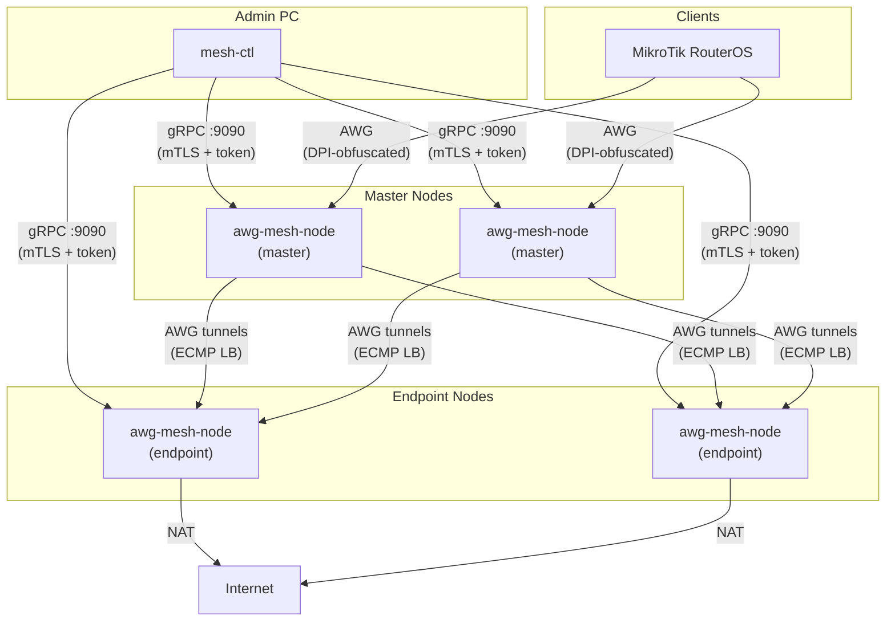

[](https://github.com/thebtf/awg-mesh/actions/workflows/build.yml)
[](https://go.dev/)
[](LICENSE)
[](https://ghcr.io/thebtf/awg-mesh)

# awg-mesh

Docker-native encrypted overlay mesh network built on AmneziaWG — WireGuard with DPI obfuscation, topology-as-code, and zero-touch onboarding.

## Architecture



## Features

**Network**
- AmneziaWG overlay mesh with anti-DPI obfuscation (WireGuard fork)
- Two-level ECMP load balancing with sticky sessions
- Health-checked failover across masters and endpoints
- Configurable overlay IP addressing

**Operations**
- Topology-as-code: single `mesh-topology.yml` as source of truth
- Three-step onboarding: `prepare` → `deploy` → `init`
- MikroTik RouterOS `.rsc` script generation for client provisioning
- Single 42 MB Alpine Docker image — no sidecar containers

**Security**
- gRPC management plane with mTLS + bearer token dual authentication
- Dynamic certificate hot-reload without service restart
- Three-tier AWG parameter rotation (junk params / S-H headers / keypair)
- Protocol family mimicry via gopacket TLS/QUIC traffic capture

**Observability**
- Prometheus metrics on `:9091`
- Structured JSON logging with configurable log level
- Per-node status reporting via `mesh-ctl status`

## Quick Start

**1. Pull the image**

```bash
docker pull ghcr.io/thebtf/awg-mesh:latest
```

**2. Create your topology file**

```bash
cp mesh-topology.example.yml mesh-topology.yml
# edit mesh-topology.yml to match your infrastructure
```

**3. Prepare node configurations**

```bash
mesh-ctl master prepare --name master-01
mesh-ctl endpoint prepare --name endpoint-eu
```

**4. Deploy and initialize nodes**

```bash
# deploy docker-compose or generated configs to each host
mesh-ctl master init --name master-01
mesh-ctl endpoint init --name endpoint-eu
```

**5. Verify the mesh**

```bash
mesh-ctl status
```

## Topology Configuration

`mesh-topology.yml` is the single source of truth for the entire mesh state.

```yaml
mesh:
  name: prod-mesh
  overlay_subnet: 10.100.0.0/16

masters:
  - name: master-01
    host: 203.0.113.10
    listen_port: 51820
    overlay_ip: 10.100.0.1/16
    grpc_addr: 203.0.113.10:9090

  - name: master-02
    host: 203.0.113.11
    listen_port: 51820
    overlay_ip: 10.100.0.2/16
    grpc_addr: 203.0.113.11:9090

endpoints:
  - name: endpoint-eu
    host: 198.51.100.20
    listen_port: 51820
    overlay_ip: 10.100.1.1/16
    grpc_addr: 198.51.100.20:9090

  - name: endpoint-us
    host: 198.51.100.21
    listen_port: 51820
    overlay_ip: 10.100.1.2/16
    grpc_addr: 198.51.100.21:9090

clients:
  - name: mikrotik-office
    type: mikrotik
    masters:
      - master-01
      - master-02
    overlay_ip: 10.100.2.1/16
```

## Node Modes

All modes run from the same binary: `awg-mesh-node`.

| Mode | Role | Key Responsibilities |
|------|------|----------------------|
| `master` | Ingress + routing | Accepts client connections, maintains N AWG tunnels to endpoints, ECMP load balancing, healthcheck, traffic capture |
| `endpoint` | Egress + NAT | AWG server accepting tunnels from masters, NAT to internet, overlay IP assignment |
| `client` | Leaf node | Tunnels to masters, overlay routing, MikroTik `.rsc` generation |

**Common flags**

```
--mode          string   Node operating mode: master|endpoint|client (required)
--name          string   Node name matching topology entry (required)
--overlay-ip    string   Overlay network CIDR for this node
--listen-port   int      AWG listen port (default: 51820)
--config-dir    string   Directory for keys, certs, and runtime state (default: /etc/awg-mesh)
--topology      string   Path to mesh-topology.yml (default: /etc/awg-mesh/mesh-topology.yml)
--log-level     string   Logging verbosity: debug|info|warn|error (default: info)
--metrics-addr  string   Prometheus metrics listen address (default: :9091)
```

**Docker example**

```bash
docker run -d \
  --name awg-mesh-master \
  --cap-add NET_ADMIN \
  --cap-add NET_RAW \
  -v /etc/awg-mesh:/etc/awg-mesh \
  -p 51820:51820/udp \
  -p 9090:9090 \
  -p 9091:9091 \
  ghcr.io/thebtf/awg-mesh:latest \
  --mode master \
  --name master-01
```

## CLI Reference

`mesh-ctl` manages the mesh topology from an admin workstation over gRPC.

### Node Lifecycle

```bash
# Master node
mesh-ctl master prepare --name <name>   # generate keys, certs, compose config
mesh-ctl master init    --name <name>   # connect and activate the node
mesh-ctl master remove  --name <name>   # gracefully decommission

# Endpoint node
mesh-ctl endpoint prepare --name <name>
mesh-ctl endpoint init    --name <name>
mesh-ctl endpoint remove  --name <name>

# Client node
mesh-ctl client prepare --name <name>   # generate config + MikroTik .rsc
mesh-ctl client init    --name <name>
mesh-ctl client remove  --name <name>
```

### Status and Monitoring

```bash
mesh-ctl status                         # mesh-wide status table
mesh-ctl status --node <name>           # single node detail
```

### Token Management

```bash
mesh-ctl token rotate                   # rotate bearer tokens on all nodes
mesh-ctl token rotate --node <name>     # rotate on a specific node
```

### AWG Parameter Rotation

```bash
mesh-ctl rotate --tier 1                # rotate junk header parameters
mesh-ctl rotate --tier 2                # rotate S/H obfuscation headers
mesh-ctl rotate --tier 3                # full keypair rotation
mesh-ctl rotate --tier 3 --node <name> # keypair rotation on one node
```

### Traffic Capture (Protocol Mimicry)

```bash
mesh-ctl capture refresh                # refresh live TLS/QUIC fingerprint capture
mesh-ctl capture schedule --cron "0 4 * * *"  # schedule automatic refresh
mesh-ctl capture domains --list         # show domains used for fingerprinting
```

### Overlay IP Management

```bash
mesh-ctl ip list                        # list all assigned overlay IPs
mesh-ctl ip range --set 10.100.0.0/16  # configure overlay address range
```

### Utility

```bash
mesh-ctl version                        # show client and connected node versions
```

## Security

**Transport and authentication**

The gRPC management plane on `:9090` requires both mTLS and a bearer token. A connection is rejected if either credential is missing or invalid.

- **mTLS**: each node holds a unique certificate signed by the mesh CA. `mesh-ctl prepare` issues node certs automatically. Certificates are hot-reloaded on SIGHUP — no restart required.
- **Bearer token**: rotated independently from TLS certs. Use `mesh-ctl token rotate` to issue new tokens without disrupting data-plane tunnels.

**AWG parameter rotation**

AmneziaWG extends WireGuard with obfuscation fields that make traffic unidentifiable to DPI systems. `awg-mesh` automates rotation across three tiers:

| Tier | What rotates | Impact |
|------|-------------|--------|
| 1 | Junk packet count / sizes | Minimal — no tunnel restart |
| 2 | S1/H1/S2/H2 header bytes | Brief re-handshake |
| 3 | WireGuard keypair | Full tunnel re-establishment |

Schedule rotation with `mesh-ctl rotate` or configure automatic schedules per tier in `mesh-topology.yml`.

**Protocol mimicry**

Masters run a gopacket-based capture loop that samples real TLS ClientHello and QUIC Initial packets from configured domains. Captured fingerprints are applied to AWG obfuscation parameters, making tunnel traffic statistically resemble ordinary HTTPS/QUIC flows.

## Observability

**Prometheus metrics**

Each node exposes metrics on `:9091/metrics`.

Key metrics:

| Metric | Description |
|--------|-------------|
| `awgmesh_tunnel_up` | AWG tunnel health (0/1) per peer |
| `awgmesh_tunnel_rx_bytes_total` | Bytes received per tunnel |
| `awgmesh_tunnel_tx_bytes_total` | Bytes transmitted per tunnel |
| `awgmesh_ecmp_active_paths` | Active ECMP paths per master |
| `awgmesh_rotation_total` | AWG rotation events by tier |
| `awgmesh_grpc_requests_total` | gRPC request count by method and status |
| `awgmesh_healthcheck_failures_total` | Endpoint healthcheck failure count |

**Logging**

All components log structured JSON to stdout. Set `--log-level debug` for full tunnel negotiation traces. Pipe to your log aggregator (Loki, CloudWatch, Datadog) via standard Docker log drivers.

```bash
# Follow logs for a specific node
docker logs -f awg-mesh-master | jq 'select(.level == "error")'
```

## Development

**Prerequisites**

- Go 1.25+
- Docker (for integration tests)
- `golangci-lint` v2

**Build**

```bash
# Local binary
go build -o bin/awg-mesh-node ./cmd/awg-mesh-node
go build -o bin/mesh-ctl      ./cmd/mesh-ctl

# Static binary (matches Docker image)
CGO_ENABLED=0 GOOS=linux GOARCH=amd64 \
  go build -ldflags="-s -w" -o bin/awg-mesh-node ./cmd/awg-mesh-node

# Docker image
docker build -t awg-mesh:dev .
```

**Test**

```bash
go test ./...                    # unit tests
go test -tags integration ./...  # unit + integration tests
go test -race ./...              # race detector
```

**Lint**

```bash
golangci-lint run ./...
```

**CI pipeline**

GitHub Actions runs on every push and pull request:

```
lint → test → build → docker
```

- `lint`: golangci-lint with project config
- `test`: unit tests with race detector
- `build`: static binaries for linux/amd64 and linux/arm64
- `docker`: multi-arch image pushed to `ghcr.io/thebtf/awg-mesh`

Dependencies are managed by Dependabot — Go modules updated weekly, GitHub Actions updated monthly.

## License

MIT — see [LICENSE](LICENSE).
