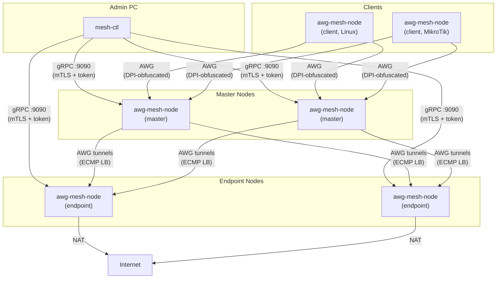

[](https://github.com/thebtf/awg-mesh/actions/workflows/build.yml)
[](https://go.dev/)
[](LICENSE)
[](https://ghcr.io/thebtf/awg-mesh)

🌐 English | [Русский](README.ru.md)

# awg-mesh

Docker-native encrypted overlay mesh network built on AmneziaWG — WireGuard with DPI obfuscation, topology-as-code, and zero-touch onboarding.

## Architecture



## Overview

awg-mesh is a self-hosted encrypted overlay network for teams that need reliable, censorship-resistant connectivity across multiple regions. It is built on [AmneziaWG](https://github.com/amnezia-vpn/amneziawg-go) — a WireGuard fork that adds protocol obfuscation to defeat deep packet inspection — and runs entirely in Docker containers with no external dependencies.

The system replaces ad-hoc WireGuard configurations and manual peer management with a declarative topology file and a CLI control plane. You describe your desired mesh in a single YAML file, run three commands, and the network comes up. Key exchange, certificate provisioning, tunnel establishment, and load balancer configuration are all automated.

Traffic routing follows a two-level ECMP model: clients connect to a pool of master nodes (ingress), each master maintains AWG tunnels to a pool of endpoint nodes (egress), and traffic is distributed across available paths with sticky sessions and health-checked failover. This design provides horizontal scalability on both the ingress and egress layers without a central routing bottleneck.

## Features

**Network**
- AmneziaWG overlay mesh with anti-DPI obfuscation (WireGuard fork)
- Two-level ECMP load balancing with sticky sessions
- Health-checked failover across masters and endpoints
- Configurable overlay IP addressing with per-role CIDR ranges

**Operations**
- Topology-as-code: single `mesh-topology.yml` as source of truth
- Three-step onboarding: `prepare` → `deploy` → `init`
- MikroTik RouterOS `.rsc` script generation for client provisioning
- Single 42 MB Alpine Docker image — no sidecar containers

**Security**
- gRPC management plane with mTLS + bearer token dual authentication
- Dynamic certificate hot-reload without service restart
- Three-tier AWG parameter rotation (junk params / S-H headers / keypair)
- Protocol family mimicry via gopacket TLS/QUIC traffic capture

**Observability**
- Prometheus metrics on `:9091`
- Structured JSON logging with configurable log level
- Per-node status reporting via `mesh-ctl status`

## Getting Started

This section walks through deploying a mesh from scratch: two masters in Russia, four endpoints across Kazakhstan and Poland, and two clients.

### Prerequisites

**On each host that will run a mesh node:**
- Docker Engine 24+ (or Docker Desktop)
- Linux kernel with `/dev/net/tun` available (standard on all modern distros)
- Outbound UDP 51820 and TCP 9090 reachable from your admin machine

**On your admin machine:**
- Go 1.24+ (to build `mesh-ctl`)
- Network access to port 9090 on every node host

### Step 1: Install mesh-ctl

`mesh-ctl` is the CLI you run from your admin workstation to manage the mesh. It does not run on nodes.

**Public repository:**

```bash
go install github.com/thebtf/awg-mesh/cmd/mesh-ctl@latest
```

The binary is placed in `$GOPATH/bin` (usually `~/go/bin`). Make sure it is in your `PATH`:

```bash
export PATH=$PATH:$(go env GOPATH)/bin
```

**Private repository** (requires Git SSH access):

```bash
git clone git@github.com:thebtf/awg-mesh.git
cd awg-mesh
make install    # Linux/macOS
# Windows (PowerShell):
go install -trimpath -ldflags "-X main.version=$(git describe --tags --always) -s -w" ./cmd/mesh-ctl
```

Verify:

```bash
mesh-ctl version
```

On first use, `mesh-ctl` creates its state directory at **`~/.mesh-ctl/`** automatically. This directory holds the mesh CA, per-node tokens, and public keys. You can check the current state at any time:

```bash
mesh-ctl config show
```

### Step 2: Create your topology file

Create `mesh-topology.yml` in your working directory. You can start from the [example in the repository](mesh-topology.example.yml) or write one from scratch.

If you cloned the repo:

```bash
cp mesh-topology.example.yml mesh-topology.yml
```

Otherwise, create the file manually. A minimal topology for two masters, two endpoints, and one client:

```yaml
overlay:
  space: 172.20.70.0/24
  physical_mtu: 1500
  awg_overhead: 80
  ranges:
    - name: masters
      cidr: 172.20.70.0/27
      balancer_ip: 172.20.70.1
    - name: endpoints
      cidr: 172.20.70.32/27
      balancer_ip: 172.20.70.33
    - name: clients
      cidr: 172.20.70.128/25

masters:
  - name: ru-master-01
    host: 185.10.20.30
    overlay_ip: 172.20.70.2
    listen_port: 51820
    endpoints:
      - kz-01
      - pl-01
  - name: ru-master-02
    host: 185.10.20.31
    overlay_ip: 172.20.70.3
    listen_port: 51820
    endpoints:
      - kz-01
      - pl-01

endpoints:
  - name: kz-01
    host: 195.200.100.10
    overlay_ip: 172.20.70.34
    listen_port: 51820
    region: kz
  - name: pl-01
    host: 91.200.50.100
    overlay_ip: 172.20.70.37
    listen_port: 51820
    region: pl

clients:
  - name: branch-router
    type: mikrotik
    overlay_ip: 172.20.70.131
    masters:
      - ru-master-01
      - ru-master-02

capture:
  domains_file: /config/domains.txt
  schedule: "0 3 * * *"
  retention_days: 30

rotation:
  defaults:
    tier1_interval: 24h
    tier2_interval: 168h
    tier3_interval: 720h
    preset: aggressive
```

### Step 3: Prepare nodes

Run `prepare` for each node. This generates AWG keypairs, mTLS certificates, a bearer token, and a Docker Compose service snippet for that node:

```bash
# Prepare all masters
mesh-ctl -t mesh-topology.yml master prepare --name ru-master-01
mesh-ctl -t mesh-topology.yml master prepare --name ru-master-02

# Prepare all endpoints
mesh-ctl -t mesh-topology.yml endpoint prepare --name kz-01
mesh-ctl -t mesh-topology.yml endpoint prepare --name pl-01

# Prepare clients (also generates MikroTik .rsc if type: mikrotik)
mesh-ctl -t mesh-topology.yml client prepare --name branch-router
```

After `prepare`, each node's generated files are stored in `~/.mesh-ctl/<node-name>/`. The compose snippet is at `~/.mesh-ctl/<node-name>/docker-compose.snippet.yml`.

### Step 4: Deploy to hosts

The generated compose snippet is **not** a standalone compose file. It defines the `awg-mesh-node` service as it should appear inside your existing infrastructure's compose file. Copy the snippet to the target host and integrate it.

**Transfer the config and compose snippet to the host:**

```bash
# Create the config directory on the host (default mount path)
ssh user@185.10.20.30 'sudo mkdir -p /srv/awg-mesh && sudo chown $USER /srv/awg-mesh'

# Copy generated node config (keys, certs, token, topology)
scp -r ~/.mesh-ctl/ru-master-01/config/ user@185.10.20.30:/srv/awg-mesh/

# Copy the compose snippet for reference
scp ~/.mesh-ctl/ru-master-01/docker-compose.snippet.yml user@185.10.20.30:~/
```

**On the host, open your existing `docker-compose.yml` and add the `awg-mesh-node` service.** For example, if your infrastructure compose looks like this:

```yaml
# /home/user/infra/docker-compose.yml  (existing file)
services:
  nginx:
    image: nginx:alpine
    ports:
      - "80:80"
      - "443:443"

  app:
    image: myapp:latest
    depends_on:
      - postgres

  postgres:
    image: postgres:16
    volumes:
      - pgdata:/var/lib/postgresql/data

volumes:
  pgdata:
```

Add the mesh node service by merging in the snippet:

```yaml
# /home/user/infra/docker-compose.yml  (after adding awg-mesh-node)
services:
  nginx:
    image: nginx:alpine
    ports:
      - "80:80"
      - "443:443"

  app:
    image: myapp:latest
    depends_on:
      - postgres

  postgres:
    image: postgres:16
    volumes:
      - pgdata:/var/lib/postgresql/data

  # --- awg-mesh-node (from mesh-ctl prepare) ---
  awg-mesh-node:
    image: ghcr.io/thebtf/awg-mesh:latest
    restart: unless-stopped
    cap_add:
      - NET_ADMIN
      - NET_RAW
    devices:
      - /dev/net/tun:/dev/net/tun
    volumes:
      - /srv/awg-mesh:/config
    ports:
      - "51820:51820/udp"
      - "9090:9090"
      - "9091:9091"
    command:
      - --mode=master
      - --name=ru-master-01
      - --topology=/config/mesh-topology.yml

volumes:
  pgdata:
```

Pull the image and bring up the new service without restarting existing containers:

```bash
ssh user@185.10.20.30 'cd ~/infra && docker compose pull awg-mesh-node && docker compose up -d awg-mesh-node'
```

Repeat for every node host.

### Step 5: Initialize the mesh

Once all containers are running and port 9090 is reachable, run `init` for each node. This connects over gRPC, verifies mTLS + token auth, exchanges peer configurations, and brings up the AWG tunnels:

```bash
mesh-ctl -t mesh-topology.yml master init --name ru-master-01
mesh-ctl -t mesh-topology.yml master init --name ru-master-02
mesh-ctl -t mesh-topology.yml endpoint init --name kz-01
mesh-ctl -t mesh-topology.yml endpoint init --name pl-01
mesh-ctl -t mesh-topology.yml client init --name branch-router
```

### Step 6: Verify

```bash
# Check all nodes
mesh-ctl -t mesh-topology.yml status

# Check a specific node in detail
mesh-ctl -t mesh-topology.yml status --node ru-master-01
```

A healthy mesh shows all tunnels up, ECMP paths active, and no healthcheck failures.

## Deployment

### Docker image

```
ghcr.io/thebtf/awg-mesh:latest
```

- Size: ~42 MB (Alpine base, static Go binary)
- Architectures: `linux/amd64`, `linux/arm64`
- No external runtime dependencies

### Volume mount

The container expects its configuration at `/config`. Map this to `/srv/awg-mesh` on the host (the default):

```
/srv/awg-mesh  →  /config  (inside container)
```

The config directory must contain:
- `mesh-topology.yml` — the topology file
- `node.key`, `node.pub` — AWG keypair
- `node.crt`, `node.key.pem`, `ca.crt` — mTLS certificates
- `token` — bearer token for gRPC auth

`mesh-ctl prepare` generates all of these. Copy them to `/srv/awg-mesh/` before starting the container.

### Integrating into existing docker-compose

The compose snippet from `mesh-ctl prepare` is a starting point, not a standalone file. The intended workflow is:

1. `mesh-ctl prepare` generates a service block for your node
2. You copy that service block into your existing infrastructure `docker-compose.yml`
3. You run `docker compose up -d awg-mesh-node` alongside your other services

This keeps awg-mesh-node on the same Docker network as your application containers and avoids managing a separate compose file per host.

**Minimal service definition** (what you add to your existing compose):

```yaml
services:
  awg-mesh-node:
    image: ghcr.io/thebtf/awg-mesh:latest
    restart: unless-stopped
    cap_add:
      - NET_ADMIN
      - NET_RAW
    devices:
      - /dev/net/tun:/dev/net/tun
    volumes:
      - /srv/awg-mesh:/config
    ports:
      - "51820:51820/udp"   # AWG data plane
      - "9090:9090"          # gRPC management
      - "9091:9091"          # Prometheus metrics
    command:
      - --mode=master         # or endpoint / client
      - --name=ru-master-01  # must match topology entry
      - --topology=/config/mesh-topology.yml
```

### Ports

| Port | Protocol | Purpose |
|------|----------|---------|
| 51820 | UDP | AmneziaWG data plane (peer tunnels) |
| 9090 | TCP | gRPC management (mTLS + token auth) |
| 9091 | TCP | Prometheus metrics |

Port 51820 must be reachable between nodes (masters ↔ endpoints, clients → masters).
Port 9090 must be reachable from your admin machine running `mesh-ctl`.

### Required capabilities

The container needs Linux capabilities to manage network interfaces:

| Capability | Reason |
|-----------|--------|
| `NET_ADMIN` | Create and configure WireGuard/AWG interfaces |
| `NET_RAW` | gopacket traffic capture for protocol mimicry |
| `/dev/net/tun` | TUN device for overlay network interface |

### Systemd integration (optional)

If you want the compose stack to start on boot without Docker Desktop, create a systemd unit:

```ini
# /etc/systemd/system/infra.service
[Unit]
Description=Infrastructure docker-compose stack
After=docker.service
Requires=docker.service

[Service]
Type=oneshot
RemainAfterExit=yes
WorkingDirectory=/home/user/infra
ExecStart=/usr/bin/docker compose up -d
ExecStop=/usr/bin/docker compose down
TimeoutStartSec=0

[Install]
WantedBy=multi-user.target
```

```bash
sudo systemctl enable --now infra.service
```

## Updating

### Updating mesh-ctl

**Public repository:**

```bash
go install github.com/thebtf/awg-mesh/cmd/mesh-ctl@latest
```

**From local clone:**

```bash
cd awg-mesh
git pull
make install    # Linux/macOS
# Windows (PowerShell):
go install -trimpath -ldflags "-X main.version=$(git describe --tags --always) -s -w" ./cmd/mesh-ctl
```

Your `~/.mesh-ctl/` state (CA, tokens, node keys) is not affected by updates.

### Updating nodes

Pull the new image and restart the container. AWG tunnels will briefly reconnect (~2-5s):

```bash
# On each node host:
docker pull ghcr.io/thebtf/awg-mesh:latest
docker compose restart awg-mesh-node
```

Or with zero-downtime on multi-master setups — update one master at a time:

```bash
# Master 1 (MikroTik ECMP keeps traffic flowing through Master 2):
ssh master-01 'docker pull ghcr.io/thebtf/awg-mesh:latest && docker compose restart awg-mesh-node'
# Wait for Master 1 to come back:
mesh-ctl status
# Then Master 2:
ssh master-02 'docker pull ghcr.io/thebtf/awg-mesh:latest && docker compose restart awg-mesh-node'
```

Configuration at `/srv/awg-mesh` persists across restarts. TLS certificates, keypairs, and tokens are preserved.

### Version pinning

To pin a specific version instead of `latest`:

```yaml
services:
  awg-mesh-node:
    image: ghcr.io/thebtf/awg-mesh:v0.1.0   # pin to release tag
```

Available tags:
- `latest` — most recent build from master
- `v0.1.0` — release tag (recommended for production)
- `<commit-sha>` — specific commit (for debugging)

## Topology Configuration

`mesh-topology.yml` is the single source of truth for the entire mesh. All `mesh-ctl` commands read from this file.

### overlay

Global network parameters:

```yaml
overlay:
  space: 172.20.70.0/24      # total address space for the overlay network
  physical_mtu: 1500          # MTU of the physical network (typical: 1500)
  awg_overhead: 80            # bytes of overhead added by AWG encapsulation
  ranges:
    - name: masters           # label for this range (informational)
      cidr: 172.20.70.0/27   # address range assigned to master nodes
      balancer_ip: 172.20.70.1  # virtual IP for ECMP load balancer
    - name: endpoints
      cidr: 172.20.70.32/27
      balancer_ip: 172.20.70.33
    - name: clients
      cidr: 172.20.70.128/25  # no balancer_ip for leaf nodes
```

The overlay MTU is computed as `physical_mtu - awg_overhead`. Set `physical_mtu` to your physical link's MTU; `awg_overhead` accounts for AWG headers, UDP, and IP encapsulation.

### masters

Nodes that accept client connections and forward traffic to endpoints:

```yaml
masters:
  - name: ru-master-01        # unique name, used in all mesh-ctl commands
    host: 185.10.20.30        # public IP of the host running this node
    overlay_ip: 172.20.70.2   # assigned overlay IP (from masters.cidr range)
    listen_port: 51820         # AWG listen port
    endpoints:                 # which endpoint nodes this master connects to
      - kz-01
      - kz-02
      - pl-01
```

### endpoints

Egress nodes that provide NAT to the internet:

```yaml
endpoints:
  - name: kz-01
    host: 195.200.100.10
    overlay_ip: 172.20.70.34
    listen_port: 51820
    region: kz               # optional region tag for grouping
```

### clients

Leaf nodes that connect to masters:

```yaml
clients:
  - name: branch-router
    type: mikrotik            # linux | mikrotik
    overlay_ip: 172.20.70.131
    masters:
      - ru-master-01          # which masters this client connects to
      - ru-master-02
```

For `type: mikrotik`, `mesh-ctl client prepare` generates a `.rsc` script ready to import on the RouterOS device.

### capture

Controls the protocol mimicry subsystem (master nodes only):

```yaml
capture:
  domains_file: /config/domains.txt  # list of domains to sample TLS/QUIC from
  schedule: "0 3 * * *"              # cron: refresh fingerprints daily at 3am
  retention_days: 30                 # how long to keep captured fingerprint data
```

### rotation

AWG parameter rotation schedule:

```yaml
rotation:
  defaults:
    tier1_interval: 24h     # rotate junk packet parameters every 24h
    tier2_interval: 168h    # rotate S/H obfuscation headers weekly
    tier3_interval: 720h    # full keypair rotation monthly
    preset: aggressive      # obfuscation parameter preset
```

## Node Modes

All modes run from the same binary: `awg-mesh-node`. The mode is selected with `--mode`.

| Mode | Role | Key Responsibilities |
|------|------|----------------------|
| `master` | Ingress + routing | Accepts client connections, maintains AWG tunnels to endpoints, ECMP load balancing, healthcheck, traffic capture |
| `endpoint` | Egress + NAT | AWG server accepting tunnels from masters, NAT to internet, overlay IP assignment |
| `client` | Leaf node | Tunnels to masters, overlay routing, MikroTik `.rsc` generation |

**Binary flags**

```
--mode          string   Node operating mode: master|endpoint|client (required)
--name          string   Node name matching topology entry (required)
--config-dir    string   Directory for keys, certs, and runtime state (default: /config)
--topology      string   Path to mesh-topology.yml (no default — pass explicitly or omit to receive config via gRPC Init)
--log-level     string   Logging verbosity: debug|info|warn|error (default: info)
--metrics-addr  string   Prometheus metrics listen address (default: :9091)
```

## CLI Reference

`mesh-ctl` runs on your admin workstation and communicates with nodes over gRPC.

**Global flags:**

```
-t, --topology string    Path to mesh-topology.yml (default: mesh-topology.yml)
    --config-dir string  mesh-ctl state directory: certs, tokens, session data (default: ~/.mesh-ctl)
```

### Node Lifecycle

```bash
# Master node
mesh-ctl master prepare --name <name>   # generate keys, certs, token, compose snippet
mesh-ctl master init    --name <name>   # connect via gRPC and activate the node
mesh-ctl master remove  --name <name>   # gracefully decommission

# Endpoint node
mesh-ctl endpoint prepare --name <name>
mesh-ctl endpoint init    --name <name>
mesh-ctl endpoint remove  --name <name>

# Client node
mesh-ctl client prepare --name <name>   # generate config + MikroTik .rsc (if applicable)
mesh-ctl client init    --name <name>
mesh-ctl client remove  --name <name>
```

### Status and Monitoring

```bash
mesh-ctl status                         # mesh-wide status table
mesh-ctl status --node <name>           # single node detail
```

### Token Management

```bash
mesh-ctl token rotate                   # rotate bearer tokens on all nodes
mesh-ctl token rotate --node <name>     # rotate on a specific node
```

### AWG Parameter Rotation

```bash
mesh-ctl rotate --tier 1                # rotate junk header parameters
mesh-ctl rotate --tier 2                # rotate S/H obfuscation headers
mesh-ctl rotate --tier 3                # full keypair rotation
mesh-ctl rotate --tier 3 --node <name> # keypair rotation on one node
```

### Traffic Capture (Protocol Mimicry)

```bash
mesh-ctl capture refresh                         # refresh live TLS/QUIC fingerprint capture
mesh-ctl capture schedule --cron "0 4 * * *"    # schedule automatic refresh
mesh-ctl capture domains --list                  # show domains used for fingerprinting
```

### Overlay IP Management

```bash
mesh-ctl ip list                        # list all assigned overlay IPs
mesh-ctl ip range --set 10.100.0.0/16  # configure overlay address range
```

### Utility

```bash
mesh-ctl version                        # show client and connected node versions
```

## Security

### Transport and authentication

The gRPC management plane on `:9090` requires both mTLS and a bearer token. A connection is rejected if either credential is missing or invalid.

- **mTLS**: each node holds a unique certificate signed by the mesh CA. `mesh-ctl prepare` issues node certs automatically. Certificates are hot-reloaded on SIGHUP — no restart required.
- **Bearer token**: rotated independently from TLS certs. Use `mesh-ctl token rotate` to issue new tokens without disrupting data-plane tunnels.

### AWG parameter rotation

AmneziaWG extends WireGuard with obfuscation fields that make traffic unidentifiable to DPI systems. `awg-mesh` automates rotation across three tiers:

| Tier | What rotates | Impact |
|------|-------------|--------|
| 1 | Junk packet count / sizes | Minimal — no tunnel restart |
| 2 | S1/H1/S2/H2 header bytes | Brief re-handshake |
| 3 | WireGuard keypair | Full tunnel re-establishment |

Schedule rotation with `mesh-ctl rotate` or configure automatic schedules per tier in `mesh-topology.yml`.

### Protocol mimicry

Masters run a gopacket-based capture loop that samples real TLS ClientHello and QUIC Initial packets from configured domains. Captured fingerprints are applied to AWG obfuscation parameters, making tunnel traffic statistically resemble ordinary HTTPS/QUIC flows.

## Observability

### Prometheus metrics

Each node exposes metrics on `:9091/metrics`.

| Metric | Description |
|--------|-------------|
| `awgmesh_tunnel_up` | AWG tunnel health (0/1) per peer |
| `awgmesh_tunnel_rx_bytes_total` | Bytes received per tunnel |
| `awgmesh_tunnel_tx_bytes_total` | Bytes transmitted per tunnel |
| `awgmesh_ecmp_active_paths` | Active ECMP paths per master |
| `awgmesh_rotation_total` | AWG rotation events by tier |
| `awgmesh_grpc_requests_total` | gRPC request count by method and status |
| `awgmesh_healthcheck_failures_total` | Endpoint healthcheck failure count |

### Logging

All components log structured JSON to stdout. Set `--log-level debug` for full tunnel negotiation traces. Pipe to your log aggregator (Loki, CloudWatch, Datadog) via standard Docker log drivers.

```bash
# Follow logs for a specific node
docker logs -f awg-mesh-master | jq 'select(.level == "error")'
```

## Development

### Prerequisites

- Go 1.25+
- Docker (for integration tests)
- `golangci-lint` v2

### Build

```bash
# Local binary
go build -o bin/awg-mesh-node ./cmd/awg-mesh-node
go build -o bin/mesh-ctl      ./cmd/mesh-ctl

# Static binary (matches Docker image)
CGO_ENABLED=0 GOOS=linux GOARCH=amd64 \
  go build -ldflags="-s -w" -o bin/awg-mesh-node ./cmd/awg-mesh-node

# Docker image
docker build -t awg-mesh:dev .
```

### Test

```bash
go test ./...                    # unit tests
go test -tags integration ./...  # unit + integration tests
go test -race ./...              # race detector
```

### Lint

```bash
golangci-lint run ./...
```

### CI pipeline

GitHub Actions runs on every push and pull request:

```
lint → test → build → docker
```

- `lint`: golangci-lint with project config
- `test`: unit tests with race detector
- `build`: static binaries for linux/amd64 and linux/arm64
- `docker`: multi-arch image pushed to `ghcr.io/thebtf/awg-mesh`

Dependencies are managed by Dependabot — Go modules updated weekly, GitHub Actions updated monthly.

## License

MIT — see [LICENSE](LICENSE).
