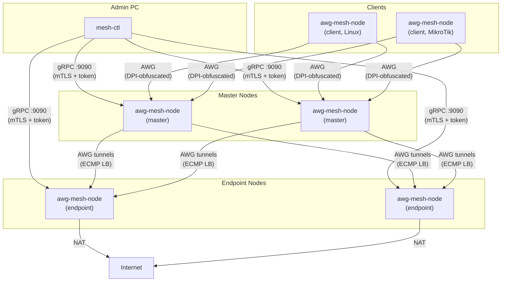

[](https://github.com/thebtf/awg-mesh/actions/workflows/build.yml)
[](https://go.dev/)
[](LICENSE)
[](https://ghcr.io/thebtf/awg-mesh)

🌐 [English](README.md) | Русский

# awg-mesh

Docker-native зашифрованная overlay-сеть на базе AmneziaWG — форк WireGuard с обфускацией DPI, топология как код и автоматический onboarding.

## Архитектура



## Обзор

awg-mesh — это самохостируемая зашифрованная overlay-сеть для команд, которым нужна надёжная, устойчивая к цензуре связь между несколькими регионами. Построена на [AmneziaWG](https://github.com/amnezia-vpn/amneziawg-go) — форке WireGuard с обфускацией протокола для обхода систем глубокой инспекции пакетов (DPI) — и работает полностью в Docker-контейнерах без внешних зависимостей.

Система заменяет ручные WireGuard-конфиги и ручное управление пирами декларативным файлом топологии и CLI-плоскостью управления. Вы описываете нужную сеть в одном YAML-файле, запускаете три команды — сеть поднимается. Обмен ключами, выдача сертификатов, установка туннелей и настройка балансировщика — всё автоматизировано.

Маршрутизация трафика работает по двухуровневой модели ECMP: клиенты подключаются к пулу master-узлов (ingress), каждый master поддерживает AWG-туннели к пулу endpoint-узлов (egress), трафик распределяется по доступным путям с sticky-сессиями и failover по результатам healthcheck. Такая архитектура обеспечивает горизонтальное масштабирование как на ingress-, так и на egress-уровне без центрального узкого места маршрутизации.

## Возможности

**Сеть**
- AmneziaWG overlay-mesh с anti-DPI обфускацией (форк WireGuard)
- Двухуровневая ECMP-балансировка нагрузки со sticky-сессиями
- Health-checked failover по master- и endpoint-узлам
- Настраиваемая адресация overlay-сети с CIDR-диапазонами по ролям

**Эксплуатация**
- Топология как код: единый `mesh-topology.yml` как источник истины
- Трёхшаговый onboarding: `prepare` → `deploy` → `init`
- Генерация `.rsc`-скриптов MikroTik RouterOS для провизии клиентов
- Единый Docker-образ 42 МБ на Alpine — никаких sidecar-контейнеров

**Безопасность**
- Плоскость управления gRPC с двойной аутентификацией mTLS + bearer token
- Горячая перезагрузка сертификатов без перезапуска сервиса
- Трёхуровневая ротация параметров AWG (junk params / S-H headers / keypair)
- Мимикрия протоколов через захват TLS/QUIC трафика с gopacket

**Наблюдаемость**
- Prometheus-метрики на `:9091`
- Структурированное JSON-логирование с настраиваемым уровнем
- Отчёт о состоянии каждого узла через `mesh-ctl status`

## Быстрый старт

В этом разделе описывается развёртывание сети с нуля: два мастера в России, четыре endpoint-узла в Казахстане и Польше, два клиента.

### Требования

**На каждом хосте, который будет запускать узел сети:**
- Docker Engine 24+ (или Docker Desktop)
- Ядро Linux с доступным `/dev/net/tun` (стандарт во всех современных дистрибутивах)
- Входящий UDP 51820 и TCP 9090 доступны с вашей машины администратора

**На машине администратора:**
- Go 1.24+ (для сборки `mesh-ctl`)
- Сетевой доступ к порту 9090 на каждом хосте

### Шаг 1: Установка mesh-ctl

`mesh-ctl` — это CLI, который запускается на рабочей станции администратора для управления сетью. На узлах он не запускается.

**Публичный репозиторий:**

```bash
go install github.com/thebtf/awg-mesh/cmd/mesh-ctl@latest
```

Бинарник устанавливается в `$GOPATH/bin` (обычно `~/go/bin`). Убедитесь, что он в `PATH`:

```bash
export PATH=$PATH:$(go env GOPATH)/bin
```

**Приватный репозиторий** (требуется SSH-доступ к Git):

```bash
git clone git@github.com:thebtf/awg-mesh.git
cd awg-mesh
go install -ldflags "-X main.version=$(git describe --tags --always)" ./cmd/mesh-ctl
# или собрать в конкретное место:
go build -ldflags "-X main.version=$(git describe --tags --always)" -o /usr/local/bin/mesh-ctl ./cmd/mesh-ctl
```

Проверка:

```bash
mesh-ctl version
```

При первом использовании `mesh-ctl` автоматически создаёт директорию состояния **`~/.mesh-ctl/`**. Там хранятся CA сертификат меша, токены и публичные ключи узлов. Текущее состояние можно проверить:

```bash
mesh-ctl config show
```

### Шаг 2: Создание файла топологии

Создайте `mesh-topology.yml` в рабочей директории. Можно начать с [примера из репозитория](mesh-topology.example.yml) или написать с нуля.

Если вы клонировали репозиторий:

```bash
cp mesh-topology.example.yml mesh-topology.yml
```

Иначе создайте файл вручную. Минимальная топология для двух мастеров, двух endpoint-узлов и одного клиента:

```yaml
overlay:
  space: 172.20.70.0/24
  physical_mtu: 1500
  awg_overhead: 80
  ranges:
    - name: masters
      cidr: 172.20.70.0/27
      balancer_ip: 172.20.70.1
    - name: endpoints
      cidr: 172.20.70.32/27
      balancer_ip: 172.20.70.33
    - name: clients
      cidr: 172.20.70.128/25

masters:
  - name: ru-master-01
    host: 185.10.20.30
    overlay_ip: 172.20.70.2
    listen_port: 51820
    endpoints:
      - kz-01
      - pl-01
  - name: ru-master-02
    host: 185.10.20.31
    overlay_ip: 172.20.70.3
    listen_port: 51820
    endpoints:
      - kz-01
      - pl-01

endpoints:
  - name: kz-01
    host: 195.200.100.10
    overlay_ip: 172.20.70.34
    listen_port: 51820
    region: kz
  - name: pl-01
    host: 91.200.50.100
    overlay_ip: 172.20.70.37
    listen_port: 51820
    region: pl

clients:
  - name: branch-router
    type: mikrotik
    overlay_ip: 172.20.70.131
    masters:
      - ru-master-01
      - ru-master-02

capture:
  domains_file: /config/domains.txt
  schedule: "0 3 * * *"
  retention_days: 30

rotation:
  defaults:
    tier1_interval: 24h
    tier2_interval: 168h
    tier3_interval: 720h
    preset: aggressive
```

### Шаг 3: Подготовка узлов

Запустите `prepare` для каждого узла. Команда генерирует AWG-ключевые пары, mTLS-сертификаты, bearer token и Docker Compose-сниппет для данного узла:

```bash
# Подготовка всех мастеров
mesh-ctl -t mesh-topology.yml master prepare --name ru-master-01
mesh-ctl -t mesh-topology.yml master prepare --name ru-master-02

# Подготовка всех endpoint-узлов
mesh-ctl -t mesh-topology.yml endpoint prepare --name kz-01
mesh-ctl -t mesh-topology.yml endpoint prepare --name pl-01

# Подготовка клиентов (генерирует .rsc для MikroTik, если type: mikrotik)
mesh-ctl -t mesh-topology.yml client prepare --name branch-router
```

После `prepare` сгенерированные файлы каждого узла хранятся в `~/.mesh-ctl/<node-name>/`. Compose-сниппет находится по пути `~/.mesh-ctl/<node-name>/docker-compose.snippet.yml`.

### Шаг 4: Развёртывание на хостах

Сгенерированный compose-сниппет — **не** самостоятельный compose-файл. Он определяет сервис `awg-mesh-node` в том виде, в каком он должен появиться внутри существующего compose-файла вашей инфраструктуры. Скопируйте сниппет на целевой хост и интегрируйте его.

**Перенос конфига и compose-сниппета на хост:**

```bash
# Создать директорию конфига на хосте (путь монтирования по умолчанию)
ssh user@185.10.20.30 'sudo mkdir -p /srv/awg-mesh && sudo chown $USER /srv/awg-mesh'

# Скопировать сгенерированный конфиг узла (ключи, сертификаты, токен, топология)
scp -r ~/.mesh-ctl/ru-master-01/config/ user@185.10.20.30:/srv/awg-mesh/

# Скопировать compose-сниппет для справки
scp ~/.mesh-ctl/ru-master-01/docker-compose.snippet.yml user@185.10.20.30:~/
```

**На хосте откройте существующий `docker-compose.yml` и добавьте сервис `awg-mesh-node`.** Например, если ваш инфраструктурный compose выглядит так:

```yaml
# /home/user/infra/docker-compose.yml  (существующий файл)
services:
  nginx:
    image: nginx:alpine
    ports:
      - "80:80"
      - "443:443"

  app:
    image: myapp:latest
    depends_on:
      - postgres

  postgres:
    image: postgres:16
    volumes:
      - pgdata:/var/lib/postgresql/data

volumes:
  pgdata:
```

Добавьте сервис узла, объединив сниппет:

```yaml
# /home/user/infra/docker-compose.yml  (после добавления awg-mesh-node)
services:
  nginx:
    image: nginx:alpine
    ports:
      - "80:80"
      - "443:443"

  app:
    image: myapp:latest
    depends_on:
      - postgres

  postgres:
    image: postgres:16
    volumes:
      - pgdata:/var/lib/postgresql/data

  # --- awg-mesh-node (из mesh-ctl prepare) ---
  awg-mesh-node:
    image: ghcr.io/thebtf/awg-mesh:latest
    restart: unless-stopped
    cap_add:
      - NET_ADMIN
      - NET_RAW
    devices:
      - /dev/net/tun:/dev/net/tun
    volumes:
      - /srv/awg-mesh:/config
    ports:
      - "51820:51820/udp"
      - "9090:9090"
      - "9091:9091"
    command:
      - --mode=master
      - --name=ru-master-01
      - --topology=/config/mesh-topology.yml

volumes:
  pgdata:
```

Стяните образ и запустите новый сервис без перезапуска существующих контейнеров:

```bash
ssh user@185.10.20.30 'cd ~/infra && docker compose pull awg-mesh-node && docker compose up -d awg-mesh-node'
```

Повторите для каждого хоста.

### Шаг 5: Инициализация сети

Когда все контейнеры запущены и порт 9090 доступен, запустите `init` для каждого узла. Команда подключается по gRPC, проверяет mTLS + токен аутентификации, обменивается конфигурациями пиров и поднимает AWG-туннели:

```bash
mesh-ctl -t mesh-topology.yml master init --name ru-master-01
mesh-ctl -t mesh-topology.yml master init --name ru-master-02
mesh-ctl -t mesh-topology.yml endpoint init --name kz-01
mesh-ctl -t mesh-topology.yml endpoint init --name pl-01
mesh-ctl -t mesh-topology.yml client init --name branch-router
```

### Шаг 6: Проверка

```bash
# Проверить все узлы
mesh-ctl -t mesh-topology.yml status

# Детальная проверка конкретного узла
mesh-ctl -t mesh-topology.yml status --node ru-master-01
```

Здоровая сеть показывает все туннели в состоянии up, активные ECMP-пути и отсутствие ошибок healthcheck.

## Развёртывание

### Docker-образ

```
ghcr.io/thebtf/awg-mesh:latest
```

- Размер: ~42 МБ (базовый образ Alpine, статический Go-бинарник)
- Архитектуры: `linux/amd64`, `linux/arm64`
- Нет внешних runtime-зависимостей

### Монтирование тома

Контейнер ожидает конфигурацию в `/config`. Смапируйте на `/srv/awg-mesh` на хосте (по умолчанию):

```
/srv/awg-mesh  →  /config  (внутри контейнера)
```

Директория конфига должна содержать:
- `mesh-topology.yml` — файл топологии
- `node.key`, `node.pub` — AWG-ключевая пара
- `node.crt`, `node.key.pem`, `ca.crt` — mTLS-сертификаты
- `token` — bearer token для gRPC-аутентификации

`mesh-ctl prepare` генерирует всё это. Скопируйте файлы в `/srv/awg-mesh/` перед запуском контейнера.

### Интеграция в существующий docker-compose

Compose-сниппет из `mesh-ctl prepare` — это отправная точка, а не самостоятельный файл. Предполагаемый рабочий процесс:

1. `mesh-ctl prepare` генерирует блок сервиса для вашего узла
2. Вы копируете этот блок в существующий `docker-compose.yml` вашей инфраструктуры
3. Вы запускаете `docker compose up -d awg-mesh-node` вместе с другими сервисами

Это позволяет awg-mesh-node находиться в одной Docker-сети с контейнерами вашего приложения и избегать управления отдельным compose-файлом на каждом хосте.

**Минимальное определение сервиса** (что добавить в существующий compose):

```yaml
services:
  awg-mesh-node:
    image: ghcr.io/thebtf/awg-mesh:latest
    restart: unless-stopped
    cap_add:
      - NET_ADMIN
      - NET_RAW
    devices:
      - /dev/net/tun:/dev/net/tun
    volumes:
      - /srv/awg-mesh:/config
    ports:
      - "51820:51820/udp"   # AWG data plane
      - "9090:9090"          # gRPC management
      - "9091:9091"          # Prometheus metrics
    command:
      - --mode=master         # или endpoint / client
      - --name=ru-master-01  # должно совпадать с записью в топологии
      - --topology=/config/mesh-topology.yml
```

### Порты

| Порт | Протокол | Назначение |
|------|----------|-----------|
| 51820 | UDP | AmneziaWG data plane (туннели между пирами) |
| 9090 | TCP | gRPC management (mTLS + token аутентификация) |
| 9091 | TCP | Prometheus-метрики |

Порт 51820 должен быть доступен между узлами (masters ↔ endpoints, clients → masters).
Порт 9090 должен быть доступен с машины администратора, запускающей `mesh-ctl`.

### Необходимые capabilities

Контейнеру нужны Linux capabilities для управления сетевыми интерфейсами:

| Capability | Причина |
|-----------|---------|
| `NET_ADMIN` | Создание и настройка WireGuard/AWG-интерфейсов |
| `NET_RAW` | Захват трафика gopacket для мимикрии протоколов |
| `/dev/net/tun` | TUN-устройство для overlay-сетевого интерфейса |

### Интеграция с systemd (опционально)

Если нужно, чтобы compose-стек запускался при загрузке без Docker Desktop, создайте systemd unit:

```ini
# /etc/systemd/system/infra.service
[Unit]
Description=Infrastructure docker-compose stack
After=docker.service
Requires=docker.service

[Service]
Type=oneshot
RemainAfterExit=yes
WorkingDirectory=/home/user/infra
ExecStart=/usr/bin/docker compose up -d
ExecStop=/usr/bin/docker compose down
TimeoutStartSec=0

[Install]
WantedBy=multi-user.target
```

```bash
sudo systemctl enable --now infra.service
```

## Обновление

### Обновление mesh-ctl

**Публичный репозиторий:**

```bash
go install github.com/thebtf/awg-mesh/cmd/mesh-ctl@latest
```

**Из локального клона:**

```bash
cd awg-mesh
git pull
go install ./cmd/mesh-ctl
```

Состояние `~/.mesh-ctl/` (CA, токены, ключи узлов) не затрагивается при обновлении.

### Обновление узлов

Загрузите новый образ и перезапустите контейнер. AWG-туннели кратковременно переподключатся (~2-5 сек):

```bash
# На каждом хосте:
docker pull ghcr.io/thebtf/awg-mesh:latest
docker compose restart awg-mesh-node
```

Для multi-master конфигураций — обновляйте по одному мастеру за раз:

```bash
# Master 1 (MikroTik ECMP продолжает маршрутизацию через Master 2):
ssh master-01 'docker pull ghcr.io/thebtf/awg-mesh:latest && docker compose restart awg-mesh-node'
# Дождитесь возврата Master 1:
mesh-ctl status
# Затем Master 2:
ssh master-02 'docker pull ghcr.io/thebtf/awg-mesh:latest && docker compose restart awg-mesh-node'
```

Конфигурация в `/srv/awg-mesh` сохраняется при перезапусках. TLS-сертификаты, ключи и токены не затрагиваются.

### Фиксация версии

Для привязки к конкретной версии вместо `latest`:

```yaml
services:
  awg-mesh-node:
    image: ghcr.io/thebtf/awg-mesh:v0.1.0   # привязка к тегу релиза
```

Доступные теги:
- `latest` — последняя сборка из master
- `v0.1.0` — тег релиза (рекомендуется для production)
- `<commit-sha>` — конкретный коммит (для отладки)

## Конфигурация топологии

`mesh-topology.yml` — единственный источник истины для всей сети. Все команды `mesh-ctl` читают из этого файла.

### overlay

Глобальные параметры сети:

```yaml
overlay:
  space: 172.20.70.0/24      # общее адресное пространство overlay-сети
  physical_mtu: 1500          # MTU физической сети (обычно: 1500)
  awg_overhead: 80            # байты накладных расходов AWG-инкапсуляции
  ranges:
    - name: masters           # метка диапазона (информационная)
      cidr: 172.20.70.0/27   # диапазон адресов для master-узлов
      balancer_ip: 172.20.70.1  # виртуальный IP для ECMP-балансировщика
    - name: endpoints
      cidr: 172.20.70.32/27
      balancer_ip: 172.20.70.33
    - name: clients
      cidr: 172.20.70.128/25  # для leaf-узлов balancer_ip не нужен
```

Overlay MTU вычисляется как `physical_mtu - awg_overhead`. Установите `physical_mtu` в MTU вашего физического канала; `awg_overhead` учитывает заголовки AWG, UDP и IP-инкапсуляцию.

### masters

Узлы, принимающие клиентские подключения и пересылающие трафик на endpoint-узлы:

```yaml
masters:
  - name: ru-master-01        # уникальное имя, используется во всех командах mesh-ctl
    host: 185.10.20.30        # публичный IP хоста, запускающего этот узел
    overlay_ip: 172.20.70.2   # назначенный overlay IP (из диапазона masters.cidr)
    listen_port: 51820         # AWG-порт прослушивания
    endpoints:                 # к каким endpoint-узлам подключается этот мастер
      - kz-01
      - kz-02
      - pl-01
```

### endpoints

Egress-узлы, обеспечивающие NAT в интернет:

```yaml
endpoints:
  - name: kz-01
    host: 195.200.100.10
    overlay_ip: 172.20.70.34
    listen_port: 51820
    region: kz               # опциональный тег региона для группировки
```

### clients

Leaf-узлы, подключающиеся к мастерам:

```yaml
clients:
  - name: branch-router
    type: mikrotik            # linux | mikrotik
    overlay_ip: 172.20.70.131
    masters:
      - ru-master-01          # к каким мастерам подключается этот клиент
      - ru-master-02
```

Для `type: mikrotik` команда `mesh-ctl client prepare` генерирует `.rsc`-скрипт, готовый к импорту на RouterOS-устройство.

### capture

Управляет подсистемой мимикрии протоколов (только для master-узлов):

```yaml
capture:
  domains_file: /config/domains.txt  # список доменов для сэмплирования TLS/QUIC
  schedule: "0 3 * * *"              # cron: обновлять fingerprints ежедневно в 3:00
  retention_days: 30                 # сколько хранить данные захваченных fingerprints
```

### rotation

Расписание ротации параметров AWG:

```yaml
rotation:
  defaults:
    tier1_interval: 24h     # ротация параметров junk-пакетов каждые 24ч
    tier2_interval: 168h    # ротация S/H-заголовков обфускации еженедельно
    tier3_interval: 720h    # полная ротация ключевой пары ежемесячно
    preset: aggressive      # пресет параметров обфускации
```

## Режимы узлов

Все режимы запускаются из одного бинарника: `awg-mesh-node`. Режим выбирается флагом `--mode`.

| Режим | Роль | Ключевые обязанности |
|-------|------|----------------------|
| `master` | Ingress + маршрутизация | Принимает клиентские подключения, поддерживает AWG-туннели к endpoint-узлам, ECMP-балансировка, healthcheck, захват трафика |
| `endpoint` | Egress + NAT | AWG-сервер, принимающий туннели от мастеров, NAT в интернет, назначение overlay IP |
| `client` | Leaf-узел | Туннели к мастерам, overlay-маршрутизация, генерация `.rsc` для MikroTik |

**Флаги бинарника**

```
--mode          string   Режим работы узла: master|endpoint|client (обязательно)
--name          string   Имя узла, совпадающее с записью в топологии (обязательно)
--config-dir    string   Директория для ключей, сертификатов и runtime-состояния (по умолчанию: /config)
--topology      string   Путь к mesh-topology.yml (без значения по умолчанию — указать явно или получить конфиг через gRPC Init)
--log-level     string   Уровень логирования: debug|info|warn|error (по умолчанию: info)
--metrics-addr  string   Адрес прослушивания Prometheus-метрик (по умолчанию: :9091)
```

## Справочник CLI

`mesh-ctl` запускается на рабочей станции администратора и взаимодействует с узлами через gRPC.

**Глобальные флаги:**

```
-t, --topology string    Путь к mesh-topology.yml (по умолчанию: mesh-topology.yml)
    --config-dir string  Директория состояния mesh-ctl: сертификаты, токены, данные сессий (по умолчанию: ~/.mesh-ctl)
```

### Жизненный цикл узла

```bash
# Master-узел
mesh-ctl master prepare --name <name>   # генерация ключей, сертификатов, токена, compose-сниппета
mesh-ctl master init    --name <name>   # подключение по gRPC и активация узла
mesh-ctl master remove  --name <name>   # плановый вывод из эксплуатации

# Endpoint-узел
mesh-ctl endpoint prepare --name <name>
mesh-ctl endpoint init    --name <name>
mesh-ctl endpoint remove  --name <name>

# Клиентский узел
mesh-ctl client prepare --name <name>   # генерация конфига + MikroTik .rsc (при наличии)
mesh-ctl client init    --name <name>
mesh-ctl client remove  --name <name>
```

### Статус и мониторинг

```bash
mesh-ctl status                         # таблица состояния всей сети
mesh-ctl status --node <name>           # детали конкретного узла
```

### Управление токенами

```bash
mesh-ctl token rotate                   # ротация bearer-токенов на всех узлах
mesh-ctl token rotate --node <name>     # ротация на конкретном узле
```

### Ротация параметров AWG

```bash
mesh-ctl rotate --tier 1                # ротация параметров junk-заголовков
mesh-ctl rotate --tier 2                # ротация S/H-заголовков обфускации
mesh-ctl rotate --tier 3                # полная ротация ключевой пары
mesh-ctl rotate --tier 3 --node <name> # ротация ключевой пары на одном узле
```

### Захват трафика (мимикрия протоколов)

```bash
mesh-ctl capture refresh                         # обновить fingerprint TLS/QUIC в реальном времени
mesh-ctl capture schedule --cron "0 4 * * *"    # настроить автоматическое обновление по расписанию
mesh-ctl capture domains --list                  # показать домены для fingerprinting
```

### Управление overlay IP

```bash
mesh-ctl ip list                        # список назначенных overlay IP
mesh-ctl ip range --set 10.100.0.0/16  # настроить диапазон overlay-адресов
```

### Утилиты

```bash
mesh-ctl version                        # версия клиента и подключённых узлов
```

## Безопасность

### Транспорт и аутентификация

Плоскость управления gRPC на `:9090` требует одновременно mTLS и bearer token. Соединение отклоняется, если любой из credentials отсутствует или недействителен.

- **mTLS**: каждый узел имеет уникальный сертификат, подписанный mesh CA. `mesh-ctl prepare` автоматически выдаёт сертификаты узлов. Сертификаты горячо перезагружаются по SIGHUP — перезапуск не требуется.
- **Bearer token**: ротируется независимо от TLS-сертификатов. Используйте `mesh-ctl token rotate` для выдачи новых токенов без прерывания туннелей data plane.

### Ротация параметров AWG

AmneziaWG расширяет WireGuard полями обфускации, делающими трафик неопознаваемым для DPI-систем. `awg-mesh` автоматизирует ротацию по трём уровням:

| Уровень | Что ротируется | Влияние |
|---------|---------------|---------|
| 1 | Количество и размеры junk-пакетов | Минимальное — без перезапуска туннеля |
| 2 | Байты заголовков S1/H1/S2/H2 | Кратковременное переподключение |
| 3 | Ключевая пара WireGuard | Полное переустановление туннеля |

Настройте ротацию с помощью `mesh-ctl rotate` или задайте автоматическое расписание по уровням в `mesh-topology.yml`.

### Мимикрия протоколов

На master-узлах работает цикл захвата на базе gopacket, который сэмплирует реальные пакеты TLS ClientHello и QUIC Initial с настроенных доменов. Захваченные fingerprints применяются к параметрам обфускации AWG, делая трафик туннеля статистически похожим на обычные HTTPS/QUIC-потоки.

## Наблюдаемость

### Prometheus-метрики

Каждый узел публикует метрики на `:9091/metrics`.

| Метрика | Описание |
|---------|---------|
| `awgmesh_tunnel_up` | Состояние AWG-туннеля (0/1) на пир |
| `awgmesh_tunnel_rx_bytes_total` | Принятые байты по туннелю |
| `awgmesh_tunnel_tx_bytes_total` | Переданные байты по туннелю |
| `awgmesh_ecmp_active_paths` | Активные ECMP-пути на мастер |
| `awgmesh_rotation_total` | События ротации AWG по уровням |
| `awgmesh_grpc_requests_total` | Количество gRPC-запросов по методу и статусу |
| `awgmesh_healthcheck_failures_total` | Количество ошибок healthcheck endpoint-узлов |

### Логирование

Все компоненты пишут структурированный JSON в stdout. Установите `--log-level debug` для полных трассировок согласования туннелей. Направляйте в агрегатор логов (Loki, CloudWatch, Datadog) через стандартные Docker log drivers.

```bash
# Следить за логами конкретного узла
docker logs -f awg-mesh-master | jq 'select(.level == "error")'
```

## Разработка

### Требования

- Go 1.25+
- Docker (для интеграционных тестов)
- `golangci-lint` v2

### Сборка

```bash
# Локальный бинарник
go build -o bin/awg-mesh-node ./cmd/awg-mesh-node
go build -o bin/mesh-ctl      ./cmd/mesh-ctl

# Статический бинарник (совпадает с Docker-образом)
CGO_ENABLED=0 GOOS=linux GOARCH=amd64 \
  go build -ldflags="-s -w" -o bin/awg-mesh-node ./cmd/awg-mesh-node

# Docker-образ
docker build -t awg-mesh:dev .
```

### Тесты

```bash
go test ./...                    # юнит-тесты
go test -tags integration ./...  # юнит + интеграционные тесты
go test -race ./...              # детектор гонок
```

### Линтинг

```bash
golangci-lint run ./...
```

### CI-пайплайн

GitHub Actions запускается на каждый push и pull request:

```
lint → test → build → docker
```

- `lint`: golangci-lint с конфигом проекта
- `test`: юнит-тесты с детектором гонок
- `build`: статические бинарники для linux/amd64 и linux/arm64
- `docker`: мультиарх-образ, публикуемый в `ghcr.io/thebtf/awg-mesh`

Зависимости управляются Dependabot — Go-модули обновляются еженедельно, GitHub Actions ежемесячно.

## Лицензия

MIT — см. [LICENSE](LICENSE).
