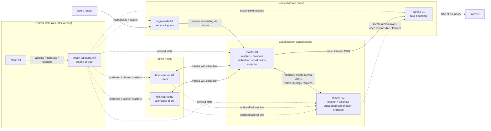

<!-- synced: 2026-05-06 source-state: README.md working-tree architecture-diagram correction -->
[English](README.md) | **Русский** | [中文](README.zh-CN.md)

[](https://github.com/coonfuuseed-paandaa/awg-mesh/actions/workflows/build.yml)
[](https://github.com/coonfuuseed-paandaa/awg-mesh/releases)
[](https://go.dev/)
[](LICENSE)
[](https://github.com/coonfuuseed-paandaa/awg-mesh/pkgs/container/awg-mesh-node)
[](https://hub.docker.com/r/coonfuuseedpaandaa/awg-mesh-node)

# awg-mesh

Docker-native зашифрованная overlay-сеть на базе AmneziaWG. awg-mesh v2
использует плоскую role-tagged топологию, master-owned runtime zones,
локальный backup/restore, развертывание MikroTik RouterOS через `/container`
и release gates, которые доказывают кодовые контракты и поведение продукта до
публикации тега.

## Обзор архитектуры



`mesh-ctl` - это desired-state tool: он читает `mesh-topology.yml`, проверяет
intent, готовит node material и выполняет явные действия оператора. Data plane
работает на экземплярах `awg-mesh-node`. В текущей модели v2.x masters владеют
runtime responsibility своих zones; отдельный standalone daemon не требуется в
happy path. Master nodes — равноправные peers; failover — это
сгенерированная из topology связь между clients или role nodes и их responsible
masters, а не отдельный failover-only класс master. Coordination endpoint
размещается внутри runtime responsible master, когда текущим v2.x flows нужны
registration, peer updates, audit или certificate lifecycle hooks.

Файл топологии v2 объявляет узлы один раз в `nodes:` и назначает каждому узлу
одну или несколько ролей:

| Роль | Назначение |
|---|---|
| `client` | Пользовательское устройство или домашний сервер. Эта роль эксклюзивна. |
| `master` | Принимает client links и соединяет их с mesh. |
| `balancer` | Выбирает активный egress/mesh path для flows. |
| `egress` | Выполняет internet-bound masquerade на границе. |
| `ingress` | Публикует сервисы mesh clients через публичные hostnames или ports. |

Egress, ingress, balancer и client nodes используют responsible master,
сгенерированный из topology. Peering каждой non-client role с каждым master -
это deployment choice, а не default invariant.

Смотрите [docs/architecture/F-009-overview.md](docs/architecture/F-009-overview.md)
для исторического контекста F-009. Release path v2.0.1, описанный здесь, является
текущим master-owned-zone contract.

## Что нового в v2.0.1

- **Schema v2 topology** с `schema_version: 2`, role-tagged `nodes:` и
  объявлениями service ingress.
- **Role-agnostic CLI**: текущий onboarding использует `mesh-ctl node prepare`,
  `mesh-ctl node init`, `mesh-ctl node list` и `mesh-ctl node remove`.
  Legacy role subcommands `master`, `endpoint` и `client` удалены из v2
  operator path.
- **Master-owned coordination** с CA-backed mTLS и локальными admin
  certificates. Insecure coordination/admin paths не входят в release flow.
- **Локальный backup/restore** для admin state, topology и опциональных
  coordination state archives.
- **Развертывание MikroTik RouterOS `/container`** через
  `mesh-ctl node prepare --platform mikrotik`. Runtime release validation
  нацелен на RouterOS 7.21+; generator syntax tests также покрывают 7.16.2 и
  7.20.8.
- **Critical suite + product emulation playbook** как release blockers.
  Перед tagging требуется `PRODUCT_WORKS`.
- **Go module v2 path**:
  `github.com/coonfuuseed-paandaa/awg-mesh/v2`.

## Быстрый старт

Этот локальный walkthrough собирает инструменты, проверяет пример топологии v2
и готовит локальные node credentials. Сам по себе он не разворачивает
production mesh; для развертывания нужны реальные hosts, Docker, доступный
responsible-master coordination endpoint и node-specific firewall rules.

### Требования

- Go 1.25+
- Docker Engine 24+ для image builds и release simulations
- Linux или WSL2 для Bash release gates
- `/dev/net/tun` на hosts, где запускаются data-plane containers

### Установка mesh-ctl

Для текущей v2 release line:

```bash
go install github.com/coonfuuseed-paandaa/awg-mesh/v2/cmd/mesh-ctl@v2.0.1
```

Для локальной разработки из clone:

```bash
CGO_ENABLED=1 go build -trimpath -o bin/mesh-ctl ./cmd/mesh-ctl
CGO_ENABLED=1 go build -trimpath -o bin/awg-mesh-node ./cmd/awg-mesh-node
```

Добавьте binary directory в `PATH`, затем проверьте версию:

```bash
export PATH="$PATH:$(go env GOPATH)/bin"
mesh-ctl version
```

### Создание и проверка топологии

```bash
mkdir -p .mesh-local
cp mesh-topology.example.yml .mesh-local/mesh-topology.yml
mesh-ctl --config-dir .mesh-local --topology mesh-topology.yml topology validate
mesh-ctl --config-dir .mesh-local --topology mesh-topology.yml node list
```

Ожидаемый вид:

```text
topology "mesh-topology.yml" valid: schema_version=2 ...
```

### Подготовка node material

`node prepare` записывает локальный admin-side state в `--config-dir`:

```bash
mesh-ctl --config-dir .mesh-local --topology mesh-topology.yml node prepare master-01
mesh-ctl --config-dir .mesh-local --topology mesh-topology.yml node prepare home-server-01
```

Сгенерированные per-node artifacts включают:

```text
.mesh-local/ca.crt
.mesh-local/nodes/<name>/token
.mesh-local/nodes/<name>/mesh.token
.mesh-local/nodes/<name>/node.crt
.mesh-local/nodes/<name>/node.key
```

Для развертывания MikroTik RouterOS container укажите доступный responsible
master coordination address. Текущее имя CLI-флага остается `--control-plane`
для совместимости v2.0.1:

```bash
mesh-ctl --config-dir .mesh-local --topology mesh-topology.yml \
  node prepare mikrotik-home \
  --platform mikrotik \
  --control-plane 192.0.2.10:9090 \
  --target-ros 7.21.4
```

Контракт совместимости RouterOS описан в
[docs/MIKROTIK-VERSION-COMPAT.md](docs/MIKROTIK-VERSION-COMPAT.md).

### Регистрация узлов через responsible master

Запустите responsible master node в deployment environment, затем
зарегистрируйте подготовленные nodes через coordination endpoint этого master.
Флаг `--control-plane` сохранен как compatibility name для этой цели:

```bash
mesh-ctl --config-dir .mesh-local --topology mesh-topology.yml \
  node init master-01 --control-plane 192.0.2.10:9090

mesh-ctl --config-dir .mesh-local --topology mesh-topology.yml \
  node init home-server-01 --control-plane 192.0.2.10:9090
```

`node init` использует локальный CA и подготовленный node certificate.
Отклоненная registration - deployment blocker, а не warning.

## Пример топологии

Минимальная топология v2:

```yaml
schema_version: 2

mesh:
  name: example-mesh
  overlay_supernet: 172.21.92.0/24
  tenants: [default]

nodes:
  - name: master-01
    roles: [master, balancer, egress, ingress]
    overlay_ip: 172.21.92.2
    bridge_ip: 192.168.93.10
    public_ip: 203.0.113.10
    region: eu
    internet_iface: eth0

  - name: home-server-01
    roles: [client]
    overlay_ip: 172.21.92.130
    region: home
    preferred_master: master-01

services:
  - name: jellyfin
    owner_node: home-server-01
    protocol: tcp
    local_port: 8096
    tenant: default
    ingress:
      - hostname: media.example.com
        mode: sni_passthrough
        ingress_node: master-01
```

Используйте [mesh-topology.example.yml](mesh-topology.example.yml) как
поддерживаемую отправную точку.

## Docker Images

Release images публикуются в GHCR и Docker Hub.

```text
ghcr.io/coonfuuseed-paandaa/awg-mesh-node:v2.0.1
ghcr.io/coonfuuseed-paandaa/awg-mesh-client:v2.0.1
ghcr.io/coonfuuseed-paandaa/awg-mesh:v2.0.1          # GHCR-only legacy node alias

docker.io/coonfuuseedpaandaa/awg-mesh-node:v2.0.1
docker.io/coonfuuseedpaandaa/awg-mesh-client:v2.0.1
```

CI workflow публикует multi-arch manifests для:

```text
linux/amd64
linux/386
linux/arm64
linux/arm/v7
linux/arm/v6
```

На release tag workflow публикует `vX.Y.Z`, `X.Y.Z`, `X.Y`, `X` и commit-SHA
tags, где major alias включается для non-v0 releases. Для production
закрепляйте `:vX.Y.Z`; используйте `:latest` только для preview environments.

## Команды

### Топология

```bash
mesh-ctl --config-dir .mesh-local --topology mesh-topology.yml topology validate
mesh-ctl --config-dir .mesh-local --topology mesh-topology.yml topology validate --output json
mesh-ctl --config-dir .mesh-local --topology mesh-topology.yml topology generate-prometheus-config
mesh-ctl migrate --from old-v1-topology.yml --to mesh-topology.yml
```

### Жизненный цикл node

Имя флага `--control-plane` сохранено для совместимости CLI v2.0.1. В текущей
master-owned-zone модели передавайте responsible master coordination address.

```bash
mesh-ctl --config-dir .mesh-local --topology mesh-topology.yml node list
mesh-ctl --config-dir .mesh-local --topology mesh-topology.yml node prepare <name>
mesh-ctl --config-dir .mesh-local --topology mesh-topology.yml node init <name> --control-plane <host:port>
mesh-ctl --config-dir .mesh-local --topology mesh-topology.yml node remove <name> --control-plane <host:port>
```

### Backup and restore

```bash
mesh-ctl --topology mesh-topology.yml --config-dir ~/.mesh-ctl backup awg-mesh-backup.zip
mesh-ctl --topology restored-topology.yml --config-dir ~/.mesh-ctl-restored restore awg-mesh-backup.zip --confirm
```

### Планирование upgrade

```bash
mesh-ctl --config-dir .mesh-local --topology mesh-topology.yml upgrade v2.0.1 --dry-run
mesh-ctl upgrade status
mesh-ctl upgrade pause
mesh-ctl upgrade resume
```

Выполнение v2 upgrade намеренно заблокировано до появления v2 deploy executor.
Текущая поддержка upgrade - это поверхность plan/state-management, а не
автоматический production rollout.

### Ротация и аудит

Mesh-wide rotation и audit queries направляются в responsible master
coordination endpoint. Имя флага остается `--control-plane` для совместимости
с command surface v2.0.0.

```bash
mesh-ctl rotate --mesh-wide --tier 1 --control-plane <host:port>
mesh-ctl rotate --mesh-wide --tier 2 --control-plane <host:port>
mesh-ctl rotate --mesh-wide --tier 3 --control-plane <host:port>
mesh-ctl audit-log query --control-plane <host:port>
```

Старые endpoint-targeted rotation flags остаются для legacy paths.

## Compatibility and Future Management Plane

`awg-mesh-node --mode control-plane` остается compatibility/deprecated surface
v2.0.1 для deployment, которые приняли standalone path v2.0.0. Это не текущий
Quick Start path, не требование customer-mode release gates и не замена
`mesh-ctl` как desired-state tool.

Более широкий management plane и WebUI могут быть спроектированы позже для
крупных инсталляций. Этот будущий layer отделен от текущей data-plane runtime
model и не должен добавлять master-to-master gossip, consensus или shared state
в happy path v2.x.

## Релизные проверки

Каждый release должен пройти automated critical suite, product emulation
playbook, Docker builds и RouterOS CHR gates до публикации тега.

```bash
CGO_ENABLED=1 go test -race -count=1 ./...
docker build -t awg-mesh-node:local -f deploy/Dockerfile.node .
docker build -t awg-mesh-client:local -f deploy/Dockerfile.client .
bash tests/critical/run-all.sh --strict
bash tests/simulation/F-009-CR-001-foundation-smoke.sh
bash tests/emulation-playbook/run.sh
go test -count=1 ./pkg/mikrotik ./pkg/mikrotik/v2
BUILDX_BUILDER=default bash tests/simulation/mikrotik-chr-baseline-runtime.sh
BUILDX_BUILDER=default bash tests/simulation/mikrotik-version-matrix.sh
```

Release не завершен, пока annotated git tag не существует на origin и GHCR
и Docker Hub не отдают matching `:vX.Y.Z` image tags. Полная release policy
описана в [AGENTS.md](AGENTS.md).

## Карта документации

| Документ | Назначение |
|---|---|
| [docs/PRODUCTION-TESTING-PLAYBOOK.md](docs/PRODUCTION-TESTING-PLAYBOOK.md) | Customer-mode product walkthrough. |
| [docs/MIKROTIK-VERSION-COMPAT.md](docs/MIKROTIK-VERSION-COMPAT.md) | Совместимость RouterOS generator/runtime. |
| [docs/MIGRATION.md](docs/MIGRATION.md) | Руководство по migration с v1.x на v2. |
| [docs/OPERATOR_FAQ.md](docs/OPERATOR_FAQ.md) | Operator details для tokens, backups и state files. |
| [docs/adr/README.md](docs/adr/README.md) | Architecture decision records. |

## Разработка

Сборка:

```bash
CGO_ENABLED=1 go build -trimpath -o bin/awg-mesh-node ./cmd/awg-mesh-node
CGO_ENABLED=1 go build -trimpath -o bin/mesh-ctl ./cmd/mesh-ctl
```

Тесты:

```bash
CGO_ENABLED=1 go test -race -count=1 ./...
go run github.com/golangci/golangci-lint/v2/cmd/golangci-lint@v2.11.4 run ./...
```

Перегенерируйте protobuf files после изменения `proto/*.proto`:

```bash
protoc --proto_path=proto \
  --go_out=. --go_opt=module=github.com/coonfuuseed-paandaa/awg-mesh/v2 \
  --go-grpc_out=. --go-grpc_opt=module=github.com/coonfuuseed-paandaa/awg-mesh/v2 \
  proto/*.proto
```

## Лицензия

MIT. См. [LICENSE](LICENSE).
