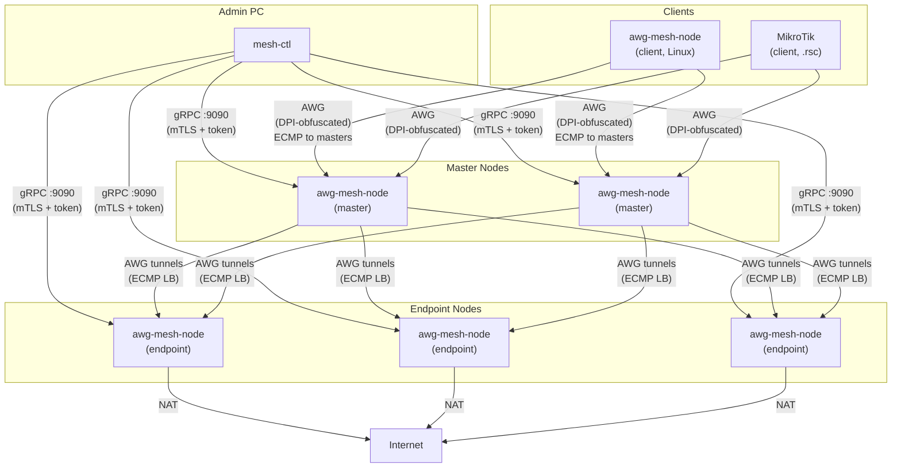
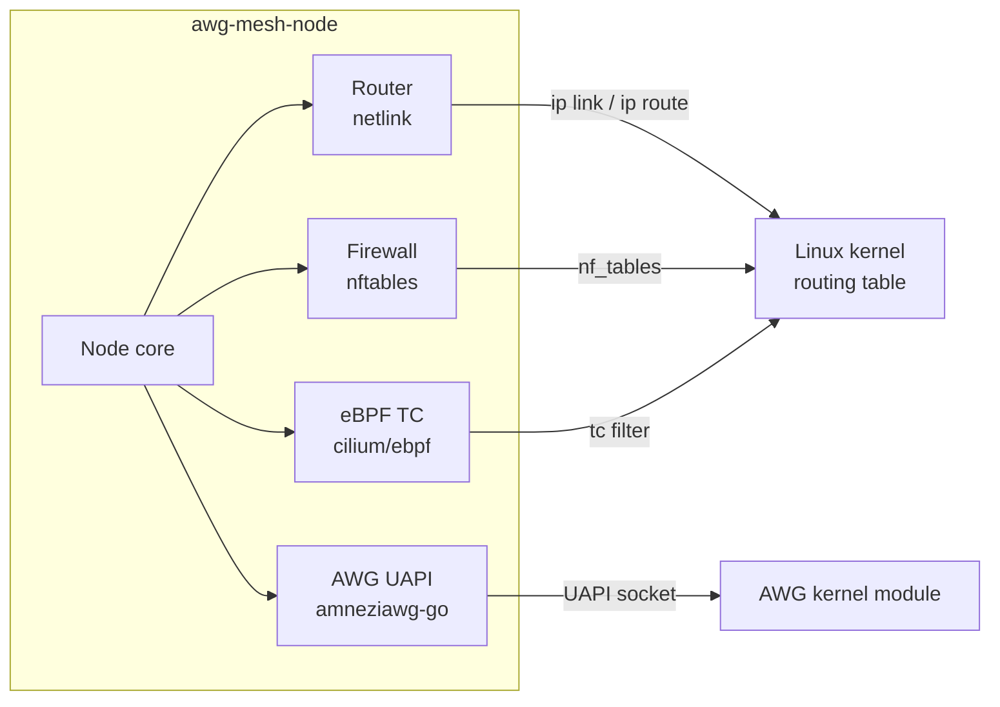

[English](README.md) | **Русский**

<!-- BADGE_ROW -->
[](https://github.com/coonfuuseed-paandaa/awg-mesh/actions/workflows/build.yml)
[](https://github.com/coonfuuseed-paandaa/awg-mesh/releases)
[](https://go.dev/)
[](LICENSE)
[](https://github.com/coonfuuseed-paandaa/awg-mesh/pkgs/container/awg-mesh)
[](https://hub.docker.com/r/coonfuuseedpaandaa/awg-mesh)

# awg-mesh

Docker-native зашифрованная overlay-сеть на базе AmneziaWG — топология как код, двухуровневая балансировка ECMP и анти-DPI обфускация в двух Docker-контейнерах (42 МБ node + 15 МБ client).

Управлять мультирегиональной WireGuard-сетью вручную — значит разбросанные конфиги, ручной обмен ключами и отсутствие failover. awg-mesh заменяет всё это одним файлом `mesh-topology.yml` и тремя командами CLI. Вы описываете желаемую сеть — masters, endpoints, clients — и система автоматически выдаёт ключи, сертификаты, туннели, правила фаервола и записи балансировщика через нативные интерфейсы ядра Linux (netlink, nftables, eBPF) без порождения дочерних процессов.

Модель трафика — двухуровневый ECMP: клиенты подключаются к пулу master-узлов (ingress), каждый master поддерживает AWG-туннели к пулу endpoint-узлов (egress), трафик распределяется по всем живым путям с sticky-сессиями на базе conntrack и failover через проверку доступности.

## Архитектура



## Что нового

### v1.8.0

- **Закрытие находок внутреннего код-ревью** — 5 issues (#20, #21, #23, #24, #25) без новых runtime-зависимостей. Корректность, безопасность, наблюдаемость.
- **Переписан ICMP healthcheck** — один shared raw ICMP socket на `HealthChecker` с демультиплексированием по seq; устраняет starvation между goroutines под Linux. Race-free `socketMu sync.RWMutex` + `sync.Once` для Close + атомарный `seqCounter` на горячем пути. См. [ADR-0006](docs/adr/0006-icmp-shared-socket-demux.md).
- **Bearer-токен убран из stdout по умолчанию** — `mesh-ctl` больше не печатает токен в stdout при `token rotate` и `* prepare`. Токен сохраняется на диск (mode 0600); путь выводится на stderr. Прежнее поведение возвращается флагом `--show-token` (при этом пишется WARN-лог). **Ломающее** изменение для скриптов, парсящих stdout — переходить на `cat <config-dir>/nodes/<name>/token`.
- **Валидация DSCP** — загрузчик топологии отвергает `routing_policies[].dscp` вне диапазона 1..63; раньше `tableID = 100 + DSCP` мог молча перезаписать зарезервированные ядром таблицы 253 (default) / 254 (main).
- **Типизированный сентинел порчи YAML** — `ErrCorruptNodeState`, `ErrCorruptTransportState`, `ErrCorruptClientState` заменяют хрупкую классификацию через `strings.Contains`. Переименование текста ошибки больше не ломает авто-восстановление. См. [ADR-0007](docs/adr/0007-typed-error-sentinel-for-yaml.md).
- **`mesh-ctl bootstrap --host IP`** — новая команда one-shot провижининга VPS: SSH-подключение, установка Docker (если отсутствует), pull образа ноды. Строгая проверка host-key через `~/.ssh/known_hosts`, опциональный `--accept-new-host-key` для первого контакта. SSH agent приоритетнее ключа на диске. `--image` защищён от command injection.
- **Миграционный гайд** — `docs/MIGRATION.md` описывает переход с исторической схемы «5× MikroTik контейнеров» на `awg-mesh` 2× master + endpoints + clients, с путями отката на каждом этапе.
- **Smoke + e2e тесты в Docker** — `tests/v18_smoke/` + `make release-gate` проверяет все поведения v1.8.0 перед тегом релиза.

### v1.7.0

- **Унификация клиентского ECMP** — единый путь `rebuildClientECMP`: health-фильтрация, CONNMARK-sticky sessions и L4 multipath hash применяются одинаково и к VIP-, и к legacy-топологиям. Двух разных семантик больше нет.
- **Детерминированные имена клиентских интерфейсов** — `wg-c<4-hex>` из SHA-256 публичного ключа пира. Стабильны между перезапусками; старые `wg-cN` чистятся при reconcile. Мониторинг, ищущий имена интерфейсов по маске, нужно обновить.
- **Транспортное состояние со схемой** — `transport.yml` теперь хранит `schema_version: 1` и per-tunnel `allowed_ips` + `persistent_keepalive`. Файлы до v1.6.0 автоматически мигрируют при первом запуске (один WARN-лог); миграция durable. Закрывает баг с хардкодом `0.0.0.0/0` в reconcile.
- **Sticky ECMP по CIDR** — `EnableStickyECMP` теперь ставит правила с матчем `ip daddr <cidr>`; `DisableStickyECMP` реально удаляет их (раньше был no-op). Смена `balancer_ip` на ходу оставляет чистое conntrack-состояние.
- **Толерантность к частичной сети при старте** — ошибки reconcile больше не фатальные; клиент запускается с тем, что подняло healthcheck, и сходится по мере восстановления.
- **Структурные логи ECMP** — каждое событие `ecmp_install` / `ecmp_withdraw` / `sticky_enable` / `sticky_disable` несёт `reason` (`init` / `onUp` / `onDown` / `reconcile` / `balancer_change` / `no_healthy_links`).
- **Docker-compose фикстура** — в `tests/client_ecmp/` лежит 4-сервисный воспроизводимый стенд и `verify.sh` для ручной регрессии US1 (failover) и US2 (stickiness).

### v1.6.0

- **12-factor bootstrap через env vars** — бинарник узла читает `MESH_MODE`, `MESH_NAME`, `MESH_OVERLAY_IP`, `MESH_LISTEN_PORT`, `MESH_CONFIG_DIR`, `MESH_TOPOLOGY`, `MESH_LOG_LEVEL`, `MESH_METRICS_ADDR` как fallback для любого CLI-флага. Флаги по-прежнему побеждают при явном указании.
- **Bootstrap токена на первом старте** — `MESH_TOKEN_HASH` (bcrypt) записывается в `/config/mesh.token` при первом запуске; на последующих игнорируется. Оператору больше не нужно доставлять файл токена вручную.
- **Многоплатформенные Docker-образы** — `linux/amd64`, `linux/386`, `linux/arm64`, `linux/arm/v7`, `linux/arm/v6`. Покрывает Intel/AMD-серверы, 32-битный x86, Raspberry Pi 3/4/5 (arm64), Pi 2/3 (arm/v7), Pi Zero/1 (arm/v6) и MikroTik hAP ax.
- **Контрактные тесты шаблонов** фиксируют инварианты деплоя (нет sysctls в host-network, смонтирован `/dev/net/tun`, `MESH_TOKEN_HASH` встроен, `MESH_NAME` присутствует, `/config` том).
- **13 деплойных багов из production field report** — sysctls на host-network, отсутствие TUN-устройства, экранирование `$` в bcrypt при docker-compose-интерполяции, неправильный layout тома, недостающие env vars, TLS capture primer, RouterOS 7.21+ синтаксис `list=`, несовпадение портов в `MESH_MASTERS host:port` и другие.
- **CI: govulncheck + привилегированные routing-тесты + верификация multi-arch manifest.**

### v1.5.0

- **Персистентность состояния клиента** — DSCP-маршрутизация и DNS-конфигурация сохраняются при перезапуске без topology-файла. После первого `mesh-ctl client init` политики маршрутизации и конфиг DNS записываются в `/config/client-state.yml` и автоматически восстанавливаются при старте контейнера.

### v1.4.0

- **Интеграция с Traefik** — новый флаг `--traefik` включает Traefik-совместимый режим: gRPC и метрики проксируются через Traefik, UDP-трафик AWG проходит напрямую (обход Traefik обязателен — он подменяет source IP, что ломает WG-хендшейки). Пример конфигурации в разделе [Деплой](#интеграция-с-traefik).
- **Исправление connmark DSCP для обратного трафика** — исправлена потеря DSCP-метки на обратном трафике: пакеты ответа теперь корректно получают fwmark через connmark, что устраняет асимметричную маршрутизацию.

### v1.3.0

- **Два Docker-образа** — лёгкий `awg-mesh-client` (~15 МБ, без CGO) для клиентов MikroTik/Linux и полный `awg-mesh-node` (~42 МБ) для master/endpoint-узлов. `awg-mesh:latest` остаётся алиасом для образа node.
- **Авто-обнаружение интерфейса** — контейнер автоматически определяет WAN-интерфейс через маршрут по умолчанию (netlink). Работает на MikroTik ROS < 7.20 (`eth0`), ROS >= 7.20 (произвольные имена VETH) и стандартном Docker. Переопределите через переменную окружения `MESH_INTERFACE`.
- **Сохранение состояния клиента** — после первого `mesh-ctl client init` политики маршрутизации и конфиг DNS сохраняются в `/config/client-state.yml`. При перезапуске контейнер восстанавливает полное состояние без файла топологии и повторной инициализации через gRPC.
- **Тег сборки `nocapture`** — `CGO_ENABLED=0 go build -tags nocapture` собирает статический клиентский бинарник без gopacket/libpcap.
- **Matrix-сборка в CI** — GitHub Actions собирает и публикует оба образа с отдельными smoke-тестами для каждого.

### v1.2.0

- **Smart Client** — один контейнер заменяет N отдельных AWG-контейнеров по регионам с помощью policy routing на основе DSCP. Роутер маркирует трафик значением DSCP, контейнер читает поле DSCP и маршрутизирует поток в нужный endpoint через соответствующие таблицы политик.
- **Встроенный DNS-сервер** — клиентские контейнеры отдают A- и PTR-записи для overlay-зоны через miekg/dns. `dig node-asia-01.mesh.zone @client` возвращает overlay IP. Запросы вне зоны проксируются на вышестоящий DNS-сервер.
- **Генерация конфига роутера** — `mesh-ctl routing generate` создаёт платформо-специфичные конфиги:
  - `--platform mikrotik`: RouterOS `.rsc`-скрипт с правилами DSCP в `/ip/firewall/mangle` и таблицами маршрутизации
  - `--platform linux`: shell-скрипт с маркировкой DSCP через `iptables -t mangle` и правилами `ip rule`/`ip route`
  - `--platform generic`: JSON с картой DSCP и резервными статическими overlay-IP маршрутами для роутеров без поддержки DSCP
- **Master в режиме exit** — master с `exit: true` в топологии включает masquerade и работает как точка выхода VPN (на один хоп меньше по сравнению с маршрутизацией через endpoint).
- **Очистка DSCP при завершении** — nftables DSCP-правила и ip rules удаляются при остановке клиента.

### v1.1.0

- **Идемпотентная инициализация endpoint** — повторный запуск `endpoint init` безопасен: существующие туннели сохраняются, а не дублируются.
- **Распространение overlay-маршрутов** — overlay-адреса надёжно анонсируются по всем туннельным интерфейсам после инициализации.
- **Полностью Go data plane** — удалено 443 строки кода с `exec.Command`; все операции маршрутизации и фаервола выполняются напрямую через netlink, nftables и eBPF.
- **E2E-симуляционный стенд** — 8-узловая Docker-симуляция (`tests/simulation/`), проверяющая WG-хендшейки, overlay-пинг, количество ECMP-nexthop, связность client-master и общий статус сети.

### v1.0.0

- **Нативный слой маршрутизации** — управление WireGuard-интерфейсами, программирование маршрутов и правил фаервола через vishvananda/netlink, google/nftables и cilium/ebpf. Никакого вызова внешних процессов во время работы.
- **Интерфейсы Router / Firewall / Sysctl** — чёткое разделение ответственности; каждая подсистема тестируется и заменяется независимо.
- **Ноль известных дефектов** — все 15 находок из цикла расследований v0.9.x устранены.

## Возможности

**Сеть**
- AmneziaWG overlay-сеть с настраиваемой анти-DPI обфускацией (форк WireGuard с мусорными пакетами и рандомизацией заголовков S/H)
- Двухуровневая балансировка ECMP со sticky-сессиями через nftables conntrack
- Failover по результатам ICMP-проб с временной меткой WG-хендшейка в качестве запасного варианта
- Настраиваемое overlay-адресное пространство с диапазонами CIDR по ролям и виртуальными IP балансировщика
- Транспортная point-to-point адресация (10.255.x.x) выделяется автоматически для каждой пары туннелей

**Smart Client (v1.2.0)**
- Policy routing на основе DSCP: роутер маркирует трафик значениями DSCP (1-63), клиент читает поле IP DSCP через nftables → устанавливает fwmark → ip rule направляет трафик в отдельную таблицу маршрутизации
- Встроенный DNS-сервер для overlay-зоны: A-записи (`node.mesh.zone` → overlay IP), PTR-записи (обратный поиск), проксирование запросов вне зоны на вышестоящий DNS
- Генерация конфига роутера: `mesh-ctl routing generate` для MikroTik `.rsc`, Linux shell и generic JSON
- Master в режиме exit: `exit: true` включает прямой интернет-egress через masquerade — без лишнего хопа через endpoint
- Резервная маршрутизация по overlay-IP для потребительских роутеров без поддержки DSCP

**Эксплуатация**
- Топология как код: единственный `mesh-topology.yml` как источник истины
- Трёхшаговый онбординг: `prepare` (генерация ключей + compose) → `deploy` (копирование на хост) → `init` (активация через gRPC)
- Генерация `.rsc`-скрипта RouterOS для MikroTik — для подключения аппаратных клиентов
- Один Alpine Docker-образ весом 42 МБ — никаких sidecar-контейнеров, никаких агентов

**Безопасность**
- Плоскость управления gRPC с двойной аутентификацией mTLS + bearer-токен (требуются оба)
- Токены хранятся в bcrypt-хэше и ротируются независимо от TLS-сертификатов
- Трёхуровневая ротация AWG-параметров: junk-параметры / S-H заголовки / полная пара ключей
- Захват TLS/QUIC-пакетов через gopacket/libpcap для мимикрии под реальный трафик

**Маршрутизация (нативное ядро)**
- Жизненный цикл WireGuard-интерфейсов через vishvananda/netlink — без вызова `ip`
- ECMP multipath-маршруты программируются напрямую в таблицу маршрутизации ядра
- NAT и conntrack через nftables via google/nftables — без вызова `nft`
- eBPF TC-программы через cilium/ebpf для высокопроизводительной пересылки пакетов

**Наблюдаемость**
- Prometheus-метрики на `:9091`
- Структурированное JSON-логирование через zerolog с настраиваемым уровнем логов
- Статус по узлам через `mesh-ctl status`

## Применение

- **Цензуроустойчивый egress**: маршрутизация трафика через пул egress-узлов в разных юрисдикциях с автоматическим переключением при блокировке одного из них.
- **Межрегиональное корпоративное подключение**: соединение офисных роутеров (MikroTik или Linux) с сетью master-узлов, ECMP распределяет нагрузку между ними.
- **Self-hosted VPN с горизонтальным масштабированием**: добавьте master- или endpoint-узлы в файл топологии и перезапустите `init` — никакой ручной настройки пиров.
- **Среды с анти-DPI**: параметры обфускации AWG ротируются по расписанию и калибруются по реальному TLS/QUIC-трафику для обхода классификаторов трафика.
- **MikroTik — один контейнер вместо нескольких**: замените 5+ AWG-контейнеров (по одному на регион) единым smart client-контейнером. DSCP-метки на роутере выбирают, через какой endpoint пойдёт каждый поток — 33 ручных mangle-правила и 10 таблиц маршрутизации заменяются одним файлом топологии и командой `mesh-ctl routing generate`.

## Управление трафиком через DSCP

> **Минимальная версия MikroTik: RouterOS 7.21+** — клиентский контейнер использует nftables (модуль ядра `nf_tables`) для policy routing на основе DSCP→fwmark. Версии RouterOS до 7.21 не загружают `nf_tables` в ядро контейнера. На Linux (не MikroTik) подходит любое современное ядро с поддержкой nf_tables.

DSCP (Differentiated Services Code Point) — механизм выбора endpoint'а для каждого потока трафика. Routing marks на MikroTik — локальные для conntrack, они не переживают переход через WG-туннель. DSCP — единственное поле в IP-заголовке, которое роутер может установить, а клиентский контейнер — прочитать на другой стороне.

### Как это работает

```
Роутер                           Клиентский контейнер         Master            Endpoint
  │                                │                            │                  │
  │ 1. address-list → conn-mark    │                            │                  │
  │ 2. conn-mark → change-dscp     │                            │                  │
  │ 3. route в контейнер           │                            │                  │
  │ ───────────────────────────────>│                            │                  │
  │                                │ 4. nftables: читает DSCP   │                  │
  │                                │ 5. DSCP → fwmark           │                  │
  │                                │ 6. fwmark → policy table   │                  │
  │                                │ 7. table → через master WG │                  │
  │                                │ ───────────────────────────>│                  │
  │                                │                            │ 8. forward       │
  │                                │                            │ ────────────────>│
  │                                │                            │                  │ 9. NAT → интернет
```

- **DSCP 0** (по умолчанию): ECMP по всем endpoint'ам — маркировка не нужна
- **DSCP 1-63**: каждое значение соответствует routing policy в `mesh-topology.yml`
- Роутер устанавливает DSCP; контейнер его читает. Routing marks не пересекают границу устройства.

### Примеры для MikroTik

**Шаг 1: Определить, какой трафик куда направлять (списки адресов):**

```routeros
/ip/firewall/address-list
add list=via-asia address=8.8.8.8 comment="Google DNS через Азию"
add list=via-asia address=1.1.1.1 comment="Cloudflare через Азию"
add list=via-us address=208.67.222.222 comment="OpenDNS через US"
```

**Шаг 2: Пометить соединения и установить DSCP (mangle):**

```routeros
/ip/firewall/mangle
# Пометка соединений по спискам адресов
add chain=prerouting dst-address-list=via-asia action=mark-connection \
    new-connection-mark=vpn-asia-conn passthrough=yes comment="awg-mesh: пометка Asia"
add chain=prerouting dst-address-list=via-us action=mark-connection \
    new-connection-mark=vpn-us-conn passthrough=yes comment="awg-mesh: пометка US"

# Установка DSCP по connection mark (переживает WG-туннель)
add chain=prerouting connection-mark=vpn-asia-conn action=change-dscp \
    new-dscp=10 passthrough=yes comment="awg-mesh: DSCP=10 для Азии"
add chain=prerouting connection-mark=vpn-us-conn action=change-dscp \
    new-dscp=20 passthrough=yes comment="awg-mesh: DSCP=20 для US"
```

**Шаг 3: Маршрутизация помеченного трафика в клиентский контейнер:**

```routeros
/routing/table
add name=vpn-mesh fib comment="awg-mesh VPN routing table"

/ip/route
add dst-address=0.0.0.0/0 gateway=192.168.254.4 routing-table=vpn-mesh \
    distance=5 comment="awg-mesh: VPN-маршрут по умолчанию"

/ip/firewall/mangle
add chain=prerouting connection-mark=vpn-asia-conn action=mark-routing \
    new-routing-mark=vpn-mesh passthrough=no comment="awg-mesh: Asia через mesh"
add chain=prerouting connection-mark=vpn-us-conn action=mark-routing \
    new-routing-mark=vpn-mesh passthrough=no comment="awg-mesh: US через mesh"
```

**Или сгенерируйте всё автоматически:**

```bash
mesh-ctl routing generate --platform mikrotik --client my-router -t mesh-topology.yml > awg-routing.rsc
# Импорт на MikroTik: /import awg-routing.rsc
```

### Весь трафик через VPN (без выбора endpoint'а)

Если нужно просто пустить весь трафик через VPN без выбора конкретного endpoint'а:

```routeros
# Просто: маршрутизация всего через клиентский контейнер
/ip/route
add dst-address=0.0.0.0/0 gateway=192.168.254.4 distance=10 comment="весь трафик через awg-mesh"
```

DSCP 0 (по умолчанию) → ECMP по всем endpoint'ам автоматически.

### Master exit (прямой выход)

Master'ы с `exit: true` в топологии могут выступать точками выхода напрямую. Назначьте значение DSCP для master'а в `routing_policies`:

```yaml
routing_policies:
  - name: vpn-direct
    dscp: 50
    targets: [master-01]   # master с exit: true
```

Трафик с DSCP=50 выходит из локации master-01 без дополнительного хопа через endpoint.

### Overlay DNS

Клиентский контейнер запускает встроенный DNS-сервер для overlay-зоны:

```bash
dig node-asia-01.mesh.zone @192.168.254.4    # → 172.20.70.34
dig -x 172.20.70.34 @192.168.254.4           # → node-asia-01.mesh.zone
```

На MikroTik — перенаправьте запросы mesh-зоны в клиентский контейнер:

```routeros
/ip/dns/static
add name=mesh.zone type=FWD forward-to=192.168.254.4
```

## Быстрый старт

Этот пример разворачивает минимальную сеть: два master'а в России, два endpoint'а в Казахстане, один Linux-клиент.

```bash
# 1. Установите mesh-ctl на своей машине администратора
go install github.com/coonfuuseed-paandaa/awg-mesh/cmd/mesh-ctl@v1.7.0
export PATH=$PATH:$(go env GOPATH)/bin

# 2. Создайте файл топологии (все поля описаны в разделе Конфигурация)
cp mesh-topology.example.yml mesh-topology.yml
# отредактируйте mesh-topology.yml, указав реальные IP-адреса и имена узлов

# 3. Подготовьте каждый узел (генерирует ключи, токен, docker-compose файл)
mesh-ctl master   prepare master-01 -t mesh-topology.yml
mesh-ctl master   prepare master-02 -t mesh-topology.yml
mesh-ctl endpoint prepare node-asia-01        -t mesh-topology.yml
mesh-ctl endpoint prepare node-asia-02        -t mesh-topology.yml
mesh-ctl client   prepare my-router    -t mesh-topology.yml

# 4. Скопируйте сгенерированные <name>-docker-compose.yml и запустите контейнеры на каждом хосте
#    (подробный workflow с scp + docker compose — в разделе Деплой)

# 5. Инициализируйте сеть — подключается через gRPC и поднимает AWG-туннели
mesh-ctl endpoint init node-asia-01        -t mesh-topology.yml
mesh-ctl endpoint init node-asia-02        -t mesh-topology.yml
mesh-ctl master   init master-01 -t mesh-topology.yml
mesh-ctl master   init master-02 -t mesh-topology.yml
mesh-ctl client   init my-router    -t mesh-topology.yml

# 6. Проверьте состояние
mesh-ctl status -t mesh-topology.yml
```

## Установка

### Требования

**Машина администратора** (там, где запускается `mesh-ctl`):
- Go 1.25+
- Сетевой доступ к порту 9090 на каждом хосте с узлом

**Каждый хост с узлом**:
- Docker Engine 24+
- Ядро Linux с доступным `/dev/net/tun` (стандартно во всех современных дистрибутивах)
- Открытый исходящий UDP 51820 и входящий TCP 9090

### Установка mesh-ctl

```bash
go install github.com/coonfuuseed-paandaa/awg-mesh/cmd/mesh-ctl@v1.7.0
```

Бинарник окажется в `$(go env GOPATH)/bin`. Убедитесь, что эта директория есть в `PATH`:

```bash
export PATH=$PATH:$(go env GOPATH)/bin
mesh-ctl version
```

При первом запуске `mesh-ctl` создаёт `~/.mesh-ctl/` для хранения mesh CA, токенов по узлам, публичных ключей и транспортных выделений. Посмотреть текущее состояние можно в любой момент:

```bash
mesh-ctl config show -t mesh-topology.yml
```

### Деплой контейнеров узлов

`mesh-ctl prepare` генерирует `<name>-docker-compose.yml` для каждого узла. Скопируйте его на целевой хост и запустите контейнер:

```bash
# Перенос файлов на хост
ssh user@198.51.100.10 'sudo mkdir -p /srv/awg-mesh'
scp master-01-docker-compose.yml user@198.51.100.10:~/

# Запуск контейнера
ssh user@198.51.100.10 'docker compose -f master-01-docker-compose.yml up -d'
```

Сгенерированный compose-файл содержит правильный образ, capabilities, проброс портов и флаги запуска для конкретного узла. При желании можно включить блок сервиса `awg-mesh-node` в существующий compose-файл вашей инфраструктуры — см. [Деплой](#деплой).

### Фиксация версии образа

По умолчанию `mesh-ctl prepare` записывает в compose-файл тег `:latest`. Rolling-теги ломают воспроизводимость: `docker compose pull` может молча обновить узел до новой версии. Используйте флаг `--image` или поле топологии, чтобы зафиксировать конкретный образ.

**Флаг `--image`** доступен на каждой из трёх команд prepare:

```bash
# Master-узел с конкретным semver-тегом
mesh-ctl master prepare master-01 --image ghcr.io/coonfuuseed-paandaa/awg-mesh-node:v1.8.1 -t mesh-topology.yml

# Endpoint-узел
mesh-ctl endpoint prepare node-asia-01 --image ghcr.io/coonfuuseed-paandaa/awg-mesh-node:v1.8.1 -t mesh-topology.yml

# Linux-клиент (использует образ awg-mesh-client)
mesh-ctl client prepare my-router --image ghcr.io/coonfuuseed-paandaa/awg-mesh-client:v1.8.1 -t mesh-topology.yml
```

For clients with `type: mikrotik`, `client prepare` generates RouterOS `.rsc` output and does not include a Docker image field, so `--image` has no effect for that client type.

**Поля топологии** `defaults.image.node` и `defaults.image.client` позволяют задать образ один раз для всей сети — без передачи флага на каждый вызов prepare:

```yaml
defaults:
  image:
    node: ghcr.io/coonfuuseed-paandaa/awg-mesh-node:v1.8.1    # для master и endpoint
    client: ghcr.io/coonfuuseed-paandaa/awg-mesh-client:v1.8.1 # для client
```

**Приоритет разрешения** (от высшего к низшему):

1. Флаг `--image` — побеждает всегда.
2. `defaults.image.node` / `defaults.image.client` из топологии.
3. Встроенный fallback: `ghcr.io/coonfuuseed-paandaa/awg-mesh-node:latest` для master/endpoint, `ghcr.io/coonfuuseed-paandaa/awg-mesh-client:latest` для client.

Если ни флаг, ни поле топологии не заданы — поведение остаётся прежним (`:latest`), так что существующие конфигурации не нарушаются.

**Рекомендация:** закрепляйте semver-тег (`:v1.8.1`) для производственных деплоев — это гарантирует воспроизводимый `docker compose pull` и возможность отката на предыдущий образ. Тег `:latest` удобен для edge-сред, где нужно всегда получать свежую сборку.

### Проверка

```bash
mesh-ctl status -t mesh-topology.yml
```

Все узлы должны отображаться как `ONLINE` с количеством туннелей, соответствующим топологии.

## Обновление

### Обновление mesh-ctl

```bash
go install github.com/coonfuuseed-paandaa/awg-mesh/cmd/mesh-ctl@v1.7.0
```

Директория состояния `~/.mesh-ctl/` (CA, токены, ключи, транспортные выделения) не затрагивается.

### Обновление контейнеров узлов

Загрузите новый образ и перезапустите. AWG-туннели восстанавливаются за 2–5 секунд:

```bash
# На каждом хосте с узлом:
docker compose -f <name>-docker-compose.yml pull
docker compose -f <name>-docker-compose.yml up -d
```

В конфигурациях с несколькими master'ами обновляйте по одному, чтобы сохранить связность:

```bash
# Обновляем Master 1 (ECMP продолжает пропускать трафик через Master 2)
ssh master-01 'docker compose -f master-01-docker-compose.yml pull && docker compose -f master-01-docker-compose.yml up -d'

# Ждём восстановления Master 1
mesh-ctl status -t mesh-topology.yml

# Затем обновляем Master 2
ssh master-02 'docker compose -f master-02-docker-compose.yml pull && docker compose -f master-02-docker-compose.yml up -d'
```

## Деплой

### Docker-образ

```
# Node-образ (master/endpoint — полные возможности)
ghcr.io/coonfuuseed-paandaa/awg-mesh-node:latest
ghcr.io/coonfuuseed-paandaa/awg-mesh:latest          # алиас для node

# Client-образ (MikroTik/Linux — лёгкий, без CGO)
ghcr.io/coonfuuseed-paandaa/awg-mesh-client:latest
```

- Размер: ~42 МБ (базовый образ Alpine)
- Архитектуры (multi-arch manifest с v1.6.0): `linux/amd64`, `linux/386`, `linux/arm64`, `linux/arm/v7`, `linux/arm/v6` — покрывает x86_64-серверы, 32-битный x86, Raspberry Pi 3/4/5 (arm64), Pi 2/3 (arm/v7), Pi Zero/1 (arm/v6) и MikroTik hAP ax
- Никаких внешних runtime-зависимостей

### Монтирование тома

Контейнер ожидает конфигурацию по пути `/config`. Смонтируйте туда директорию конфигурации узла:

```
/srv/awg-mesh  →  /config  (внутри контейнера)
```

`mesh-ctl prepare` генерирует все необходимые файлы в привязку тома compose-файла.

### Минимальное описание сервиса

```yaml
services:
  awg-mesh-node:
    image: ghcr.io/coonfuuseed-paandaa/awg-mesh-node:latest
    restart: unless-stopped
    cap_add:
      - NET_ADMIN
      - NET_RAW
    devices:
      - /dev/net/tun:/dev/net/tun
    volumes:
      - /srv/awg-mesh:/config
    ports:
      - "51820:51820/udp"   # AWG data plane
      - "9090:9090"          # gRPC management
      - "9091:9091"          # Prometheus metrics
    command:
      - --mode=master         # или endpoint / client
      - --name=master-01  # должно совпадать с записью в топологии
      - --topology=/config/mesh-topology.yml
```

### Порты

| Порт | Протокол | Назначение |
|------|----------|-----------|
| 51820 | UDP | AmneziaWG data plane (туннели между пирами) |
| 9090 | TCP | gRPC management (mTLS + token auth) |
| 9091 | TCP | Prometheus metrics |

Порт 51820 должен быть доступен между узлами (masters ↔ endpoints, clients → masters).
Порт 9090 должен быть доступен с машины администратора, где запущен `mesh-ctl`.

### Необходимые capabilities

| Capability | Причина |
|-----------|---------|
| `NET_ADMIN` | Создание и настройка AWG-интерфейсов, программирование маршрутов, управление nftables |
| `NET_RAW` | Захват трафика через gopacket/libpcap для определения протокольного fingerprint |
| `/dev/net/tun` | TUN-устройство для overlay-интерфейса сети |

### Интеграция с Traefik

awg-mesh работает с реверс-прокси Traefik по гибридной схеме: Traefik обрабатывает gRPC и метрики (TCP/HTTP), тогда как UDP-трафик AWG проходит напрямую через прямое связывание порта.

> **Почему AWG не через Traefik?** UDP-прокси Traefik подменяет source IP на IP своего контейнера. WireGuard использует source IP для идентификации пиров — все пиры будут выглядеть как один адрес, что ломает handshake. Это фундаментальное ограничение протокола, а не проблема производительности. Подробности в [ADR-0003](docs/adr/0003-traefik-integration.md).

```yaml
services:
  awg-mesh-node:
    image: ghcr.io/coonfuuseed-paandaa/awg-mesh-node:latest
    restart: unless-stopped
    cap_add:
      - NET_ADMIN
      - NET_RAW
    devices:
      - /dev/net/tun:/dev/net/tun
    volumes:
      - /srv/awg-mesh:/config
    ports:
      # AWG data plane — DIRECT, bypasses Traefik (required)
      - "51820:51820/udp"
    labels:
      - "traefik.enable=true"
      # gRPC management — TCP with mTLS passthrough
      - "traefik.tcp.routers.awg-grpc.entrypoints=awg-grpc"
      - "traefik.tcp.routers.awg-grpc.rule=HostSNI(`*`)"
      - "traefik.tcp.routers.awg-grpc.tls.passthrough=true"
      - "traefik.tcp.routers.awg-grpc.service=awg-grpc-svc"
      - "traefik.tcp.services.awg-grpc-svc.loadbalancer.server.port=9090"
      # Prometheus metrics — HTTP
      - "traefik.http.routers.awg-metrics.rule=Host(`node.example.com`) && PathPrefix(`/metrics`)"
      - "traefik.http.routers.awg-metrics.entrypoints=web"
      - "traefik.http.routers.awg-metrics.service=awg-metrics-svc"
      - "traefik.http.services.awg-metrics-svc.loadbalancer.server.port=9091"
    command:
      - --mode=master
      - --name=master-01
      - --topology=/config/mesh-topology.yml
```

Статическая конфигурация Traefik — добавьте точку входа gRPC:

```yaml
entryPoints:
  awg-grpc:
    address: ":9090"
```

| Порт | Протокол | Маршрутизация | Причина |
|------|----------|---------------|---------|
| 51820 | UDP | Прямая (`ports:`) | Source IP необходим для идентификации WG-пиров |
| 9090 | TCP | Traefik (mTLS passthrough) | Управление gRPC, TLS на ноде |
| 9091 | HTTP | Traefik | Метрики Prometheus |

### Интеграция с systemd (опционально)

```ini
# /etc/systemd/system/awg-mesh.service
[Unit]
Description=awg-mesh node
After=docker.service
Requires=docker.service

[Service]
Type=oneshot
RemainAfterExit=yes
WorkingDirectory=/home/user
ExecStart=/usr/bin/docker compose -f master-01-docker-compose.yml up -d
ExecStop=/usr/bin/docker compose -f master-01-docker-compose.yml down
TimeoutStartSec=0

[Install]
WantedBy=multi-user.target
```

```bash
sudo systemctl enable --now awg-mesh.service
```

## Конфигурация

`mesh-topology.yml` — единственный источник истины для всей сети. Все команды `mesh-ctl` читают из этого файла.

### overlay

```yaml
overlay:
  space: 172.20.70.0/24      # полное адресное пространство overlay-сети
  physical_mtu: 1500          # MTU физической сети (обычно: 1500)
  awg_overhead: 80            # байты накладных расходов AWG-инкапсуляции
  ranges:
    - name: masters           # метка диапазона (информационная)
      cidr: 172.20.70.0/27   # диапазон адресов для master-узлов
      balancer_ip: 172.20.70.1  # виртуальный IP ECMP-балансировщика
    - name: endpoints
      cidr: 172.20.70.32/27
      balancer_ip: 172.20.70.33
    - name: clients
      cidr: 172.20.70.128/25  # leaf-узлы — balancer_ip не нужен
```

Overlay MTU = `physical_mtu - awg_overhead`. Укажите в `physical_mtu` MTU вашего физического канала.

### masters

```yaml
masters:
  - name: master-01        # уникальное имя во всех командах mesh-ctl
    host: 198.51.100.10        # публичный IP — используется mesh-ctl для gRPC-подключений
    peer_host: 192.168.50.10  # опционально: адрес для WG-пиринга, если отличается от host
                              #   (например, в Docker-симуляции с внутренними IP контейнеров)
    overlay_ip: 172.20.70.2   # назначенный overlay IP (из диапазона masters.cidr)
    listen_port: 51820         # AWG listen port
    grpc_port: 9090            # опционально: переопределение gRPC-порта (по умолчанию: 9090)
    endpoints:                 # к каким endpoint-узлам подключается этот master
      - node-asia-01
      - node-asia-02
      - node-eu-01
    exit: true                 # опционально: включить прямой интернет-egress (masquerade)
```

`peer_host` используется, когда адрес, по которому WireGuard-пиры достигают этот узел, отличается от адреса, который `mesh-ctl` использует для gRPC-управления. Типичный случай — Docker-симуляции, где внутренние IP контейнеров используются для data-plane пиринга, а `localhost` с проброшенными портами — для управления.

### endpoints

```yaml
endpoints:
  - name: node-asia-01
    host: 203.0.113.10      # публичный IP — используется mesh-ctl для gRPC-подключений
    peer_host: 192.168.50.20  # опционально: адрес WG-пиринга (см. peer_host выше)
    overlay_ip: 172.20.70.34
    listen_port: 51820
    grpc_port: 9090            # опционально: переопределение gRPC-порта
    region: asia                 # опциональная метка региона (информационная)
```

### clients

```yaml
clients:
  - name: my-router
    type: linux                # linux | mikrotik | generic
    host: 203.0.113.50          # management-хост для gRPC (Linux-клиенты)
    overlay_ip: 172.20.70.131
    grpc_port: 9090            # опционально: переопределение gRPC-порта
    masters:
      - master-01           # к каким master'ам подключается этот клиент
      - master-02

    # Smart Client: policy routing на основе DSCP (опционально, v1.2.0+)
    routing_policies:
      - name: vpn-asia           # имя политики (используется в генерируемых конфигах роутера)
        dscp: 10               # значение DSCP (1-63) — роутер маркирует этим значением трафик
        targets: [node-asia-01]       # имена endpoint'ов или exit-master'ов для маршрутизации
      - name: vpn-americas
        dscp: 20
        targets: [node-us-01]
      # DSCP 0 (по умолчанию) → ECMP по всем endpoint'ам

    # Встроенный DNS-сервер (опционально, v1.2.0+)
    dns:
      zone: mesh.zone          # имя overlay DNS-зоны
      listen: "0.0.0.0:53"     # адрес привязки (по умолчанию: 0.0.0.0:53)
      upstream: "1.1.1.1"      # сюда проксируются запросы вне зоны
```

Для `type: mikrotik` команда `mesh-ctl client prepare` генерирует `.rsc`-скрипт, готовый для вставки в терминал RouterOS. Для MikroTik-клиентов поля `host` и `grpc_port` не нужны — они провизируются офлайн.

### capture

Управляет выборкой TLS/QUIC fingerprint, используемой для мимикрии AWG-протокола (только master-узлы):

```yaml
capture:
  domains_file: /config/domains.txt  # список доменов для выборки
  schedule: "24h"                     # интервал обновления (duration или cron-выражение)
  retention_days: 30                  # срок хранения захваченных данных
```

### rotation

Расписание ротации AWG-параметров обфускации:

```yaml
rotation:
  defaults:
    tier1_interval: 24h     # ротация параметров мусорных пакетов
    tier2_interval: 168h    # ротация байт заголовков S1/H1/S2/H2
    tier3_interval: 720h    # полная ротация AWG-ключевой пары
    preset: aggressive      # пресет параметров обфускации
```

### transport

Point-to-point адресация для WireGuard-туннельных интерфейсов. Выделяется автоматически через `mesh-ctl` — вручную назначать не нужно:

```yaml
transport:
  pool: 10.255.0.0/16      # пул адресов для туннельных point-to-point линков
  prefix_length: 30         # /30 = 4 IP на туннель (2 используемых: сторона master + сторона endpoint)
```

Транспортные выделения хранятся в `~/.mesh-ctl/transport.yml` (админская сторона) и зеркалируются в `/config/transport.yml` на каждом узле. Пример состояния узла (схема v1.7.0+):

```yaml
# /config/transport.yml на клиенте
schema_version: 1         # v1.7.0+. Отсутствие → state до v1.6.0; автоматически мигрирует на первом старте (один WARN)
overlay_ip: 172.20.70.130
tunnels:
  - name: wg-c<4-hex>     # детерминированное имя из sha256[:4] пубкея пира
    transport_ip: 10.255.0.2
    peer_transport_ip: 10.255.0.1
    peer_public_key: <hex>
    peer_endpoint: master-01.example:51820
    balancer_ip: 172.20.70.1
    allowed_ips: ["172.20.70.0/24"]     # персистит значения из AddPeer дословно; никакого захардкоженного 0.0.0.0/0 в v1.7.0+
    persistent_keepalive: 25             # секунды; 0 = отключено
```

На админской стороне `mesh-ctl config show` показывает состояние транспортного аллокатора.

### Именование клиентских интерфейсов (v1.7.0+)

Клиентские WireGuard-интерфейсы используют детерминированные имена, выведенные из публичного ключа пира: `wg-c` + первые 4 hex-символа `SHA-256(peer_pubkey)`. Имена стабильны между перезапусками и переживают цикл RemovePeer → AddPeer того же пира. При апгрейде с версий до v1.7.0 старые интерфейсы `wg-cN` автоматически удаляются на первом reconcile (INFO-лог `event=legacy_iface_cleanup`). Внешний мониторинг, ищущий `wg-c0`/`wg-c1` по маске, нужно обновить на `wg-c[0-9a-f]{4}(-\d+)?` — опциональный суффикс `-N` появляется только при коллизии в 16-битном пространстве имён (редкость при <100 пирах).

### Схема состояния транспорта

`/config/transport.yml` использует `schema_version: 1` начиная с v1.7.0. State-файлы до v1.6.0 (без `schema_version`, без `allowed_ips` per-tunnel) мигрируют автоматически при первом запуске с единственным WARN-логом; миграция durable — повторно WARN не фиксируется. Операторам рекомендуется выполнить `mesh-ctl client init` после апгрейда, чтобы обновить state значениями из топологии.

## Использование

### Типовые сценарии

**Первоначальное развёртывание сети:**

```bash
# Подготовка всех узлов (генерирует ключи, токены, docker-compose файлы)
mesh-ctl master   prepare master-01 -t mesh-topology.yml
mesh-ctl master   prepare master-02 -t mesh-topology.yml
mesh-ctl endpoint prepare node-asia-01        -t mesh-topology.yml
mesh-ctl endpoint prepare node-eu-01        -t mesh-topology.yml
mesh-ctl client   prepare my-router    -t mesh-topology.yml

# Деплой контейнеров (копирование compose-файлов на хосты, запуск контейнеров)
# ...см. раздел Деплой...

# Инициализация — сначала endpoint'ы, чтобы master'а могли обменяться ключами пиров
mesh-ctl endpoint init node-asia-01        -t mesh-topology.yml
mesh-ctl endpoint init node-eu-01        -t mesh-topology.yml
mesh-ctl master   init master-01 -t mesh-topology.yml
mesh-ctl master   init master-02 -t mesh-topology.yml
mesh-ctl client   init my-router    -t mesh-topology.yml
```

**Проверка состояния сети:**

```bash
mesh-ctl status -t mesh-topology.yml
mesh-ctl status --node master-01 -t mesh-topology.yml
```

**Ротация AWG-параметров:**

```bash
mesh-ctl rotate --tier 1 -t mesh-topology.yml   # junk-параметры (без перезапуска туннеля)
mesh-ctl rotate --tier 2 -t mesh-topology.yml   # S/H заголовки (кратковременный re-handshake)
mesh-ctl rotate --tier 3 -t mesh-topology.yml   # полная пара ключей (переустановка туннеля)
```

**Ротация bearer-токенов:**

```bash
mesh-ctl token rotate -t mesh-topology.yml
mesh-ctl token rotate --node master-01 -t mesh-topology.yml
```

**Обновление протокольных fingerprint:**

```bash
mesh-ctl capture refresh -t mesh-topology.yml
```

## Режимы узлов

Все три режима работают из одного бинарника (`awg-mesh-node`). Режим выбирается флагом `--mode`.

| Режим | Роль | Основные обязанности |
|-------|------|----------------------|
| `master` | Ingress + маршрутизация | Принимает AWG-подключения клиентов, поддерживает туннели к endpoint'ам, программирует ECMP-маршруты, проверяет доступность endpoint'ов, запускает цикл захвата |
| `endpoint` | Egress + NAT | AWG-сервер, принимающий туннели от master'ов, NAT в интернет, назначение overlay-IP |
| `client` | Leaf-узел | AWG-туннели к master'ам, ECMP-маршрут к balancer IP master'ов, overlay-маршрутизация |

### Флаги бинарника узла

```
--mode          string   Режим работы узла: master|endpoint|client (по умолчанию: master)
--name          string   Имя узла, совпадающее с записью в топологии (обязательно)
--overlay-ip    string   Overlay IP-адрес этого узла (например, 172.20.70.2)
--listen-port   int      UDP порт AWG/WireGuard (по умолчанию: 51820)
--config-dir    string   Директория для ключей, сертификатов, токена и runtime-состояния (по умолчанию: /config)
--topology      string   Путь к mesh-topology.yml (опционально — узел может получить конфиг через gRPC Init)
--log-level     string   Уровень логирования: debug|info|warn|error (по умолчанию: info)
--metrics-addr  string   Адрес Prometheus metrics (по умолчанию: :9091)
MESH_INTERFACE  env    Переопределить авто-обнаруженное имя WAN-интерфейса (например, veth-awg)
```

## Справка по CLI

`mesh-ctl` запускается на рабочей станции администратора и общается с узлами через gRPC (mTLS + токен).

**Глобальные флаги:**

```
-t, --topology    string   Путь к mesh-topology.yml (по умолчанию: mesh-topology.yml)
    --config-dir  string   Директория состояния mesh-ctl (по умолчанию: ~/.mesh-ctl)
```

### Жизненный цикл узлов

```bash
# Master-узлы
mesh-ctl master prepare <name>   # генерация ключей, токена, docker-compose файла
mesh-ctl master init    <name>   # активация через gRPC: выпуск сертификатов, обмен пирами, подъём туннелей
mesh-ctl master remove  <name>   # снос всех туннелей с этого master'а

# Endpoint-узлы
mesh-ctl endpoint prepare <name>
mesh-ctl endpoint init    <name>
mesh-ctl endpoint remove  <name>

# Клиентские узлы
mesh-ctl client prepare <name>   # генерирует конфиг Linux или MikroTik .rsc
mesh-ctl client init    <name>
mesh-ctl client remove  <name>
```

### Генерация конфига роутера (v1.2.0)

```bash
# Генерация RouterOS .rsc-скрипта для MikroTik
mesh-ctl routing generate --platform mikrotik -t mesh-topology.yml

# Генерация Linux shell-скрипта с iptables/ip rule
mesh-ctl routing generate --platform linux -t mesh-topology.yml

# Генерация generic JSON (с резервными overlay-IP маршрутами)
mesh-ctl routing generate --platform generic -t mesh-topology.yml

# Указать конкретного клиента (по умолчанию — первый клиент в топологии)
mesh-ctl routing generate --platform mikrotik --client my-router -t mesh-topology.yml
```

Сгенерированный конфиг сопоставляет значение DSCP каждой политики маршрутизации с командами конкретной платформы:
- **MikroTik**: правила `/ip/firewall/mangle` с действием `change-dscp` + записи `/ip/route`
- **Linux**: маркировка DSCP через `iptables -t mangle` + `ip rule add fwmark N lookup TABLE` + `ip route`
- **Generic JSON**: записи `dscp_map[]` + `fallback_routes[]` со статическими маршрутами по overlay-IP

### Статус и мониторинг

```bash
mesh-ctl status                   # таблица состояния всей сети (все узлы)
mesh-ctl status --node <name>     # детали по одному узлу
```

### Ротация AWG-параметров

```bash
mesh-ctl rotate --tier 1                    # ротация количества и размеров мусорных пакетов
mesh-ctl rotate --tier 2                    # ротация заголовков обфускации S1/H1/S2/H2
mesh-ctl rotate --tier 3                    # полная ротация ключевой пары
mesh-ctl rotate --tier 3 --node <name>     # ротация ключевой пары на одном узле
```

### Управление токенами

```bash
mesh-ctl token rotate                       # ротация bearer-токенов на всех узлах
mesh-ctl token rotate --node <name>        # ротация на конкретном узле
```

### Захват трафика (протокольная мимикрия)

```bash
mesh-ctl capture refresh                              # немедленное обновление TLS/QUIC fingerprint
mesh-ctl capture schedule --cron "0 4 * * *"         # настройка автоматического обновления по расписанию
mesh-ctl capture domains --list                       # список доменов для выборки
```

### Управление overlay IP

```bash
mesh-ctl ip list                            # список всех назначенных overlay IP
mesh-ctl ip range --set 10.100.0.0/16      # настройка диапазона overlay-адресов
```

### Конфигурация

```bash
mesh-ctl config show                        # отобразить текущее состояние mesh-ctl
mesh-ctl version                            # показать версию mesh-ctl
```

## Архитектура

### Слой маршрутизации

Data plane работает полностью через нативные интерфейсы ядра Linux — никаких дочерних процессов во время работы:



- **Router (netlink)**: создаёт WireGuard-интерфейсы, программирует ECMP multipath-маршруты, управляет транспортными point-to-point линками через `vishvananda/netlink` — ноль вызовов `ip`.
- **Firewall (nftables)**: настраивает NAT masquerade, conntrack для sticky-сессий и правила меток пакетов через `google/nftables` — ноль вызовов `nft`.
- **eBPF TC**: высокопроизводительные программы пересылки пакетов, загружаемые через `cilium/ebpf`.
- **AWG UAPI**: настройка пиров, обмен ключами и параметры обфускации через AmneziaWG UAPI-сокет (`amneziawg-go` импортируется как библиотека, не как subprocess).

### Плоскость управления gRPC

Все операции control plane проходят через gRPC-сервер на `:9090`. 14 RPC включают:

- `Init` — провизирование узла сертификатами, конфигурацией и overlay IP
- `AddTunnel` / `RemoveTunnel` — управление AWG-туннелями master→endpoint
- `AddPeer` / `RemovePeer` — управление записями пиров на endpoint-узлах
- `RotateParams` — запуск ротации AWG-параметров по уровню
- `GetStatus` — возврат состояния здоровья узла, туннелей и информации о пирах
- `RotateToken` — выпуск нового bearer-токена
- `RefreshCapture` — запуск живого захвата TLS/QUIC fingerprint

### Policy routing на основе DSCP (v1.2.0)

```
Router (MikroTik/Linux)        Client container              Master            Endpoint
  │                              │                            │                  │
  │ 1. address-list match        │                            │                  │
  │ 2. set DSCP=10               │                            │                  │
  │ 3. route to client gateway   │                            │                  │
  │ ─────────────────────────────>│                            │                  │
  │                              │ 4. nftables: DSCP→fwmark   │                  │
  │                              │ 5. ip rule: fwmark→table   │                  │
  │                              │ 6. table: default via WG   │                  │
  │                              │ ─────────────────────────────>                │
  │                              │                            │ 7. overlay route │
  │                              │                            │ ───────────────────>
  │                              │                            │                  │ 8. NAT → internet
```

Значения DSCP 1-63 соответствуют отдельным политикам маршрутизации. DSCP 0 (по умолчанию) использует существующий ECMP-путь через все endpoint'ы.

### ECMP-балансировка нагрузки

```
Client → balancer_ip (172.20.70.1)
             ↓  nftables conntrack (sticky)
       ┌─────┴─────┐
    master-01    master-02   (ECMP nexthops в таблице маршрутизации)
       ↓ ECMP         ↓ ECMP
    ┌──┴──┐        ┌──┴──┐
  node-asia-01 node-eu-01    node-asia-01 node-eu-01  (пул endpoint'ов для каждого master'а)
```

Каждый master программирует multipath ECMP-маршрут для balancer IP endpoint'ов с одним nexthop на каждый живой endpoint. Сбой проверки доступности удаляет проблемный nexthop; восстановление добавляет его обратно — перезапуск не требуется.

### Fallback по WG-хендшейку

Основная проверка доступности: ICMP-пинг на транспортный IP пира. Запасной вариант: временная метка WireGuard-хендшейка — если последний хендшейк был в пределах порога, пир считается живым, даже если ICMP заблокирован.

## Безопасность

### Аутентификация

Порт gRPC-управления (`:9090`) требует **одновременно** mTLS и bearer-токен. Подключение отклоняется при отсутствии или недействительности любого из учётных данных.

- **mTLS**: каждый узел имеет уникальный сертификат, подписанный mesh CA. `mesh-ctl prepare` генерирует CA при первом использовании и выпускает сертификаты узлов во время `init`. Сертификаты горячо перезагружаются по `SIGHUP` — перезапуск контейнера не нужен.
- **Bearer-токен**: случайный токен, генерируемый при `prepare`, хранится в bcrypt-хэше по пути `/config/mesh.token`. Открытый текст хранится только в `~/.mesh-ctl/nodes/<name>/`. Ротация независима: `mesh-ctl token rotate`.

### Ротация AWG-параметров

AmneziaWG расширяет WireGuard полями обфускации, делающими туннельный трафик неопознаваемым для DPI-систем:

| Уровень | Что ротируется | Влияние на туннель |
|---------|---------------|-------------------|
| 1 | Количество и размеры мусорных пакетов | Нет — живое обновление |
| 2 | Байты заголовков S1/H1/S2/H2 | Кратковременный re-handshake |
| 3 | AWG-ключевая пара | Полная переустановка туннеля |

Планируйте ротацию через `mesh-ctl rotate` или настройте автоматические интервалы в `mesh-topology.yml` в секции `rotation.defaults`.

### Протокольная мимикрия

Master-узлы запускают цикл захвата через gopacket/libpcap, который выбирает реальные пакеты TLS ClientHello и QUIC Initial с настроенных доменов. Захваченные fingerprint применяются к параметрам обфускации AWG, делая туннельный трафик статистически похожим на обычные HTTPS/QUIC-потоки.

## Наблюдаемость

### Prometheus-метрики

Каждый узел экспортирует метрики на `:9091/metrics`.

| Метрика | Описание |
|---------|---------|
| `awgmesh_tunnel_up` | Состояние AWG-туннеля (0/1) по пирам |
| `awgmesh_tunnel_rx_bytes_total` | Принято байт по туннелю |
| `awgmesh_tunnel_tx_bytes_total` | Отправлено байт по туннелю |
| `awgmesh_ecmp_active_paths` | Активные ECMP-пути на master |
| `awgmesh_rotation_total` | События ротации AWG по уровням |
| `awgmesh_grpc_requests_total` | Количество gRPC-запросов по методу и статусу |
| `awgmesh_healthcheck_failures_total` | Количество сбоев проверки endpoint |

### Логирование

Все компоненты пишут структурированный JSON в stdout через zerolog. Перенаправляйте в агрегатор логов через стандартные Docker log drivers.

```bash
# Фильтрация событий уровня error с запущенного узла
docker logs -f awg-mesh-master | jq 'select(.level == "error")'
```

Установите `--log-level debug` для полных трасс переговоров туннелей и маршрутизации.

## Тестирование

### Юнит- и интеграционные тесты

```bash
# Установите заголовки libpcap (требуется для CGO-сборки gopacket)
sudo apt-get install -y libpcap-dev   # Debian/Ubuntu
sudo apk add libpcap-dev              # Alpine

# Юнит-тесты с детектором гонок
CGO_ENABLED=1 go test -race ./...

# С покрытием
CGO_ENABLED=1 go test -race -coverprofile=coverage.out ./...
go tool cover -func=coverage.out
```

CI-пайплайн требует минимум 30% покрытия.

### E2E-симуляция

Директория `tests/simulation/` содержит 8-узловую Docker-симуляцию:

| Узел | Режим | Имя |
|------|-------|-----|
| Master | master | master-01, master-02 |
| Endpoint | endpoint | node-asia-01, node-asia-02, node-asia-03, node-eu-01, node-us-01 |
| Client | client | client-01 |

Симуляция использует внутреннюю Docker-сеть (`192.168.50.0/24`) для AWG data-plane пиринга и проброшенные порты на `localhost` для gRPC-управления. Именно здесь задействуется поле `peer_host` — у каждого узла `host` равен `127.0.0.1` (gRPC), а `peer_host` — внутренний IP контейнера (WG-пиринг).

**Запуск E2E-стенда:**

```bash
cd tests/simulation
AWG_E2E=1 go test -tags e2e -v -timeout 300s .
```

Тест-раннер (`TestE2EFullMesh`) выполняет пять подтестов последовательно:

| Подтест | Проверяет |
|---------|----------|
| `WGHandshake` | На каждом master'е поднято 6 WG-интерфейсов (5 endpoint + 1 client) |
| `OverlayPing` | Master может пинговать все overlay IP endpoint'ов |
| `ECMP` | Master имеет ≥4 ECMP nexthop; client имеет 2 nexthop к balancer IP master'а |
| `ClientToMaster` | Client достигает транспортный и overlay IP master'а |
| `Status` | Все 7 не-клиентских узлов отображаются `ONLINE` в `mesh-ctl status` |

Флаг `AWG_E2E=1` предотвращает случайный запуск в CI. Docker должен быть запущен с доступным compose-стеком из `tests/simulation/`.

## Разработка

### Сборка из исходников

> **Важно:** `CGO_ENABLED=1` обязателен. Проект использует gopacket/libpcap для захвата пакетов, что требует CGO. Сборки с `CGO_ENABLED=0` завершатся ошибкой.

```bash
# Установка системной зависимости
sudo apt-get install -y libpcap-dev   # Debian/Ubuntu

# Сборка обоих бинарников
CGO_ENABLED=1 go build -trimpath -o bin/awg-mesh-node ./cmd/awg-mesh-node
CGO_ENABLED=1 go build -trimpath -o bin/mesh-ctl      ./cmd/mesh-ctl
```

Версия определяется автоматически во время работы через `runtime/debug.ReadBuildInfo()` — ldflags не нужны:

| Способ сборки | Отображаемая версия |
|---------------|---------------------|
| `go install ...@v1.7.0` | `v1.7.0` |
| Локальный клон на тегированном коммите | `v1.7.0 (abcd1234)` |
| `go run` | `dev` |

### Сборка Docker-образа

Dockerfile использует многоэтапную сборку: builder на `golang:1.25-alpine` (с `libpcap-dev`), создающий CGO-бинарник, который копируется в runtime-образ `alpine:3.21` с разделяемой библиотекой `libpcap`:

```bash
docker build -f deploy/Dockerfile.node -t awg-mesh:dev .
```

### Линтинг

```bash
golangci-lint run ./...
```

### CI-пайплайн

GitHub Actions запускается на каждый push и pull request в `main`:

```
lint → test → build → docker (smoke test + push to GHCR)
```

- **lint**: golangci-lint v2.11.4
- **test**: `CGO_ENABLED=1 go test -race` с проверкой порога покрытия; привилегированные тесты (требующие `NET_ADMIN`) запускаются в отдельном job'е; govulncheck проверяет зависимости на известные CVE; coverage-профили из нескольких job'ов объединяются перед проверкой порога
- **build**: `CGO_ENABLED=1 go build -trimpath` для обоих бинарников
- **docker**: матричная сборка двух образов (`awg-mesh-node` и `awg-mesh-client`), smoke test для каждого (проверка создания AWG-интерфейса и запуска gRPC-сервера), push в `ghcr.io/coonfuuseed-paandaa/awg-mesh` на main

## Участие в разработке

См. [CONTRIBUTING.md](CONTRIBUTING.md) для руководства по разработке, соглашений по веткам и требований к pull request'ам.

## Лицензия

MIT — см. [LICENSE](LICENSE).
