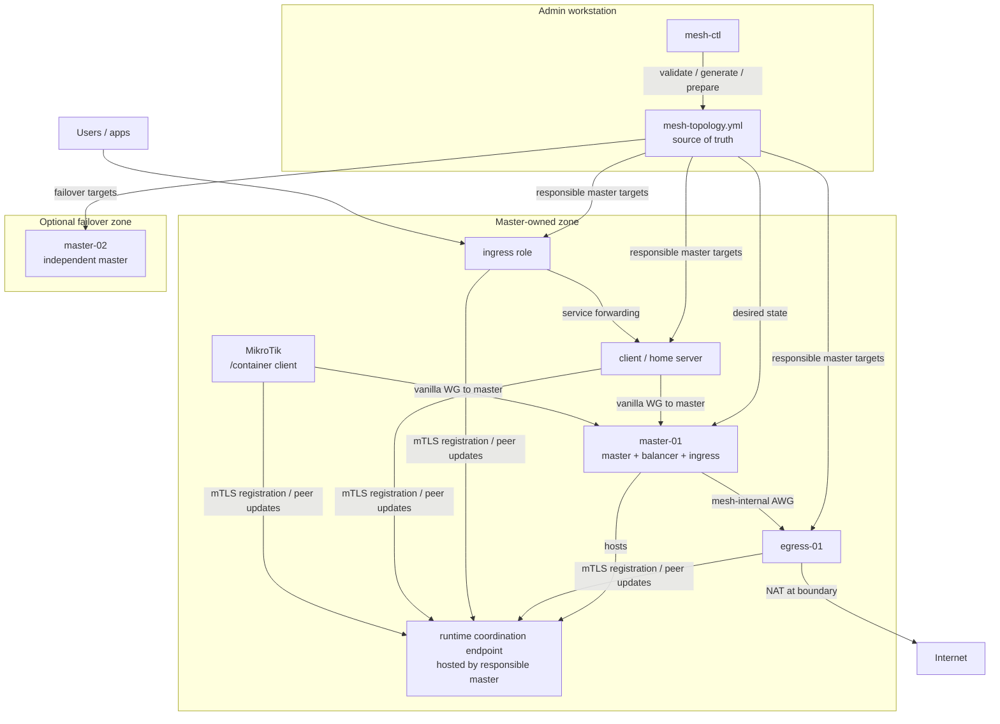

<!-- synced: 2026-05-05 source-commit: 2ac88340119bf7f2a5f55fcdf994a8709b8f11f1 -->
[English](README.md) | [Русский](README.ru.md) | **中文**

[](https://github.com/coonfuuseed-paandaa/awg-mesh/actions/workflows/build.yml)
[](https://github.com/coonfuuseed-paandaa/awg-mesh/releases)
[](https://go.dev/)
[](LICENSE)
[](https://github.com/coonfuuseed-paandaa/awg-mesh/pkgs/container/awg-mesh-node)
[](https://hub.docker.com/r/coonfuuseedpaandaa/awg-mesh-node)

# awg-mesh

awg-mesh 是基于 AmneziaWG 的 Docker-native 加密 overlay mesh 网络。awg-mesh v2
使用扁平的 role-tagged topology、master-owned runtime zones、本地
backup/restore、通过 MikroTik RouterOS `/container` 部署，以及在发布 tag 前
证明代码契约和产品行为的 release gates。

## 架构概览



`mesh-ctl` 是 desired-state tool：它读取 `mesh-topology.yml`、验证 intent、
准备 node material，并执行显式的 operator actions。Data plane 运行在
`awg-mesh-node` 实例上。在当前 v2.x 模型中，masters 拥有各自 zones 的
runtime responsibility；happy path 不需要独立的 standalone daemon，并且 masters
之间不共享 runtime state。

v2 topology 文件在 `nodes:` 下只声明一次节点，并给每个节点分配一个或多个角色：

| 角色 | 用途 |
|---|---|
| `client` | 终端用户设备或家庭服务器。这个角色是互斥角色。 |
| `master` | 接收 client links，并将它们桥接进 mesh。 |
| `balancer` | 为 flows 选择 active egress/mesh path。 |
| `egress` | 在边界执行 internet-bound masquerade。 |
| `ingress` | 通过 public hostnames 或 ports 发布 mesh clients 上的服务。 |

Egress、ingress、balancer 和 client nodes 使用由 topology 生成的
responsible master。让每个 non-client role 与每个 master peering 是
deployment choice，不是 default invariant。

参见 [docs/architecture/F-009-overview.md](docs/architecture/F-009-overview.md)
了解 F-009 的历史背景。本文档描述的 v2.0.1 release path 是当前
master-owned-zone contract。

## v2.0 新内容

- **Schema v2 topology**：包含 `schema_version: 2`、role-tagged `nodes:` 和
  service ingress declarations。
- **Role-agnostic CLI**：当前 onboarding 使用 `mesh-ctl node prepare`、
  `mesh-ctl node init`、`mesh-ctl node list` 和 `mesh-ctl node remove`。
  legacy `master`、`endpoint` 和 `client` role subcommands 已从 v2 operator
  path 中移除。
- **Master-owned coordination**：使用 CA-backed mTLS 和本地 admin
  certificates。Insecure coordination/admin paths 不属于 release flow。
- **Local backup/restore**：用于 admin state、topology 和可选的
  coordination state archives。
- **MikroTik RouterOS `/container` deployment**：通过
  `mesh-ctl node prepare --platform mikrotik` 生成。runtime release validation
  面向 RouterOS 7.21+；generator syntax tests 也覆盖 7.16.2 和 7.20.8。
- **Critical suite + product emulation playbook** 是 release blockers。
  tagging 前必须得到 `PRODUCT_WORKS`。
- **Go module v2 path**：
  `github.com/coonfuuseed-paandaa/awg-mesh/v2`。

## 快速开始

这个本地 walkthrough 会构建工具、验证 v2 示例 topology，并准备本地 node
credentials。它本身不会部署 production mesh；部署需要真实 hosts、Docker、可达的
responsible-master coordination endpoint，以及针对节点的 firewall rules。

### 前置要求

- Go 1.25+
- Docker Engine 24+，用于 image builds 和 release simulations
- Linux 或 WSL2，用于 Bash release gates
- 运行 data-plane containers 的 hosts 上需要 `/dev/net/tun`

### 安装 mesh-ctl

对于当前 v2 release line：

```bash
go install github.com/coonfuuseed-paandaa/awg-mesh/v2/cmd/mesh-ctl@v2.0.1
```

从 clone 进行本地开发：

```bash
CGO_ENABLED=1 go build -trimpath -o bin/mesh-ctl ./cmd/mesh-ctl
CGO_ENABLED=1 go build -trimpath -o bin/awg-mesh-node ./cmd/awg-mesh-node
```

将 binary 目录加入 `PATH`，然后确认版本：

```bash
export PATH="$PATH:$(go env GOPATH)/bin"
mesh-ctl version
```

### 创建并验证 topology

```bash
mkdir -p .mesh-local
cp mesh-topology.example.yml .mesh-local/mesh-topology.yml
mesh-ctl --config-dir .mesh-local --topology mesh-topology.yml topology validate
mesh-ctl --config-dir .mesh-local --topology mesh-topology.yml node list
```

预期输出形态：

```text
topology "mesh-topology.yml" valid: schema_version=2 ...
```

### 准备 node material

`node prepare` 会把本地 admin-side state 写入 `--config-dir`：

```bash
mesh-ctl --config-dir .mesh-local --topology mesh-topology.yml node prepare master-01
mesh-ctl --config-dir .mesh-local --topology mesh-topology.yml node prepare home-server-01
```

生成的 per-node artifacts 包括：

```text
.mesh-local/ca.crt
.mesh-local/nodes/<name>/token
.mesh-local/nodes/<name>/mesh.token
.mesh-local/nodes/<name>/node.crt
.mesh-local/nodes/<name>/node.key
```

对于 MikroTik RouterOS container deployment，需要嵌入可达的 responsible master
coordination address。当前 CLI flag name 为了 v2.0.1 compatibility 仍保留为
`--control-plane`：

```bash
mesh-ctl --config-dir .mesh-local --topology mesh-topology.yml \
  node prepare mikrotik-home \
  --platform mikrotik \
  --control-plane 192.0.2.10:9090 \
  --target-ros 7.21.4
```

RouterOS compatibility contract 记录在
[docs/MIKROTIK-VERSION-COMPAT.md](docs/MIKROTIK-VERSION-COMPAT.md)。

### 通过 responsible master 注册节点

在部署环境中启动 responsible master node，然后把已准备好的 nodes 注册到该
master 的 coordination endpoint。`--control-plane` flag 是为这个目标保留的
compatibility name：

```bash
mesh-ctl --config-dir .mesh-local --topology mesh-topology.yml \
  node init master-01 --control-plane 192.0.2.10:9090

mesh-ctl --config-dir .mesh-local --topology mesh-topology.yml \
  node init home-server-01 --control-plane 192.0.2.10:9090
```

`node init` 使用本地 CA 和已准备好的 node certificate。被拒绝的 registration
是 deployment blocker，不是 warning。

## Topology 示例

最小 v2 topology：

```yaml
schema_version: 2

mesh:
  name: example-mesh
  overlay_supernet: 172.21.92.0/24
  tenants: [default]

nodes:
  - name: master-01
    roles: [master, balancer, egress, ingress]
    overlay_ip: 172.21.92.2
    bridge_ip: 192.168.93.10
    public_ip: 203.0.113.10
    region: eu
    internet_iface: eth0

  - name: home-server-01
    roles: [client]
    overlay_ip: 172.21.92.130
    region: home
    preferred_master: master-01

services:
  - name: jellyfin
    owner_node: home-server-01
    protocol: tcp
    local_port: 8096
    tenant: default
    ingress:
      - hostname: media.example.com
        mode: sni_passthrough
        ingress_node: master-01
```

使用 [mesh-topology.example.yml](mesh-topology.example.yml) 作为维护中的起点。

## Docker Images

Release images 会同时发布到 GHCR 和 Docker Hub。

```text
ghcr.io/coonfuuseed-paandaa/awg-mesh-node:v2.0.1
ghcr.io/coonfuuseed-paandaa/awg-mesh-client:v2.0.1
ghcr.io/coonfuuseed-paandaa/awg-mesh:v2.0.1          # GHCR-only legacy node alias

docker.io/coonfuuseedpaandaa/awg-mesh-node:v2.0.1
docker.io/coonfuuseedpaandaa/awg-mesh-client:v2.0.1
```

CI workflow 会为以下平台发布 multi-arch manifests：

```text
linux/amd64
linux/386
linux/arm64
linux/arm/v7
linux/arm/v6
```

在 release tag 上，workflow 会发布 `vX.Y.Z`、`X.Y.Z`、`X.Y`、`X` 和
commit-SHA tags，其中 major alias 会为 non-v0 releases 启用。production
请固定 `:vX.Y.Z`；仅在 preview environments 中使用 `:latest`。

## 命令

### 拓扑

```bash
mesh-ctl --config-dir .mesh-local --topology mesh-topology.yml topology validate
mesh-ctl --config-dir .mesh-local --topology mesh-topology.yml topology validate --output json
mesh-ctl --config-dir .mesh-local --topology mesh-topology.yml topology generate-prometheus-config
mesh-ctl migrate --from old-v1-topology.yml --to mesh-topology.yml
```

### 节点生命周期

`--control-plane` flag name 为了 CLI v2.0.1 compatibility 仍然保留。在当前
master-owned-zone 模型中，请传入 responsible master coordination address。

```bash
mesh-ctl --config-dir .mesh-local --topology mesh-topology.yml node list
mesh-ctl --config-dir .mesh-local --topology mesh-topology.yml node prepare <name>
mesh-ctl --config-dir .mesh-local --topology mesh-topology.yml node init <name> --control-plane <host:port>
mesh-ctl --config-dir .mesh-local --topology mesh-topology.yml node remove <name> --control-plane <host:port>
```

### 备份与恢复

```bash
mesh-ctl --topology mesh-topology.yml --config-dir ~/.mesh-ctl backup awg-mesh-backup.zip
mesh-ctl --topology restored-topology.yml --config-dir ~/.mesh-ctl-restored restore awg-mesh-backup.zip --confirm
```

### 升级规划

```bash
mesh-ctl --config-dir .mesh-local --topology mesh-topology.yml upgrade v2.0.1 --dry-run
mesh-ctl upgrade status
mesh-ctl upgrade pause
mesh-ctl upgrade resume
```

v2 upgrade execution 会被有意阻止，直到 v2 deploy executor 发布。当前 upgrade
支持是 plan/state-management surface，不是自动 production rollout。

### 轮换与审计

Mesh-wide rotation 和 audit queries 会指向 responsible master coordination
endpoint。flag name 为了兼容 v2.0.0 command surface 仍保留为 `--control-plane`。

```bash
mesh-ctl rotate --mesh-wide --tier 1 --control-plane <host:port>
mesh-ctl rotate --mesh-wide --tier 2 --control-plane <host:port>
mesh-ctl rotate --mesh-wide --tier 3 --control-plane <host:port>
mesh-ctl audit-log query --control-plane <host:port>
```

较旧的 endpoint-targeted rotation flags 仍保留给 legacy paths。

## Compatibility and Future Management Plane

`awg-mesh-node --mode control-plane` 作为 compatibility/deprecated surface
保留在 v2.0.1，用于已经采用 v2.0.0 standalone path 的部署。它不是当前
Quick Start path，不是 customer-mode release gates 的要求，也不是作为
desired-state tool 的 `mesh-ctl` 的替代品。

面向大型安装的更广泛 management plane 和 WebUI 可以在以后设计。该未来 layer
与当前 data-plane runtime model 分离，不能向 v2.x happy path 引入
master-to-master gossip、consensus 或 shared state。

## 发布门禁

每个 release 在发布 tag 之前都必须通过 automated critical suite、product
emulation playbook、Docker builds 和 RouterOS CHR gates。

```bash
CGO_ENABLED=1 go test -race -count=1 ./...
docker build -t awg-mesh-node:local -f deploy/Dockerfile.node .
docker build -t awg-mesh-client:local -f deploy/Dockerfile.client .
bash tests/critical/run-all.sh --strict
bash tests/simulation/F-009-CR-001-foundation-smoke.sh
bash tests/emulation-playbook/run.sh
BUILDX_BUILDER=default bash tests/simulation/mikrotik-chr-baseline-runtime.sh
BUILDX_BUILDER=default bash tests/simulation/mikrotik-version-matrix.sh
```

直到 annotated git tag 出现在 origin，且 GHCR 和 Docker Hub 都能提供匹配的
`:vX.Y.Z` image tags，release 才算完成。完整 release policy 见
[AGENTS.md](AGENTS.md)。

## 文档地图

| 文档 | 用途 |
|---|---|
| [docs/PRODUCTION-TESTING-PLAYBOOK.md](docs/PRODUCTION-TESTING-PLAYBOOK.md) | Customer-mode product walkthrough。 |
| [docs/MIKROTIK-VERSION-COMPAT.md](docs/MIKROTIK-VERSION-COMPAT.md) | RouterOS generator/runtime compatibility。 |
| [docs/MIGRATION.md](docs/MIGRATION.md) | v1.x 到 v2 migration guidance。 |
| [docs/OPERATOR_FAQ.md](docs/OPERATOR_FAQ.md) | tokens、backups 和 state files 的 operator details。 |
| [docs/adr/README.md](docs/adr/README.md) | Architecture decision records。 |

## 开发

构建：

```bash
CGO_ENABLED=1 go build -trimpath -o bin/awg-mesh-node ./cmd/awg-mesh-node
CGO_ENABLED=1 go build -trimpath -o bin/mesh-ctl ./cmd/mesh-ctl
```

测试：

```bash
CGO_ENABLED=1 go test -race -count=1 ./...
go run github.com/golangci/golangci-lint/v2/cmd/golangci-lint@v2.11.4 run ./...
```

修改 `proto/*.proto` 后重新生成 protobuf files：

```bash
protoc --proto_path=proto \
  --go_out=. --go_opt=module=github.com/coonfuuseed-paandaa/awg-mesh/v2 \
  --go-grpc_out=. --go-grpc_opt=module=github.com/coonfuuseed-paandaa/awg-mesh/v2 \
  proto/*.proto
```

## 许可证

MIT。见 [LICENSE](LICENSE)。
